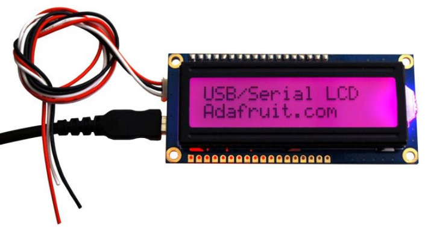
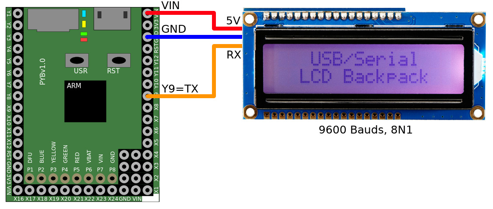

[Ce fichier existe également en FRANCAIS ici](readme.md)

# Using a 2x16 chars RGB LCD display with USB/Serial backpack

This library offer classes to drive the Adafruit's USB+Serial LCD backpack wich handle a LCD display of (2x 16 characters) + RGB backlight.



For more information, please check this [product sheet](http://shop.mchobby.be/product.php?id_product=475) or [our Arduino & Raspberry-Pi tutorial](http://wiki.mchobby.be/index.php?title=LCD-USB-TTL).

# Wiring

The backpack use 5V power logic. You can wire it directly to a Pyboard because that board is 5V tolerant. It would be better to user [_Level Shiftesr_](https://shop.mchobby.be/fr/breakout/131-convertisseur-logique-4-canaux-bi-directionnel-i2c-compatible-3232100001312-adafruit.html) to avoids any kind of damage on 3.3V systems.



# Test it

The library contains various examples: `writetest.py`, `fulltest.py`, `frenchtest.py` . The `frenchtest.py` script allows to draw frechy's chars like é,è,ê,ç,€ on the LCD.

The `writetest.py` is the most simple and already covers a wide variety of features.

```
from pyb import UART
from lcdmtrx import LcdMatrix
import time

uart = UART(3, 9600) # RX = Y10, TX = Y9

LCD_COLS = 16 # LCD Size: 16 characters x 2 lines
LCD_ROWS = 2


lcd = LcdMatrix( uart )

# Init the LCD size (ans save it to the EEPROM)
lcd.set_lcd_size( LCD_COLS, LCD_ROWS )
lcd.clear_screen()


# Activate/deactivate the backlight
lcd.activate_lcd( True );

# Default contrast
lcd.contrast()

# Max brightness + RGB color
lcd.brightness( 255 )

# RBG Color
#lcd.color( 255, 17, 30 )
lcd.color( 0, 255, 0 )

# Cursor at original position & clear the screen
lcd.clear_screen()

# Auto Scroll
lcd.clear_screen()
lcd.autoscroll( True )
lcd.write("Voici du texte..")
time.sleep(1)
lcd.write("Un peu plus....")
time.sleep(1)
lcd.write(" Et ca scroll:-)")
time.sleep(1)

# Test the screen with carriage return embeded into strings
# \r makes carriage return and is not sensitive to autoscroll settings.
lcd.autoscroll( False )
lcd.clear_screen()
lcd.write( "Ligne 1\rLigne 2" )
time.sleep(1)

# If we wrote a long ligne of texte, only the lasts "x" characters would be
# displayed on the line of the LCD... The firsts "y" characters would be ignored!
lcd.autoscroll( True )
if (LCD_ROWS == 4):
	lcd.write("Voici une longue longue ligne de texte  ")
else:
	lcd.write("Voici une longue ligne...")
time.sleep(1)

# Moving the cursor on LCD before printing
lcd.clear_screen()
lcd.autoscroll( False )
lcd.position( 1, 1 )
lcd.write( 'a' )
lcd.position( 1, LCD_COLS )
lcd.write( 'b' )
lcd.position( LCD_ROWS, 1 )
lcd.write( 'c' )
lcd.position( LCD_ROWS, LCD_COLS )
lcd.write( 'd' )

lcd.writepos( 1, 7, ':-)' ) # Move cursor + display
```

# Where to buy
* [USB/Serial LCD Backpack @ MC Hobby](http://shop.mchobby.be/product.php?id_product=475)
* [USB/Serial LCD Backpack @ Adafruit](https://www.adafruit.com/product/782)
