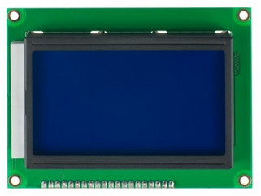
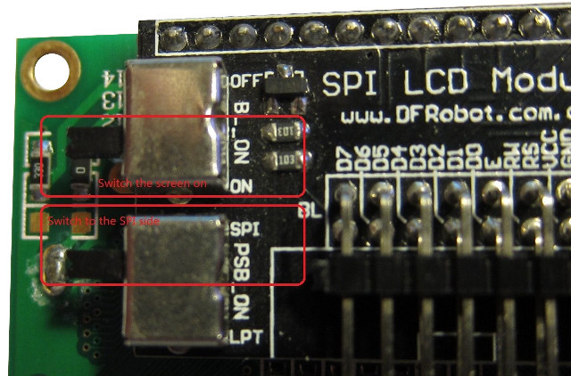
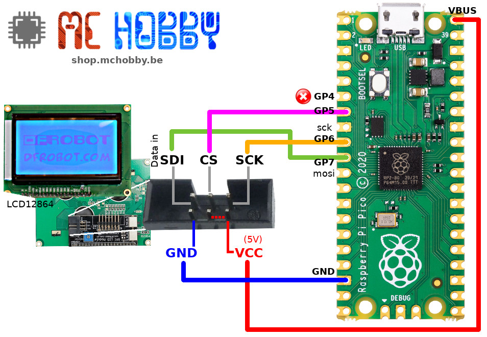
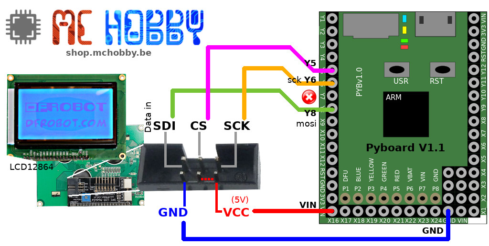
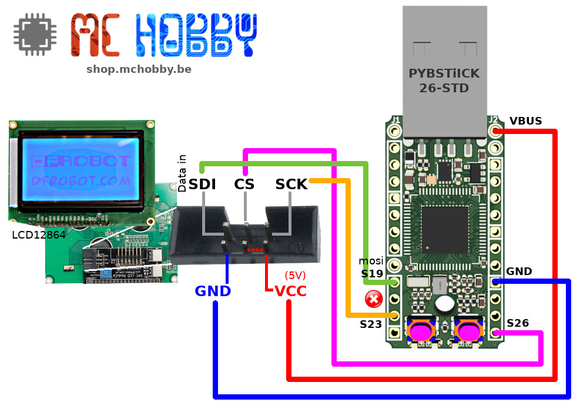
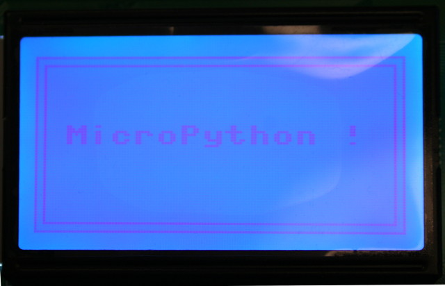
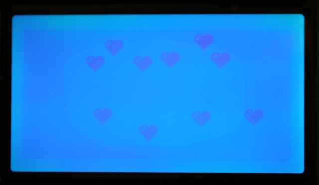

[This file also exist in ENGLISH](readme_ENG.md)

# Utiliser un afficheur LCD graphique 128x64 pixels sous MicroPython

DFRobot propose un écran LCD 128 x 64 (DFR0091) qu'il est possible de commander à partir d'un bus SPI (avec seulement 3 fils, MISO n'est pas utilisé).



# Brancher

Avant d'utiliser l'afficheur, il faut le configurer en mode SPI et activer le rétro-éclairage.



## Brancher sur PICO



Les bus et signaux nécessaires sont créés comme suit:

``` python
# Pico: GP7=mosi, GP6=sck, GP5=/ss
cs = Pin( 5, Pin.OUT, value=0 )
spi = SPI( 0 )
spi.init( polarity=0, phase=1 )
```
## Brancher sur Pyboard



Les bus et signaux nécessaires sont créés comme suit:

``` python
# PYBOARD: Y8=mosi, Y6=sck, Y5=/ss
cs = Pin( 'Y5', Pin.OUT, value=0 )
spi = SPI( 2 )
spi.init( polarity=0, phase=1 )
```

_Note: Cette configuration n'a pas été testée mais devrait fonctionner à l'identique de la PYBStick._

## Brancher sur PYBStick



Les bus et signaux nécessaires sont créés comme suit:

``` python
# PYBStick: S19=mosi, S23=sck, S26=/ss
spi = SPI( 1 )
spi.init( polarity=0, phase=1 )
cs = Pin( 'S26', Pin.OUT, value=0 )
```

# Utiliser

## test_simple.py

Le pilote MicroPython expose la classe `SPI_LCD12864` qui dérive de la classe `FrameBuffer` . Par conséquent, toutes [les méthodes de tracé exposées par FrameBuffer](https://docs.micropython.org/en/latest/library/framebuf.html) peuvent être utilisées.

Le code source de cet exemple est disponible dans [test_simple.py](examples/test_simple.py) .

``` python
from machine import SPI, Pin
from lcd12864 import SPI_LCD12864
import time

# PYBStick: S19=mosi, S23=sck, S26=/ss
spi = SPI( 1 )
spi.init( polarity=0, phase=1 )
cs = Pin( 'S26', Pin.OUT, value=0 )

lcd = SPI_LCD12864( spi=spi, cs=cs )
# texte à X=10, Y=25, couleur=1 (trait)
lcd.text( "MicroPython !", 10, 25, 1 )
# tracer deux rectangles
lcd.rect(0,0,128,64,1)
lcd.rect(3,3,128-6,64-6,1)
# Afficher sur le LCD
lcd.update()
```



## test_icon.py

L'exemple [test_icon.py](examples/test_icon.py) dessine une icone aléatoirement sur l'afficheur.

Encoder et dessiner une icone est sur l'afficheur est plutôt simple. Il suffit de manipuler des pixels dans un FrameBuffer.

``` python
HEART_ICON = [
  [0,0,0,0,0,0,0,0,0,0,0],
  [0,0,1,1,1,0,1,1,1,0,0],
  [0,1,1,0,1,1,1,1,1,1,0],
  [0,1,0,1,1,1,1,1,1,1,0],
  [0,1,1,1,1,1,1,1,1,1,0],
  [0,0,1,1,1,1,1,1,1,0,0],
  [0,0,0,1,1,1,1,1,0,0,0],
  [0,0,0,0,1,1,1,0,0,0,0],
  [0,0,0,0,0,1,0,0,0,0,0],
  [0,0,0,0,0,0,0,0,0,0,0] ]

def draw_icon( lcd, from_x, from_y, icon ):
    for y, row in enumerate( icon ):
        for x, color in enumerate( row ):
            if color==None:
                continue
            lcd.pixel( from_x+x,
                       from_y+y,
                       color )
```



## test_pbmlcd.py

L'exemple [test_pbmlcd.py](examples/test_pbmlcd.py) affiche le contenu d'une image `mpy.pbm` (format PBM) sur l'afficheur.


Le fichier [mpy.pbm](examples/mpy.pbm) doit être présent à la racine du système de fichiers de la carte micropython.

La bibliothèque `imglib` ([voir ce dépôt](https://github.com/mchobby/esp8266-upy/tree/master/FILEFORMAT)) doit également être présente sur le système de fichier MicroPython. La documentation explique comment créer des images au format Pbm.

``` python
from machine import SPI, Pin
from lcd12864 import SPI_LCD12864
from img import open_image

# PYBStick: S19=mosi, S23=sck, S26=/ss
cs = Pin( 'S26', Pin.OUT, value=0 )
spi = SPI( 1 )
spi.init( polarity=0, phase=1 )

lcd = SPI_LCD12864( spi=spi, cs=cs )

def color_transform( rgb ):
	# transform the clipreader (rgb) color to the target FrameBuffer color (2 colors)
	return 0 if rgb==(0,0,0) else 1

reader = open_image( 'mpy.pbm' )
reader.clip(0,0,lcd.width,lcd.height)
# Copy the clipped aread TO a target FrameBuffer (lcd) at is starting
# position 0,0 for the given clipping width,height .
reader.copy_to(lcd, 0,0, color_transform )
lcd.update()
```


## Utiliser une autre font

La font par défaut de MicroPython est assez grasse... et donc pas très élégante.

Il existe plus alternatives:
* [__FreeType-Generator__ : des fonts pour FrameBuffer](https://github.com/mchobby/freetype-generator)
* [__SMALL-FONT__ : une font allégée pour MicroPython](https://github.com/mchobby/esp8266-upy/tree/master/SMALL-FONT)

## test_raw.py

Le fichier [examples/test_raw.py](examples/tesraw.py) était le tout premier portage de la bibliothèque Arduino. Code qui servira à la création du pilote.

# Liste d'achat

* [Afficheur LCD 128x64 (DFR0091)](https://shop.mchobby.be/fr/gravity-boson/1878-afficheur-lcd-128x64-spi-3-fils-3232100018785-dfrobot.html) @ MCHobby
* [PYBStick-Std-26 microcontrôleur](https://shop.mchobby.be/fr/pybstick/1844-pybstick-standard-26-micropython-et-arduino-3232100018440-garatronic.html) @ MCHobby
