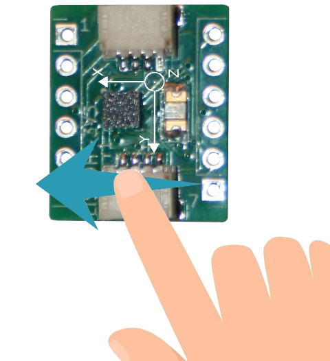
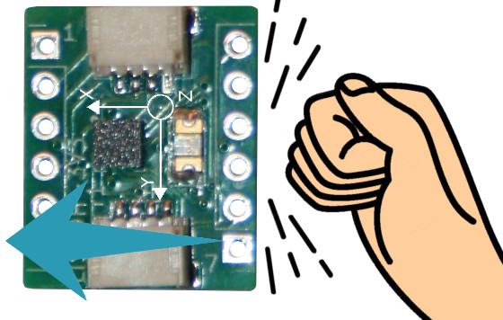

# Utiliser l'accéléromètre LIS3DH avec MicroPython

[This file also exists in ENGLISH](readme_ENG.md)

Le LIS3DH est un accéléromètre à faible consomation utilisé pour détecter l'orientation d'un objet par rapport au vecteur g (pointant vers le centre de la terre).


Il peu évaluer l'orientation d'une voiture sur la route grimpant une colline ou étant couchée sur le côté suite à un accident). Le meilleure usage d'un accéléromètre est d'évaluer l'orientation d'un objet volant (avion ou drone).


La disposition des axes d'accélération sur la carte est important pour evaluer la direction de l'accélération.


Comme ce composant mesuure l'accélération il est également capable de détecter:

* l'accroissement/diminution de la vitesse d'un véhicule, 
* taper sur l'objet (ou avec l'objet), 
* déviation inopinée de la trajectoire (suite a choc), 
* chute libre, 
* Click et double-click.

## Comprendre les valeurs

__Direction des axes:__

Avec la carte déposée sur le bureau, lever brutalement la carte vers le plafond accroît la valeur de l'accélération sur l'axe Z (avec une valeur positive pendant que l'accélération se poursuit).

__Règle de l'action/réaction:__

Lorsque la carte est déposée sur le bureau, le capteur présente une valeur __positive__ sur l'axe Z (valeur proche de 1). Pourquoi une valeur positive alors que le vecteur g est dans la direction opposée (vers le centre de la terre puisque g est le vecteur d'accélération terrestre). 
```
x = 0.017 G, y = -0.018 G, z = 0.946 G
```

Est-ce que votre carte tombe à travers le bureau? Non... il reste bien à plat sur le bureau! Une valeur positive retournée par le capteur est __un lecture de la reaction__!

__Action ou Réaction?__

Dans l'exemple ci-dessous, lorsqu'un mouvement est appliqué sur la capteur dans l'axe X, une __valeur positive__ est ajoutée sur l'axe dans les relevés résultant de l'action.



```
x = -0.056 G, y = 0.036 G, z = 0.942 G <<<< floor value
x = -0.044 G, y = 0.031 G, z = 0.970 G
x = 0.013 G, y = 0.025 G, z = 0.942 G  <<<< moving on X
x = 0.086 G, y = -0.007 G, z = 0.969 G <<<< Moving on X
x = -0.109 G, y = 0.018 G, z = 0.937 G
x = -0.069 G, y = 0.037 G, z = 0.927 G
```

Frapper le capteur dans l'axe des X déplacera encore une fois la carte dans la même direction mais cette fois, c'est en réaction au un choc (la __valeur ajoutée est négative__).



```
x = -0.072 G, y = 0.028 G, z = 0.937 G  <<<< floor value
x = -0.051 G, y = 0.027 G, z = 0.936 G  <<<< knocking on X
x = -0.679 G, y = 0.123 G, z = 0.733 G
x = -0.704 G, y = -0.471 G, z = 0.350 G
```

## Credit & license

Cette bibliothèque est basée sur:

* [UnexpectedMaker pour tinypico](https://github.com/tinypico/tinypico-micropython/tree/master)
* Le [travail de Tony DiCola](https://github.com/adafruit/Adafruit_LIS3DH/) pour Arduino
* Le travail de Matt Trentini, Seon Rozenblum 

Cette bibliothèque préserve la license MIT d'origine.

## Remark
Le support des interruption n'est pas complet comme le mentionne le Readme de TinyPico


# Bibliothèque

La bibliothèque lis3dh doit être copié sur votre carte MicroPython avant d'executer les divers examples.

Sur une plateforme connectée:

 ```
 >>> import mip
 >>> mip.install("github:mchobby/esp8266-upy/lis3dh")
 ```

 Ou en utilisant l'outil `mpremote` :

 ```
 mpremote mip install github:mchobby/esp8266-upy/lis3dh
 ```

# Brancher

## Brancher sur un Pico
Le plus simple est d'utiliser le connecteur Qwicc/StemmaQt accessible sur la carte breakout.


Il est aussi possible de brancher la carte en utilisant les pastilles de connexion.


# Utiliser le LIS3DH

## L'exemple test.py
L'example [test.py](examples/test.py) présente la fonction principale de l'accéléromètre.

```python
import lis3dh
from machine import Pin, I2C

i2c = I2C(sda=Pin(21), scl=Pin(22)) # Correct I2C pins for TinyPICO
imu = lis3dh.LIS3DH_I2C(i2c)

# Si le LIS3DH n'est pas trouvé
if imu.device_check():
    # Gamme de mesure (peut être RANGE_2_G, RANGE_4_G, RANGE_8_G or RANGE_16_G).
    imu.range = lis3dh.RANGE_2_G

    # boucle infinie
    while True:
        # Lecture des accélérations (en m / s ^ 2).  retourne un tuple de 3 valeur pour les axes
        #  x, y, z.  Divisés par 9.806 pour avoir une conversion en G
        x, y, z = [value / lis3dh.STANDARD_GRAVITY for value in imu.acceleration]
        print("x = %0.3f G, y = %0.3f G, z = %0.3f G" % (x, y, z))
        # pause de 100ms
        time.sleep(0.1)
```

Lorsque la cartte est à plat sur le bureau the board alors the script ptoduit le résultat suivant.

```
x = 0.017 G, y = -0.018 G, z = 0.946 G
x = 0.038 G, y = -0.005 G, z = 0.954 G
x = 0.027 G, y = -0.026 G, z = 0.938 G
x = 0.073 G, y = -0.040 G, z = 0.948 G
x = 0.057 G, y = -0.031 G, z = 0.961 G
x = 0.058 G, y = -0.036 G, z = 0.948 G
x = 0.049 G, y = -0.032 G, z = 0.947 G
x = 0.049 G, y = -0.029 G, z = 0.954 G
```

A noter que le script sur le dépôt complet affiche également les informations de rotation.
# Liste d'achat
* [Breakout accéléromètre LIS3DH avec connecteur Qwiic/StemmaQt](https://shop.mchobby.be/fr/nouveaute/2882-accelerometre-3-axes-spi-i2c-qwiicstemmaqt-3232100028821.html) @ mchobby