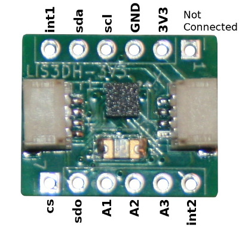
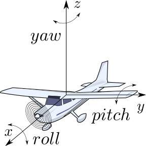
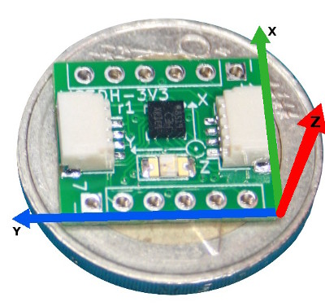
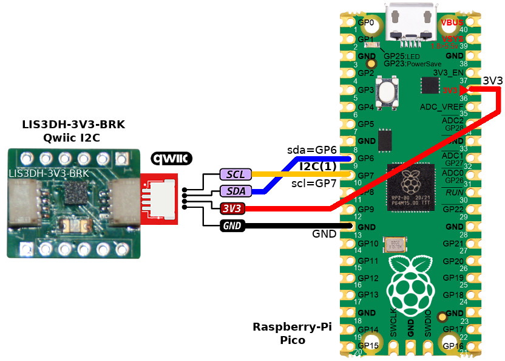
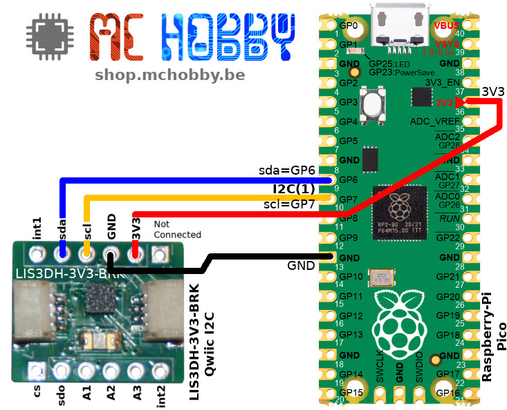

# Using LIS3DH accelerometer with MicroPython

[Ce fichier existe également en FRANCAIS](readme.md)

The LIS3DH is a low power accelerometer used to detect the object orientation relative to the g vector (pointing toward the earth's center).



It can evaluate the orientation of car on the road (climbing a hill, being on the side following an accident) The best usage of an accelerometer is to evaluate orientation of a flying object (plane or quad-copter).



The knowledge of the board's acceleration axis is important to properly estimate the acceleration direction.



As this device measure acceleration it can also be used to detect:

* vehicule speed increase, 
* knock on the object, 
* unespected trajectory deviation, 
* free-fall, 
* klick and double-click.

## Understanding the values

__Direction of axis:__

Having the board sitting on the desk then suddently lift it up toward the ceiling will increase the Z value with a positive value (as long as the acceleration continues).

__Action/Reaction rule:__

Sitting the board on the desk shows a __positive__ z value close to 1. Why a positive value? It is the opposite direction of the g vector (terrestrial acceleration vector). 
```
x = 0.017 G, y = -0.018 G, z = 0.946 G
```

Do you see the board falling to the ground? No... it is still standing on the desk!

The positive value __read is the reaction__!

## Credit

This library is based on:

* the [UnexpectedMaker for tinypico](https://github.com/tinypico/tinypico-micropython/tree/master)
* the [work of Tony DiCola](https://github.com/adafruit/Adafruit_LIS3DH/) for Arduino
* former work of  Matt Trentini, Seon Rozenblum 

## Remark
Interrupt support is not complete as stated by TinyPico


# Library

The lis3dh library must be copied to the MicroPython board before using the examples scripts.

On a connected plateform:

 ```
 >>> import mip
 >>> mip.install("github:mchobby/esp8266-upy/lis3dh")
 ```

 Or using the mpremote tool :

 ```
 mpremote mip install github:mchobby/esp8266-upy/lis3dh
 ```

# Wiring

## wire to pico
The most simple is to use the Qwicc/StemmaQt connector available on the board.



A wiring to the breakout pads is also possible.



# Using LIS3DH

## test example
The [test.py](examples/test.py) example shows the basic function of the accelerometer

```python
import lis3dh
from machine import Pin, I2C

i2c = I2C(sda=Pin(21), scl=Pin(22)) # Correct I2C pins for TinyPICO
imu = lis3dh.LIS3DH_I2C(i2c)

# If we have found the LIS3DH
if imu.device_check():
    # Set range of accelerometer (can be RANGE_2_G, RANGE_4_G, RANGE_8_G or RANGE_16_G).
    imu.range = lis3dh.RANGE_2_G

    # Loop forever printing accelerometer values
    while True:
        # Read accelerometer values (in m / s ^ 2).  Returns a 3-tuple of x, y,
        # z axis values.  Divide them by 9.806 to convert to Gs.
        x, y, z = [value / lis3dh.STANDARD_GRAVITY for value in imu.acceleration]
        print("x = %0.3f G, y = %0.3f G, z = %0.3f G" % (x, y, z))
        # Small delay to keep things responsive but give time for interrupt processing.
        time.sleep(0.1)
```

When the board is flat on the desk, the script shows the following value

```
x = 0.017 G, y = -0.018 G, z = 0.946 G
pitch = -1.07, roll = -1.01
x = 0.038 G, y = -0.005 G, z = 0.954 G
pitch = -0.29, roll = -2.29
x = 0.027 G, y = -0.026 G, z = 0.938 G
pitch = -1.16, roll = -1.39
x = 0.073 G, y = -0.040 G, z = 0.948 G
pitch = -2.42, roll = -4.41
x = 0.057 G, y = -0.031 G, z = 0.961 G
pitch = -2.90, roll = -3.07
x = 0.058 G, y = -0.036 G, z = 0.948 G
pitch = -1.88, roll = -4.68
x = 0.049 G, y = -0.032 G, z = 0.947 G
pitch = -1.95, roll = -2.95
x = 0.049 G, y = -0.029 G, z = 0.954 G
```

# Shopping List
* [LIS3DH accelerometer breakout with Qwiic/StemmaQt connector](https://shop.mchobby.be/fr/nouveaute/2882-accelerometre-3-axes-spi-i2c-qwiicstemmaqt-3232100028821.html) @ mchobby