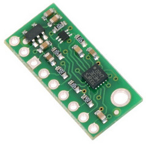
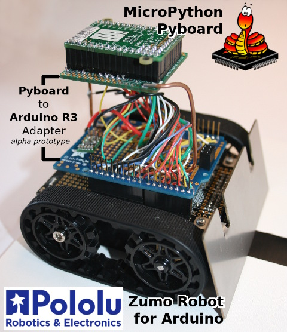
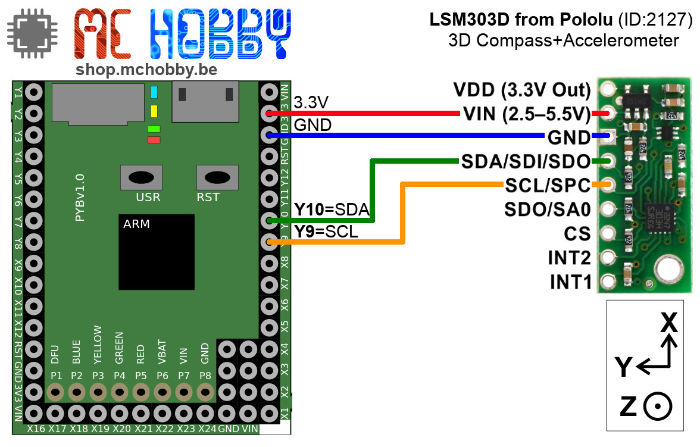

[Ce fichier existe également en FRANCAIS ici](readme.md)

# LSM303 Magnetometer (compas) and accelerometer

Here is the MicroPython portage of the Pololu's LSM303D, compass and accelerometer for Arduino.



It makes it simple to configure the device and read the raw accelerometer and magnetometer data, and it has a function for computing the tilt-compensated heading for those looking to use the LSM303 as a tilt-compensated compass.

The LSM303D is also present on the [Zumo Robot for Arduino](https://shop.mchobby.be/fr/prototypage-robotique-roue/448-robot-zumo-pour-arduino-assemble-moteurs-3232100004481-pololu.html) visible here under with the early prototype of [PYBOARD-UNO-R3 adapter](https://github.com/mchobby/pyboard-driver/tree/master/UNO-R3).



MCHobby ported this code to make the [Zumo-Robot for Arduino](https://shop.mchobby.be/fr/prototypage-robotique-roue/448-robot-zumo-pour-arduino-assemble-moteurs-3232100004481-pololu.html) **Running with [MicroPython Pyboard](https://shop.mchobby.be/fr/micropython/570-micropython-pyboard-3232100005709.html)**

The MicroPython Library is ported from 2 sources:
* The Arduino source is [Arduino library for Pololu LSM303 boards](https://github.com/pololu/lsm303-arduino) @ GitHub which contains many ressource and reference.
* The CircuitPython source is [CircuitPython library for Adafruit LSM303 board](https://github.com/adafruit/Adafruit_CircuitPython_LSM303_Accel) @ GitHub.

# Library

The library must be copied on the MicroPython board before using the examples.

On a WiFi capable plateform:

```
>>> import mip
>>> mip.install("github:mchobby/esp8266-upy/lsm303")
```

Or via the mpremote utility :

```
mpremote mip install github:mchobby/esp8266-upy/lsm303
```

# Wiring

## Pyboard



## Pyboard-UNO-R3

Plug the adapter [PYBOARD-UNO-R3](https://github.com/mchobby/pyboard-driver/tree/master/UNO-R3) with the Pyboard on the Robot Zumo for Arduino.

You can also make the connections Pyboard --> UNO-R3 as described in the [PYBOARD-UNO-R3](https://github.com/mchobby/pyboard-driver/tree/master/UNO-R3) schematic.

# Test

Several examples scripts are availables that show how to use the library. They are available in the `examples` sub-folder.

## Serial

This program continuously reads the accelerometer and magnetometer, communicating the x,y,z readings on the REPL session.

Example output:
```
MicroPython v1.10 on 2019-01-25; PYBv1.1 with STM32F405RG
Type "help()" for more information.
>>>
>>> import serial
Acc:   -172   -179  17397    Mag:  -1088    416 -14702
Acc:   -148   -142  17253    Mag:  -1088    418 -14710
Acc:   -125   -156  17326    Mag:  -1087    422 -14709
Acc:   -168   -139  17309    Mag:  -1097    417 -14715
Acc:   -164   -123  17249    Mag:  -1093    427 -14710

```

See the comments in python script for some notes on how to convert the raw sensor values to units of g and gauss.

## Calibrate

This program is similar to the Serial example, but instead of printing the most recent readings, it prints a running minimum and maximum of the readings from each magnetometer axis. These values can be used to calibrate the heading() functions and the Heading example after moving the LSM303 through every possible orientation.

When stopping the script, it will output the min & max vector with x,y,z values
```
MicroPython v1.10 on 2019-01-25; PYBv1.1 with STM32F405RG
Type "help()" for more information.
>>>
>>> import calibrate
Move around to calibrate the magnetometer min & max values
Press Ctrl+C to stop the script and catch the resulting vectors
Mag min:  -1025    446 -14693    max:  -1025    446 -14693
Mag min:  -1025    441 -14697    max:  -1016    446 -14693
...
[WHEN CTRL+C IS PRESSED]


=== Magnetometer Min & Max ===========================
running_min = <Vector -4000,-1253,-15179>
running_max = <Vector 927,4250,-8277>
```

## Heading
This program uses readings from the accelerometer and magnetometer to calculate a tilt-compensated compass heading (in degrees relative to a default vector), which is communicated serially and can be displayed on the REPL session. The default vector is chosen to point along the surface of the PCB, in the direction of the top of the text on the silkscreen. (This is the +X axis on the Pololu LSM303D carrier). You can use a different reference vector (see the comments).

For the most accurate results, you should replace the values of m_min and m_max assigned script starting with your own values obtained from the `calibrate.py` example.

```
MicroPython v1.10 on 2019-01-25; PYBv1.1 with STM32F405RG
Type "help()" for more information.
>>>
>>> import heading
Heading to north: 290.7362
Heading to north: 290.947
Heading to north: 290.969
Heading to north: 290.9015
```
# Shopping list
* [MicroPython Pyboard](https://shop.mchobby.be/fr/micropython/766-micro-python-pyboard-lite-accelerometre-3232100007666.html) @ MC Hobby
* [LSM303D breakout - 3D Compass and Accelerometer ](https://www.pololu.com/product/2127) @ Pololu
* [Robot Zumo for Arduino](https://shop.mchobby.be/fr/prototypage-robotique-roue/448-robot-zumo-pour-arduino-assemble-moteurs-3232100004481-pololu.html) @ MCHobby
* [Robot Zumo for Arduino](https://www.pololu.com/product/2510) @ Pololu
* [PYBOARD-UNO-R3 adapter : Pyboard to UNO-R3](https://shop.mchobby.be/fr/nouveaute/1745-adaptateur-pyboard-vers-uno-r3-extra-3232100017450.html) @ MC Hobby
