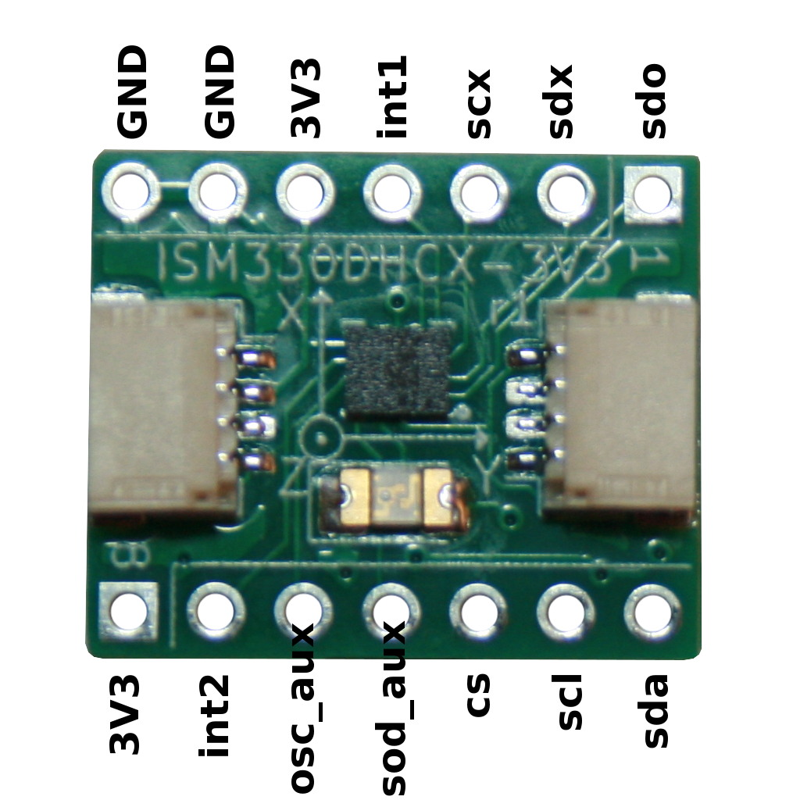
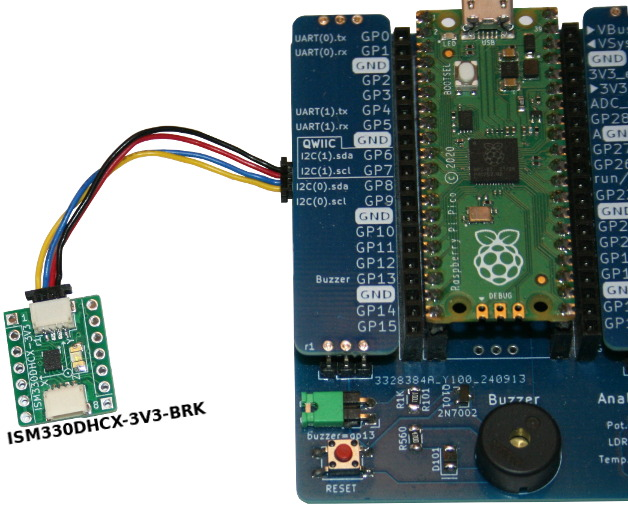

[Ce fichier existe également en FRANCAIS ici](readme.md)

# Using ISM330DHCX IMU with MicroPython

The ISM330DHCX from ST Electronics is a direct derivated of the LSM6DSOX (from the same company).

This Inertial Measurement Unit combining Accelerometer, Gyroscope and temperature sensor. This chip can work with I2C and SPI bus... but this implementation only focus on I2C bus.

This drivers will work with any [ISM330DHCX breakout](https://shop.mchobby.be/fr/mouvement/2883-ism330dhcx-centrale-inertielle--3232100028838.html) exposing the I2C interface.



# Credit

This driver is a MicroPython portage of the [Adafruit_LSM6DS repository for Arduino](https://github.com/adafruit/Adafruit_LSM6DS/tree/master).

That library is a wonderful work made by Adafruit.

The Arduino library is quite complex with many classes and sub-classes. It also rely on the [Adafruit_Sensor library](https://github.com/adafruit/Adafruit_Sensor/tree/master)

```
[ISM330DHCX class]--->[LSM6DSOX class]--->[LSM6DS class]
``` 

This __MicroPython portage implements the essential classes and definitions to make it working with the ISM330DHCX__ .

# Wiring

The most simple is to use the popular Qwiic/StemmaQt I2C connector. Wiring is just obvious.



Wire the sda, scl signals to your microcontroler. Also connects 3V3 and GND to power the breakout board.

# Library 

The library must be copied to your MicroPython board before using the examples.

On the WiFi enabled board:

 ```
 >>> import mip
 >>> mip.install("github:mchobby/esp8266-upy/lsm6ds")
 ```

Or by using the mpremote utility :

 ```
 mpremote mip install github:mchobby/esp8266-upy/lsm6ds
 ```

# Examples

The [ism330dhcx_test.py](examples/ism330dhcx_test.py) example collects the information about the sensors then displays the result on the REPL output.

This example is quite useful to test the connectivity with the sensor.

Here the typical result:

```
------------------------------------
Sensor: LSM6DS_A
Type: Acceleration (m/s2)
Driver Ver: 1
Unique ID: 1745
Min Value: -156.9064
Max Value: 156.9064 
Resolution: 0.061
------------------------------------
------------------------------------
Sensor: LSM6DS_G
Type: Gyroscopic (rad/s)
Driver Ver: 1
Unique ID: 1746
Min Value: -34.91
Max Value: 34.91 
Resolution: 7.6358e-05
------------------------------------
------------------------------------
Sensor: LSM6DS_T
Type: Ambient Temp (C)
Driver Ver: 1
Unique ID: 1744
Min Value: -40
Max Value: 85 
Resolution: 1
------------------------------------
```

The second [ism330dhcx_read.py](examples/ism330dhcx_read.py) example capture the data on the sensor then display them on the REPL output.

Here a typical example of output:

```
Accelerometer range set to: 
	+-4G
Gyroscope range set to: 
	2000 degrees/s
Accelerometer data rate set to: 
	104 Hz
Gyro data rate set to: 
	104 Hz
Temperature 22.2343736 deg C
Accel X: -1.884348 	Y: 0.7573284 	Z: 9.759127 m/s^2
Gyro X: 0.002443461 	Y: -0.010995574 	Z: 0.0061086524 radians/s
Temperature 22.261718 deg C
Accel X: -1.88554432 	Y: 0.75254268 	Z: 9.738788 m/s^2
Gyro X: 0.0012217305 	Y: -0.00366519132 	Z: 0.004886922 radians/s
```

# Shopping List
* [ISM330DHCX breakout](https://shop.mchobby.be/fr/mouvement/2883-ism330dhcx-centrale-inertielle--3232100028838.html) @ MCHobby
