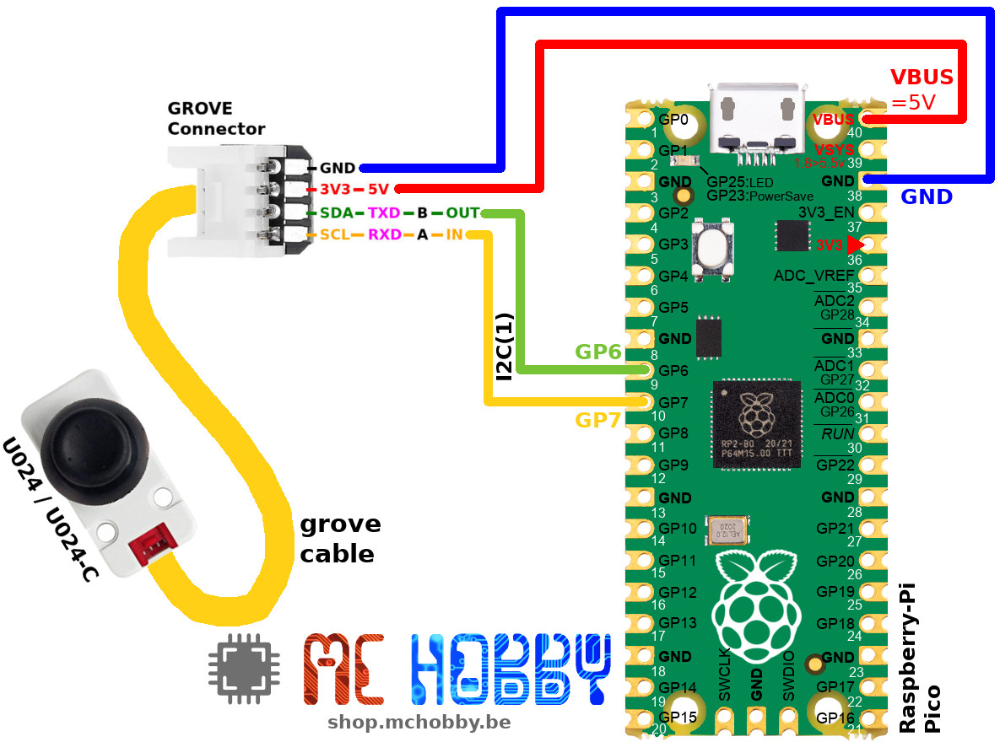

Ce fichier existe également en [Français ici](readme.md)

# Using an I2C Grove Joystick (U024) Grove with MicroPython

This unit is a joystick control input unit using I2C communication interface.

The joystick supports three-axis control signal input (X/Y-axis offset analog input, Z-axis key digital input).


Such joystick is suitable for application scenarios such as games/robot control.

When using the joystick you will get the `x`, `y` and `button` values.


# Library

The library must be copied on the MicroPython board before using the examples.

On a WiFi capable plateform:

```
>>> import mip
>>> mip.install("github:mchobby/esp8266-upy/m5stack-u024")
```

Or via the mpremote utility :

```
mpremote mip install github:mchobby/esp8266-upy/m5stack-u024
```

# Wiring

The joystick can be powered with 3.3V or 5V power supply.

The SDA / SCL data lines are at 3.3V level.

## Joystick I2C with Raspberry-Pi Pico



# Test

## Reading the joystick

The [test.py](examples/test.py) script do reads the joystick position, read made every 100ms.

``` python
from machine import I2C
from joyi2c import Joystick
from time import sleep

# Pico - I2C(1) - sda=GP6, scl=GP7
i2c = I2C(1)
# M5Stack core
# i2c = I2C( sda=Pin(21), scl=Pin(22) )

joy = Joystick(i2c)
while True:
	joy.update() # Query joystick over I2C and update internal
	print( "X: %4i, Y: %4i, Button: %s" % (joy.x, joy.y, joy.button) )
	sleep( 0.1 )
```
