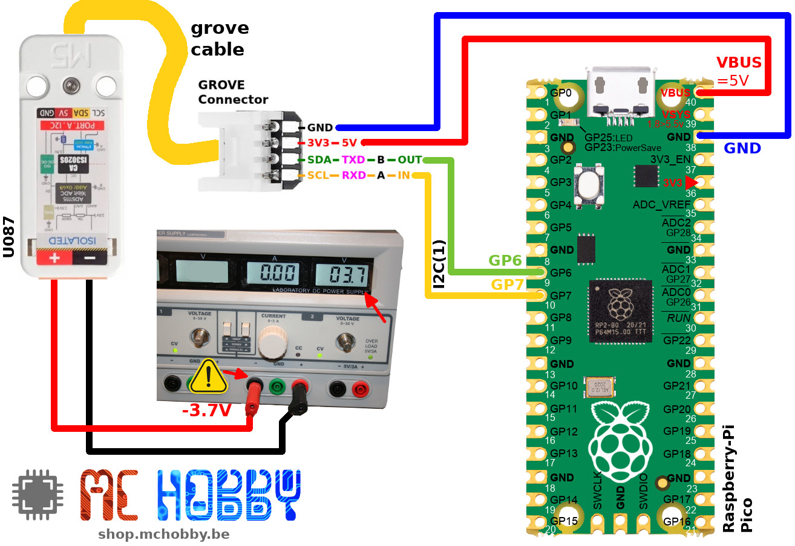
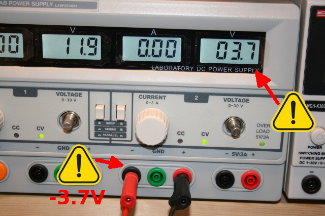
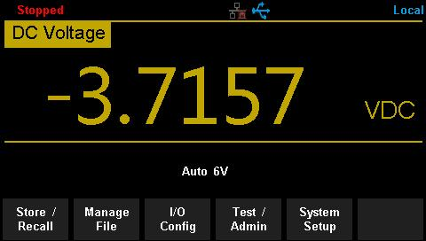

This file also exist in [English here](readme_ENG.md)

# Utiliser un module voltmètre I2C (U087) Grove avec MicroPython

Cette module Voltmètre permet de mesurer la tension en temps réel (grâce au convertisseur analogique-vers-numérique 16-bits ADS1115).


Le module communique par l'intermédiaire du bus I2C avec l'hôte.

L'alimentation DC-DC interne est isolée, ce qui permet d'assurer une meilleure précision analogique. Le bus I2C est également isolé à l'aide du composant CA-IS3020S (un isolateur I2C faible puissance).

L'isolateur et le convertisseur DC/DC isolé évite également que le bruit du circuit mesuré ou une surtension puisse passer vers le circuit basse tension via le bus I2C et le microcontrôleur. Cela protège également les composants fragile d'une pollution de bruit par la masse.

Chaque unité est calibrée en usine et les données de calibration sont stockée dans l'EEPROM présente sur le module. La tension maximale mesurable est de l'ordre de 36V.

__Alimentation 5V requise:__

Ce module doit être alimenté en 5V pour assurer un bon fonctionnement. Par contre, les signaux SDA/SCL du bus I2C sont bien en logique 3.3V. Ce module peut donc être utilisé avec vos microcontrôleurs 3.3V comme ESP32, Pico, Pyboard, M5Stack core, Raspberry.

# Brancher

## Raspberry-Pi Pico




# Test

## Lecture de tension

Le script [test_volts.py](examples/test_volts.py) permet de lire la valeur du voltmetre dans sa configuration par défaut, lecture répétée toutes les 300ms.

``` python
from machine import I2C
from vmeter import *
from time import sleep

# Pico - I2C(1) - sda=GP6, scl=GP7
i2c = I2C(1, freq=10000)

vmeter = Voltmeter(i2c)
while True:
	print( 'Voltage: %5.3f Volts' % vmeter.voltage )
	sleep( 0.3 )
```

Ce qui affiche le résultat suivant en faisant varier la tension sur le voltmètre:

```
MicroPython v1.15 on 2021-04-18; Raspberry Pi Pico with RP2040
Type "help()" for more information.
>>>
>>> import test_volts
Voltage: -3.722 Volts
Voltage: -3.726 Volts
Voltage: -4.558 Volts
Voltage: -4.649 Volts
Voltage: -4.617 Volts
Voltage: -3.714 Volts
Voltage: -3.624 Volts
Voltage: -3.628 Volts
Voltage: -0.012 Volts
Voltage: -0.192 Volts
Voltage: 0.024 Volts
Voltage: 0.027 Volts
Voltage: 0.008 Volts
Voltage: -0.016 Volts
Voltage: 0.055 Volts
Voltage: 3.624 Volts
Voltage: 3.628 Volts
Voltage: 5.080 Volts
Voltage: 6.698 Volts
Voltage: 6.769 Volts
Voltage: 8.539 Volts
Voltage: 9.007 Volts
```
## Lecture détaillée

Le script d'exemple [test_simple.py](examples/test_simple.py) permet de lire la tension sur le module Voltmeter _avec informations complémentaires_.

C'est aussi l'occasion de tester un gain différent offrant une meilleure résolution mais qui abaisse aussi la tension maximale acceptée par le module Voltmetre.

L'exemple ci-dessous reprend l'utilisation du module sur un Pico pour mesurer une tension de référence arbitraire de 3.7V (branché à l'envers sur le module).




``` python
MPY: soft reboot
MicroPython v1.15 on 2021-04-18; Raspberry Pi Pico with RP2040
Type "help()" for more information.

>>> import test_simple
M5Stack - U087 - Voltmeter
--------------------------

Max voltage : +/- 16 V (depends on ADC gain)
Resolution  : 0.98153 v/unit
Sample rate : 8 SPS
Voltage     : -3719.033 mV
Voltage     : -3716.844 mV (calibrated)
Raw ADC     : 3789
>>>
```

La tension lue est bien de 3.7 Volts.

En utilisant les données de calibrations stockées dans l'EEPROM (fonctionnement par défaut de la bibliothèque), la tension lue est très précisément de __-3.716844 Volts__.



L'utilisation d'un multimètre Siglent SDM3045x au même moment (à quelques ms près) révèle que la tension sur le module voltmètre est de __-3.7157 Volts__ .

__Le module voltmètre offre une résolution allant jusqu'à presque 3 décimales!__

# Liste d'achat
* [Module Voltmetre (M5Stack u087)](https://shop.mchobby.be/fr/grove/2153-m5stack-voltmetre-mesure-de-tension-36v-ds1115-grove-3232100021532-m5stack.html) @ MCHobby
* [Module Voltmetre (M5Stack u087)](https://shop.m5stack.com/products/voltmeter-unit-ads1115) @ M5Stack
* [Raspberry-Pi Pico avec Header](https://shop.mchobby.be/fr/pico-rp2040/2036-pico-header-rp2040-microcontroleur-2-coeurs-raspberry-pi-3232100020368.html) @ MCHobby
* [Connecteur Grove](https://shop.mchobby.be/fr/m5stack-esp/1929-connecteur-grove-vers-broches-5pcs-3232100019294-m5stack.html) @ MCHobby
* [Connecteur Grove avec broche](https://shop.mchobby.be/fr/m5stack-esp/2145-connecteur-grove-vers-broches-10pcs-3232100021457-m5stack.html) @ MCHobby
