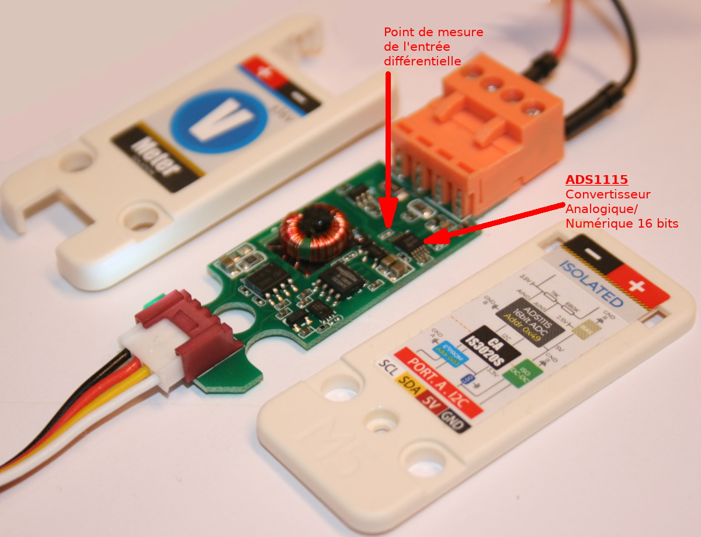
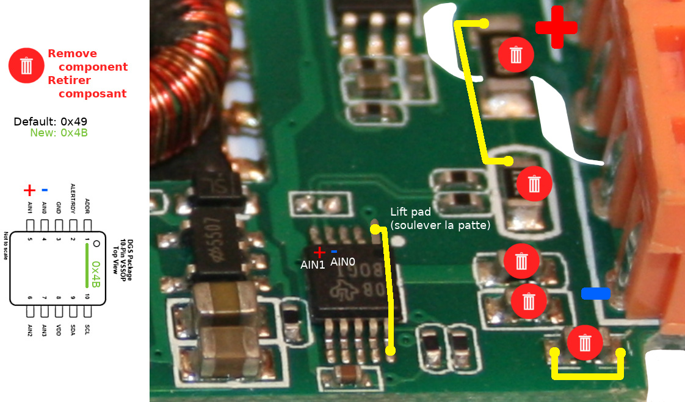
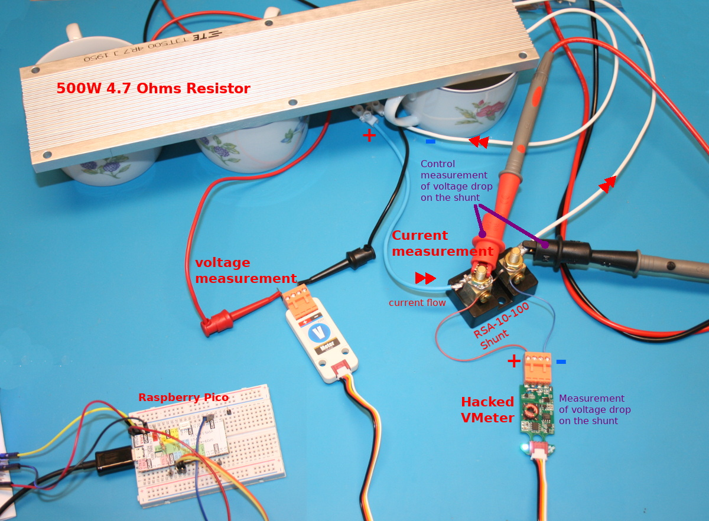
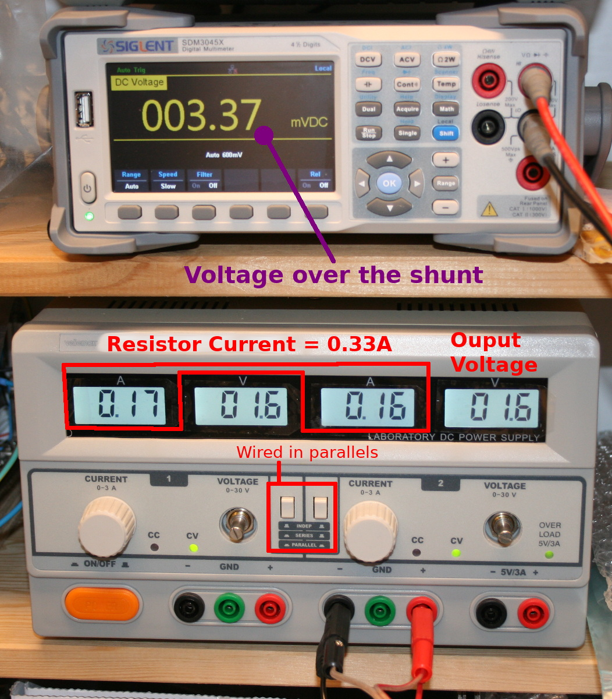

Ce fichier existe également en [Français](readme.md)

# Using the I2C Voltmeter Grove module (U087) with MicroPython

This voltmeter module is used to measure realtime voltage (thanks to the analog-to-digital ADS1115 16-bits converter).


This module communicates with the host via the I2C bus.

The internal DC/DC power supply is isolated allowing a better analog accuracy. The I2C is also isolated thanks to the CA-IS3020S chip (a low power / I2C isolator).

The isolator and the DC/DC regulator would avoids that measured circuit noise (or overvoltage) would reach the I2C bus and the microcontroler. This will also protects fragiles componant from noise transfert via the ground.

Each unit is calibrated in factory and calibration data are stored inside the EEPROM module (also present on the voltmeter module). The maximum voltage is about 36V.

__5V power required:__

This module must be powered with 5V to assume a proper operation. However, the I2C SDA/SCL lines are in 3.3V logic. So this modules can be used with 3.3V microcontroler as ESP32, Pico, Pyboard, M5Stack core, Raspberry.

# Library

The library must be copied on the MicroPython board before using the examples.

On a WiFi capable plateform:

```
>>> import mip
>>> mip.install("github:mchobby/esp8266-upy/m5stack-u087")
```

Or via the mpremote utility :

```
mpremote mip install github:mchobby/esp8266-upy/m5stack-u087
```

# Wiring

## Raspberry-Pi Pico


# Test

## Voltage reading

The [test_volts.py](examples/test_volts.py) script read the value from the voltmeter with its default configuration, read made once every 300ms.

``` python
from machine import I2C
from vmeter import *
from time import sleep

# Pico - I2C(1) - sda=GP6, scl=GP7
i2c = I2C(1, freq=10000)

vmeter = Voltmeter(i2c)
while True:
	print( 'Voltage: %5.3f Volts' % vmeter.voltage )
	sleep( 0.3 )
```

Which do display the following results (when we do change the measured voltage):

```
MicroPython v1.15 on 2021-04-18; Raspberry Pi Pico with RP2040
Type "help()" for more information.
>>>
>>> import test_volts
Voltage: -3.722 Volts
Voltage: -3.726 Volts
Voltage: -4.558 Volts
Voltage: -4.649 Volts
Voltage: -4.617 Volts
Voltage: -3.714 Volts
Voltage: -3.624 Volts
Voltage: -3.628 Volts
Voltage: -0.012 Volts
Voltage: -0.192 Volts
Voltage: 0.024 Volts
Voltage: 0.027 Volts
Voltage: 0.008 Volts
Voltage: -0.016 Volts
Voltage: 0.055 Volts
Voltage: 3.624 Volts
Voltage: 3.628 Volts
Voltage: 5.080 Volts
Voltage: 6.698 Volts
Voltage: 6.769 Volts
Voltage: 8.539 Volts
Voltage: 9.007 Volts
```
## Detailled read

The [test_simple.py](examples/test_simple.py) example script would also read the voltmeter voltage _with additional data_.

This script is also the oppotunity to used alternate ADC gain that may offers better resolution (but will reduce the maximum voltage supported).

The following example shows how to use the voltmeter module with a Raspberry-Pi Pico to measure an arbitrary voltage ( reversed 3.7V = -3.7V ).


``` python
MPY: soft reboot
MicroPython v1.15 on 2021-04-18; Raspberry Pi Pico with RP2040
Type "help()" for more information.

>>> import test_simple
M5Stack - U087 - Voltmeter
--------------------------

Max voltage : +/- 16 V (depends on ADC gain)
Resolution  : 0.98153 v/unit
Sample rate : 8 SPS
Voltage     : -3719.033 mV
Voltage     : -3716.844 mV (calibrated)
Raw ADC     : 3789
>>>
```

The voltage read is indeed 3.7 Volts.

By using calibration data stored within the EEPROM (default behavior of the library), the voltage readed by the module is exactly __-3.716844 Volts__.


The Siglent SDM3045x multimeter have been used to compare the voltmeter module read with a quality multimeter (reading voltage at __-3.7157 Volts__).

__The voltmeter module offers an accuracy almost going to the third decimal!__

# VMeter Hacking

The VMeter module offers several electrical protection and is a great implementation for an ADS1115. To fulfil a project requirement where voltage (up to 60V) and current  (up to 11A) must be readed accross a load resistor, I did hack the VMeter.

The VMeter can read POSITIVE voltage up to 70 Volts (thank to voltage divider).

It was necessary to read the voltage accross a RSA-10-100 shunt (100 mV @ 10A). So I hacked the VMeter module to read the ADS1115 voltage with high resolution and also modifies the I2C address to be able to use 2 VMeter modules at the same time.



Here the modification made on the hacked module.



To make several modules sharing the same I2C bus, we do need to change the EEPROM I2C address.


__The test bench__ is made as follow:





The [test_hack.py](examples/test_hack.py) test script is used to read the voltage drop accross the shunt.

``` python
from machine import I2C
from vmeter import *
from time import sleep

# Pico - I2C(1) - sda=GP8, scl=GP9
i2c = I2C(1, freq=10000)
# M5Stack core
# i2c = I2C( sda=Pin(21), scl=Pin(22) )

vmeter = Voltmeter(i2c, ads1115_addr=0x4b, eeprom_addr=0x51 ) # Addr-->Scl
while True:
	# read ADC voltage (in millivolts)
	print( 'ADC Voltage: %5.3f mV' % vmeter.adc_mv )
	sleep( 0.3 )

```

The Script produce the following results:

```
ADC Voltage: 3.313 mV
ADC Voltage: 3.313 mV
ADC Voltage: 3.375 mV
ADC Voltage: 3.313 mV
ADC Voltage: 3.313 mV
ADC Voltage: 3.313 mV
```

As the shunt produce 100mV for 10A. So 1mv for 0.1A.

When measuring 3.31 mv accross the shunt, the current flowing into it is 0.331A.

# Shopping list
* [Voltmeter Module (M5Stack u087)](https://shop.mchobby.be/fr/grove/2153-m5stack-voltmetre-mesure-de-tension-36v-ds1115-grove-3232100021532-m5stack.html) @ MCHobby
* [Voltmeter Module (M5Stack u087)](https://shop.m5stack.com/products/voltmeter-unit-ads1115) @ M5Stack
* [Raspberry-Pi Pico with Header](https://shop.mchobby.be/fr/pico-rp2040/2036-pico-header-rp2040-microcontroleur-2-coeurs-raspberry-pi-3232100020368.html) @ MCHobby
* [Grove connector](https://shop.mchobby.be/fr/m5stack-esp/1929-connecteur-grove-vers-broches-5pcs-3232100019294-m5stack.html) @ MCHobby
* [Grove connector with header](https://shop.mchobby.be/fr/m5stack-esp/2145-connecteur-grove-vers-broches-10pcs-3232100021457-m5stack.html) @ MCHobby
