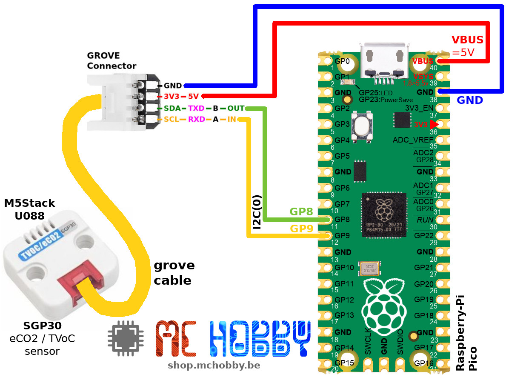

[This file also exists in ENGLISH here](readme_ENG.md)

# Utiliser le capteur SGP30 de qualité d'air pour l'eCO2, TVOC (M5Stack U088) avec MicroPython

L'unité Grove TVOC/eCO2 est un module capteur de gaz numérique basé sur le composant SGP30.


Il mesure la concentration de composés organiques volatiles COVs (_Volatile Organic Compounds_, VOC) ainsi que la concentration de CO2 dans l'air.

Ce capteur peut être utilisé pour mesurer:
* La concentration TVOC (total volatile organic compounds, total des composés organiques volatiles) les déchets que l'on retrouve dans la transpiration et expiration en milieu confiné. Les TVOC, mesuré en ppb (part par billion) sont un indicateur de dégradation de la qualité de l'air.
* La concentration de eCO2 (dioxyde de carbone équivalent). La concentration naturelle de l'air est de 400 ppm (part par million). Toute augmentation est également un indicateur de dégradation de l'air puisque cela laisse moins d'oxygène pour le cerveau... raison du mal de tête en salle de réunion ;-)

__Alimentation 5V requise:__

Ce module utilise un élément chauffant (environ 48mA). Il faut donc alimenter le module en 5V pour assurer un bon fonctionnement.

__Temps de chauffe = No data__

Durant le temps de chauffe de l'élément chauffant, le capteur retourne des valeurs nulle (donc eCO2=400 ppm et VoC=0 bpm)

# Bibliothèque

Cette bibliothèque doit être copiée sur la carte MicroPython avant d'utiliser les exemples.

Sur une plateforme connectée:

```
>>> import mip
>>> mip.install("github:mchobby/esp8266-upy/m5stack-u088")
```

Ou via l'utilitaire mpremote :

```
mpremote mip install github:mchobby/esp8266-upy/m5stack-u088
```

# Brancher

## Brancher sur un Pico



# Tester

Après avoir copié la bibliothèque [lib/sgp30.py](lib/sgp30.py), il est possible d'exécuter les scripts d'exemples.

Le script [test.py](examples/test.py) repris ci-dessous indique comment obtenir les informations eCO2 et TVOC.

Si une seule des informations vous intéresse alors il est possible d'utiliser l'une des propriétés `TVOC` ou `eCO2`.

``` python
from machine import I2C, Pin
from sgp30 import *
import time

# Pico - I2C(0) - sda=GP8, scl=GP9
i2c = I2C(0, sda=Pin.board.GP8, scl=Pin.board.GP9 )
sgp = SGP30( i2c=i2c )

# Les permières 10 à 20 lectures retournent "TVOC 0 ppb eCO2 400 ppm" parce que le capteur  
# à besoin de chauffer avant de retourner des valeurs utiles.
#
# Les méthodes baseline sont utilisée pour la calibration. Voir le lien suivant pour en apprendre plus
# https://learn.adafruit.com/adafruit-sgp30-gas-tvoc-eco2-mox-sensor/arduino-code#baseline-set-and-get-2980166
while True:
	eCO2, TVOC = sgp.iaq_measure()
	print("eCO2 = %d ppm \t TVOC = %d ppb" % (eCO2, TVOC))

	time.sleep(1)
```

# Où acheter
* [SGP30 TVoc/eCO2 M5Stack module (U088)](https://shop.mchobby.be/fr/grove/2322-m5stack-tvoceco2-gas-sensor-unit-sgp30-gro-3232100023222-m5stack.html) @ MCHobby
* [AdaFruit SGP30 : Capteur qualité d'air VOC / eCO2 - I2C - Qwiic / StemmaQt](https://shop.mchobby.be/fr/environnemental-press-temp-hrel-gaz/2546-sgp30-capteur-qualite-d-air-voc-eco2-qwiic-stemmaqt-3232100025462-adafruit.html) @ MCHobby
