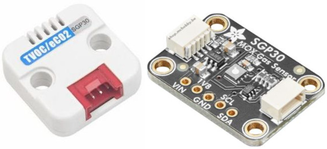
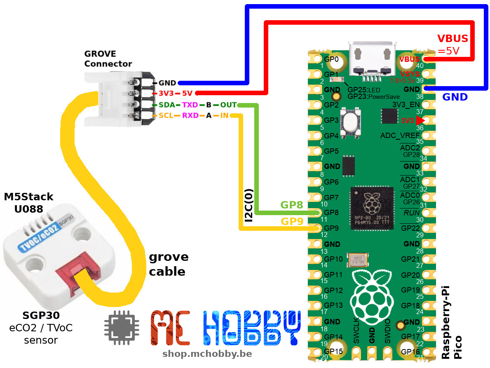

[Ce fichier existe également en FRANCAIS ici](readme.md)

# Using the SGP30 air quality sensor for equivalent CO2, TVOC (M5Stack U088) with MicroPython

The TVOC/eCO2 Grove unit is a digital gas sensor based on the SGP30 chipset.



It measure the cencentration of volatile organic compound in the air (_namely COV_) as well as the CO2 equivalent concentration.

This sensor can be used to measure:
* TVOC concentration which are  waste found in perspiration and expiration in a confined environment. The TVOC is measured in ppb (part per billion) and is a good indicator of the air quality.
* The eCO2 concentration (carbon dioxide equivalent) have a natural concentration of 400 ppm in the air (ppm stand for "part per million"). Any increase of this value indicates a air quality decrease (more CO2 means less oxygen... a brain having less oxygen tend to have headhache ;-)

__5V power supply required:__

This module uses a heating element (approximately 48mA). The module must therefore be supplied with 5V to ensure proper operation.

__Heating time = No data__

During the heating time of the heating element, the sensor returns zero values (so eCO2=400 ppm and VoC=0 bpm)

# Library

The library must be copied to the MicroPython board before using the example.

For online microcontroler:

```
>>> import mip
>>> mip.install("github:mchobby/esp8266-upy/m5stack-u088")
```

Or using the MPRemore tool :

```
mpremote mip install github:mchobby/esp8266-upy/m5stack-u088
```

# Wiring

## Wiring to the Pico



# Test

When the [lib/sgp30.py](lib/sgp30.py) is copied to the board then the user can execute script example.

The [test.py](examples/test.py) script -visible here below- show how to grab the eCO2 & TVOC data.

If only one of the data is required, the user script can rely on `TVOC` or `eCO2` properties.

``` python
from machine import I2C, Pin
from sgp30 import *
import time

# Pico - I2C(0) - sda=GP8, scl=GP9
i2c = I2C(0, sda=Pin.board.GP8, scl=Pin.board.GP9 )
sgp = SGP30( i2c=i2c )

# The first 10 to 20 reading will return "TVOC 0 ppb eCO2 400 ppm" because the
# sensor need to warm up and returns null values.
#
# The baseline method are used for calibration. Read more about it at
# https://learn.adafruit.com/adafruit-sgp30-gas-tvoc-eco2-mox-sensor/arduino-code#baseline-set-and-get-2980166
while True:
	eCO2, TVOC = sgp.iaq_measure()
	print("eCO2 = %d ppm \t TVOC = %d ppb" % (eCO2, TVOC))

	time.sleep(1)
```

# Shopping list
* [SGP30 TVoc/eCO2 M5Stack module (U088)](https://shop.mchobby.be/fr/grove/2322-m5stack-tvoceco2-gas-sensor-unit-sgp30-gro-3232100023222-m5stack.html) @ MCHobby
* [AdaFruit SGP30 : VOC / eCO2 air quality sensor - I2C - Qwiic / StemmaQt](https://shop.mchobby.be/fr/environnemental-press-temp-hrel-gaz/2546-sgp30-capteur-qualite-d-air-voc-eco2-qwiic-stemmaqt-3232100025462-adafruit.html) @ MCHobby
