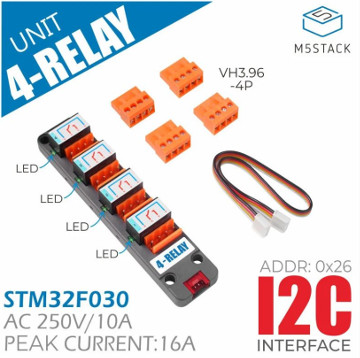
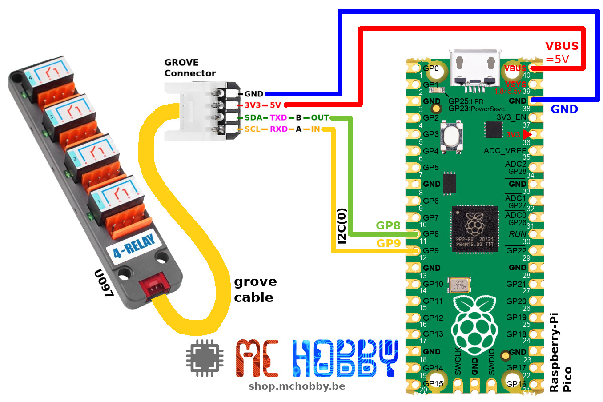
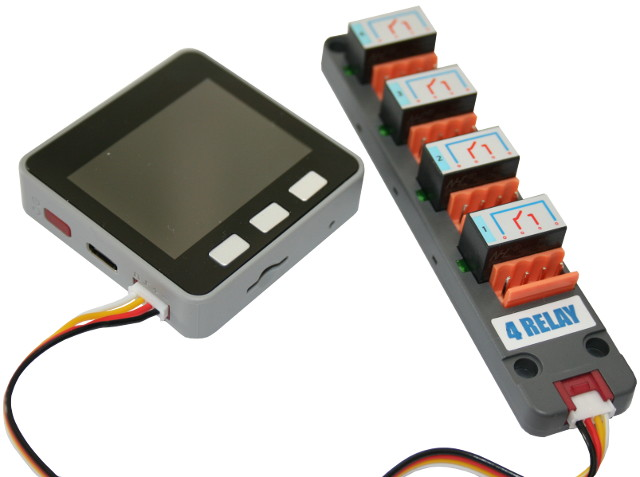

This file also exist in [English here](readme_ENG.md)

# Utiliser le module 4 relais I2C (U097) Grove avec MicroPython

Le module "[U097: 4-Relay Unit](https://shop.m5stack.com/products/4-relay-unit)"  de M5Stack est un module 4 relais contrôlable via I2C. Ce module est équipé d'une interface Grove permettant de faciliter les raccordements sur les plateformes exposant cette connectique.



Pour les autres plateformes, il existe des connecteurs [Grove to Pin](https://shop.mchobby.be/product.php?id_product=2145) (ou [Grove to Pad](https://shop.mchobby.be/product.php?id_product=1929
)) pour ajouter une connectique Grove.

# Bibliothèque

Cette bibliothèque doit être copiée sur la carte MicroPython avant d'utiliser les exemples.

Sur une plateforme connectée:

```
>>> import mip
>>> mip.install("github:mchobby/esp8266-upy/m5stack-u097")
```

Ou via l'utilitaire mpremote :

```
mpremote mip install github:mchobby/esp8266-upy/m5stack-u097
```

# Brancher

## Brancher sur un Pico



## Brancher sur M5Stack Core



# Tester

Après avoir copié la bibliothèque [lib/m4relay.py](lib/m4relay.py), il est possible d'exécuter les scripts d'exemples.

Le script [test_simple.py](examples/test_simple.py) repris ci-dessous indique comment controler les relais.

``` python
from machine import I2C
from m4relay import Relays
from time import sleep

# Pico - I2C(0) - sda=GP8, scl=GP9
i2c = I2C(0)
# M5Stack core
# i2c = I2C( sda=Pin(21), scl=Pin(22) )

rel = Relays(i2c)

# The LED is controled with the Relay

# Switch all relay ON
for i in range(4): # from 1 to 3
	rel.relay( i, True )
	sleep( 1 )

# Switch All relay OFF
for i in range(4): # from 1 to 3
	rel.relay( i, False )
	sleep( 1 )
```

Le script [test_async.py](examples/test_async.py) permet de contrôler les:
* LEDs avec `Relays.led(index=0..3, state=True/False)` et
* Relais avec  `Relays.relay(index=0..3, state=True/False)`

... indépendamment les uns des autres après avoir désynchronisé le contrôle entre relais et LEDs ( `Relays.synchronize( False )` ).

# Où acheter
* [M5Stack U097: 4-Relay Unit](https://shop.mchobby.be/fr/nouveaute/2149-m5stack-module-4-relais-i2c-grove-3232100021495.html) @ MCHobby
* [M5Stack U097: 4-Relay Unit](https://shop.m5stack.com/products/4-relay-unit) @ M5Stack
* [Grove to Pin](https://shop.mchobby.be/product.php?id_product=2145)
* [Grove to Pad](https://shop.mchobby.be/product.php?id_product=1929)
