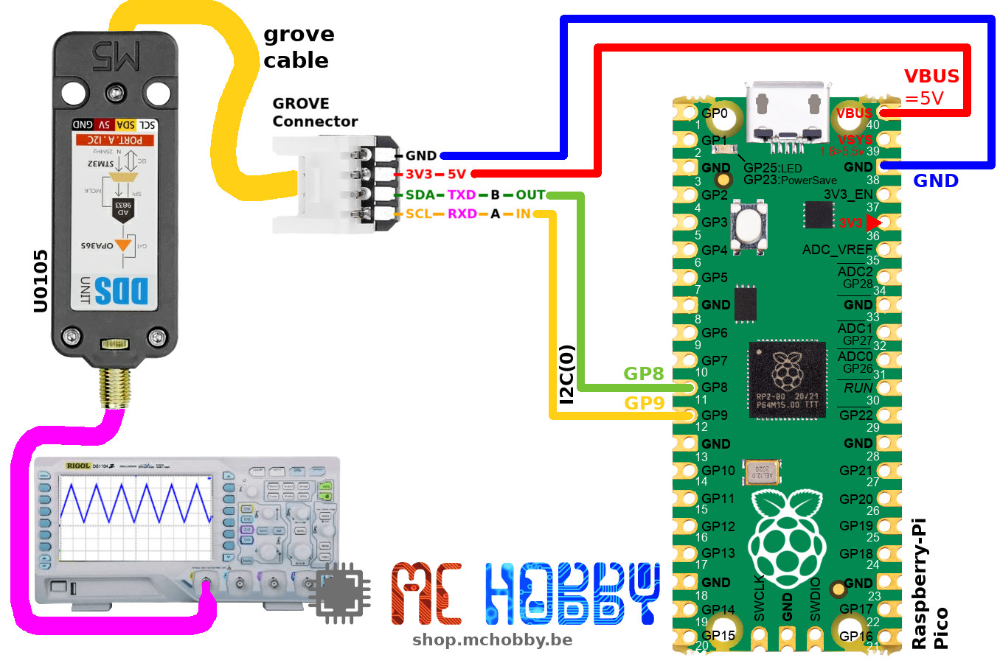
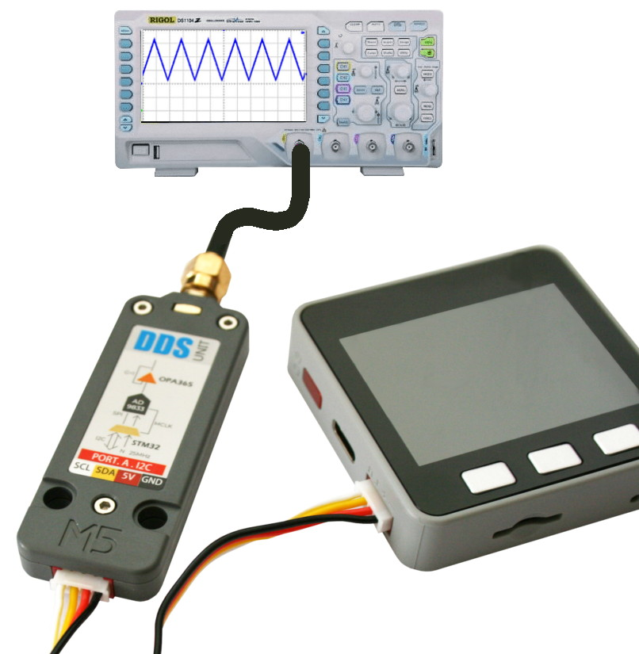
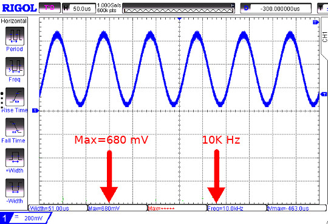
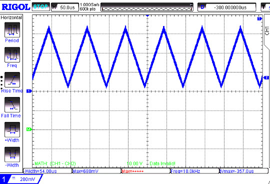
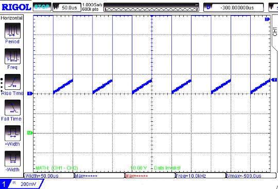
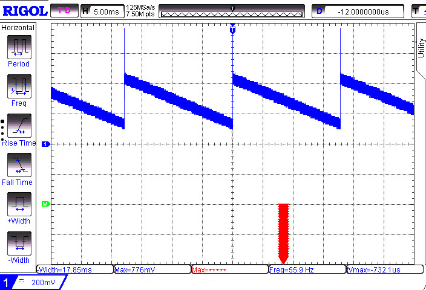

Ce fichier existe également en [Français ici](readme.md)

# Use the DDS Unit AD9833 (U105) with I2C Grove under MicroPython

The "[U105: DDS Unit AD9833](https://shop.m5stack.com/products/dds-unit-ad9833)" from M5Stack is an I2C module used to generates sinewave, square wave, triangle ware and sawtooth wave with tuning of frequence and phase. This module does fit a Grove interface used to ease the wiring on compatible microcontroler plateform.


__Please note:__
* The AD9833 output signal is around 680mV.
* The SawTooth fequency is fixed at 55.9 Hz.

# Library

The library must be copied on the MicroPython board before using the examples.

On a WiFi capable plateform:

```
>>> import mip
>>> mip.install("github:mchobby/esp8266-upy/m5stack-u105")
```

Or via the mpremote utility :

```
mpremote mip install github:mchobby/esp8266-upy/m5stack-u105
```

# Wiring

## Wire to Pico

  

## Wire to M5Stack Core



# Testing

The library [lib/mdds.py](lib/mdds.py) must be copied to the board before running the various examples.

## test_simple

The [test_simple.py](examples/test_simple.py) scipt, visible here below, will creates a 10 KHz sine wave.

``` python
from machine import I2C
from mdds import *
from time import sleep

# Pico - I2C(0) - sda=GP8, scl=GP9
i2c = I2C(0)
# M5Stack core
# i2c = I2C( sda=Pin(21), scl=Pin(22) )

dds = DDS(i2c)

freq = 10000 # 10 KHz
phase = 0
dds.quick_out( SINUS_MODE, freq, phase )
```


## test_waves

The [test_waves.py](examples/test_waves.py) script change the kind of waveform evey second.

``` python
from machine import I2C
from mdds import *
from time import sleep

# Pico - I2C(0) - sda=GP8, scl=GP9
i2c = I2C(0)
# M5Stack core
# i2c = I2C( sda=Pin(21), scl=Pin(22) )

shapes = ( SINUS_MODE, TRIANGLE_MODE, SQUARE_MODE, SAWTOOTH_MODE )
shape_names = { SINUS_MODE : "Sinus", TRIANGLE_MODE : "Triangle",
                SQUARE_MODE : "Square", SAWTOOTH_MODE : "SawTooth"}
dds = DDS(i2c)

while True:
	for shape in shapes:
		print( '%s @ 10 KHz' % shape_names[shape] )
		dds.quick_out( shape, freq=10000, phase=0 )
		sleep( 1 )
```

The screen capture here below shows the triangle and square generated with the module.





## test_freq

The [test_freq.py](examples/test_freq.py) script change the sinewave frequency from 10 KHz (10 000 Hz) to 1 MHz (1 000 000 Hz).

See the [test_freq2.py](examples/test_freq2.py) example for Square and Triangle waveform.

``` python
from machine import I2C
from mdds import *
from time import sleep_ms

# Pico - I2C(0) - sda=GP8, scl=GP9
i2c = I2C(0)
# M5Stack core
# i2c = I2C( sda=Pin(21), scl=Pin(22) )


dds = DDS(i2c)
# quick_out set & use the freq register 0 & phase register 0
dds.quick_out( SINUS_MODE, freq=10000, phase=0 )

# set_freq() is I2C bus efficient but will reset signal mode to sinus
while True:
	for f in range( 10000, 1000000, 10000 ):
		print( 'Set freq @ %s KHz' % (f//1000) )
		dds.set_freq( reg=0, freq=f )
		sleep_ms(100)
```

## test_saw

The [test_saw.py](examples/test_saw.py) script does set the signal output to sawtooth.

__REMARKS:__ The sawtooth signal is generated at fixed 55.9Hz frequency.

``` python
from machine import I2C
from mdds import *
from time import sleep

# Pico - I2C(0) - sda=GP8, scl=GP9
i2c = I2C(0)
# M5Stack core
# i2c = I2C( sda=Pin(21), scl=Pin(22) )

dds = DDS(i2c)

# Generates the SAW TOOTH signal at 55.9Hz (fixed frequency)
dds.quick_out( SAWTOOTH_MODE, freq=1, phase=0 )
```



# Où acheter
* [M5Stack U105: DDS Unit (AD9833)](https://shop.mchobby.be/fr/nouveaute/2151-m5stack-generateur-de-signal-dds-stm32f0-ad9833-grove-3232100021518.html) @ MCHobby
* [M5Stack U105: DDS Unit (AD9833)](https://shop.m5stack.com/products/dds-unit-ad9833) @ M5Stack
* [Grove to Pin](https://shop.mchobby.be/product.php?id_product=2145)
* [Grove to Pad](https://shop.mchobby.be/product.php?id_product=1929)
