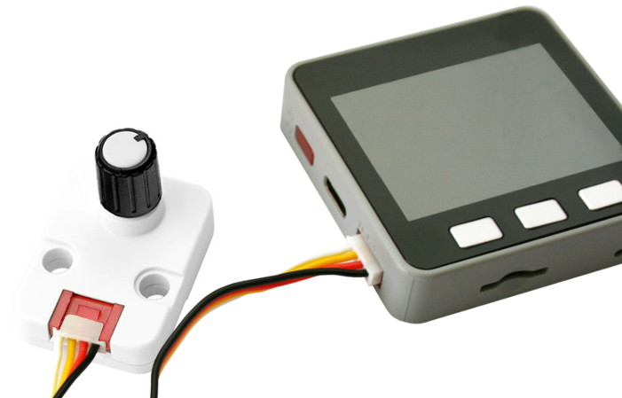

Ce fichier existe également en [Français ici](readme.md)

# Use the Encoder unit (U135, I2C, Grove) with MicroPython

The "[U135: Encoder Unit I2C](https://shop.m5stack.com/products/encoder-unit)" from M5Stack is an I2C unit allowing to create rotative controler over I2C bus thanks to its 30 pulses encoder. The encoder includes a clickable button as well as smart RGB LEDs (SK6812, also known as NeoPixels). The module is fitted with a Grove interface making the wiring dead simple.


The encoder will:
* -32768 <= encoder_position <= 32767
* Button state detection (pressed or not)
* Two RGB LEDs controled with a (R,G,B) tuple from (0,0,0) to (255,255,255)

__Please note:__
* The unit must be powered with 5V (for the RGB LEDs).
* I2C signals are in 3.3V logic.

# Wiring

## Wire to the Pico


## Wire to a M5Stack Core

This is quite simple...connect it to you core/core2 by using a Grove cable.



# Test

Before testing the unit, the library [lib/i2cenc.py](lib/i2cenc.py) must be copied to the board prior to the execution of any examples.

## test

The [test.py](examples/test.py) script, visible here below, is used to test the basic features of the unit.

``` python
from machine import I2C
from i2cenc import I2CEncoder
from time import sleep

# Pico - I2C(0) - sda=GP8, scl=GP9
i2c = I2C(0)
# M5Stack core
# i2c = I2C( sda=Pin(21), scl=Pin(22) )

enc = I2CEncoder(i2c)

print( "Testing the LEDs" )
enc.color = (255,0,0) # Red
sleep( 0.5 )
enc.color = (0,255,0) # Green
sleep( 0.5 )
enc.color = (0,0,255) # Blue
sleep( 1 )
enc.color = (0,0,0) # Off

print( "Press the button and rotate the switch")

last_v = 0
while True:
	if enc.button: # Is the button currently pressed ?
		print( 'Button PRESSED')
		enc.position = 0 # reset the counter - not working!

	v = enc.position # -32768 <= v <= 32767
	if v != last_v: # Only display if value changes
		print( v )
		last_v = v
	sleep( 0.05 )
```

## test_2led
The [test_2led.py](examples/test_2led.py) script show how to control each of the both LEDs inside the unit.

Here below a code excerpt showing how to do it.

``` python
...
enc = I2CEncoder(i2c)

enc.set_led( 1, (255,0,0) ) # Red
enc.set_led( 2, (0,255,0) ) # Green
# Turn the both LED off
enc.color = (0,0,0)
```

## test_relative
The [test_relative.py](examples/test_relative.py) script shows how to workaround a technical limitation of the unit.

Indeed, as stated on the [technical documentation](https://docs.m5stack.com/en/unit/encoder) it is possible to change the counter value on the unit (by sending a new arbitrary value to the register). Apparently, this feature was not handled by my encoder unit (it is not working)!

So I did wrote the `I2CRelEncoder` class containing the `reset()` method and the `rel_position` property returning the encoder position since the last call to `reset()`.
