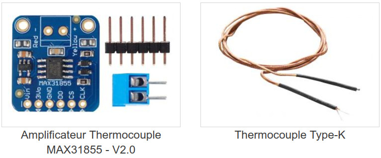
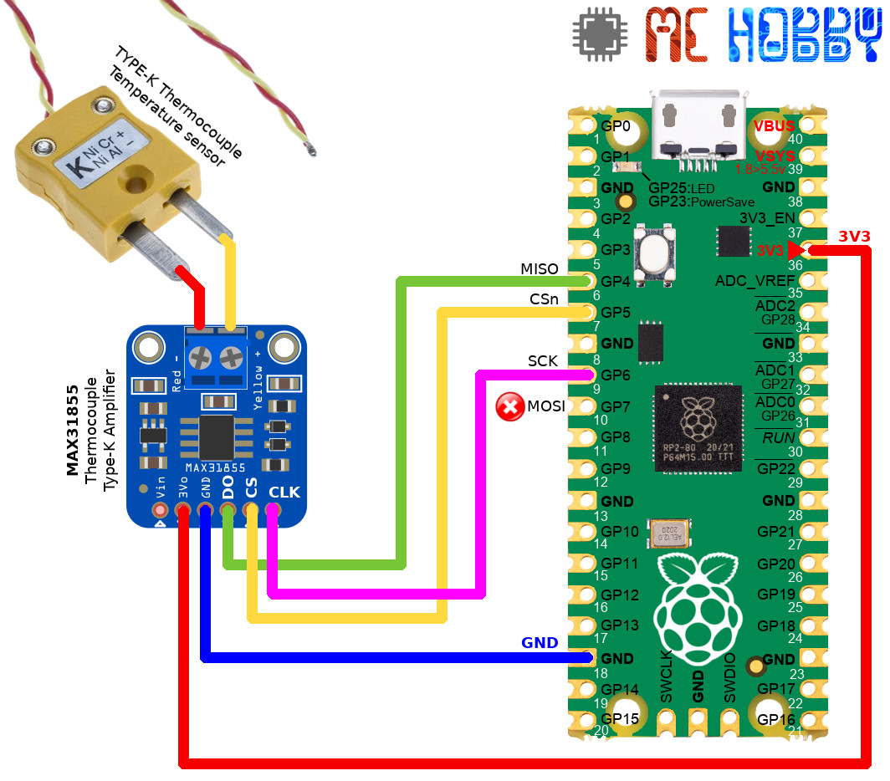

[This file also exists in ENGLISH here](readme_ENG.md)

# Utiliser un ThermoCouple Type-K + MAX31855 avec votre carte MicroPython

Les thermocouples de type-K sont sont constitués d'un couple de matériaux produisant un couple thermoélectrique (la tension à la jonction des matériaux, varie en fonction de la température).

Un thermocouple de type-K permet de relever une température entre -200°C et 1350°C.

Cependant, la tension générée par une telle sonde est tellement faible qu'il faut utiliser un amplificateur approprié, ce que fait le composant MAX31855 que l'on retrouve sur des cartes breakouts.



La carte breakout MAX31855 communique avec le microcontrôleur à l'aide d'un bus SPI __configuré en mode 0__.

Seul le signal MISO est utilisé sur le bus, le signal MOSI __ne devra donc pas__ être raccordé entre le MAX31855 et le MCU. Cependant, MOSI ne pourra pas être ré-alloué à une autre tâche puisqu'il appartient physiquement au bus SPI.

# Calibration recommandée

Un __même thermocouple__ branché sur des amplificateurs différents retournerons des températures sensiblement différente de l'ordre de 1 à 2 degrés (ex: MAX31855 et SIGLENT SDM3045x, différence de 2.7°C).

Cela rappelle l'importance du processus d'étalonnage permettant d'appliquer, par la suite, les corrections nécessaires aux différentes lectures réalisée.  

# Bibliothèque

 Cette bibliothèque doit être copiée sur la carte MicroPython avant d'utiliser les exemples.

 Sur une plateforme connectée:

 ```
 >>> import mip
 >>> mip.install("github:mchobby/esp8266-upy/max31855")
 ```

 Ou via l'utilitaire mpremote :

 ```
 mpremote mip install github:mchobby/esp8266-upy/max31855
 ```

# Brancher

## Raspberry-Pi Pico

Voici comment réaliser les branchements avec un Raspberry-Pi Pico.



# Tester

Avant de pouvoir lire la température, il est nécessaire de copier la bibliothèque [lib/max31855.py](lib/max31855.py) sur votre carte MicroPython.

L'exemple [test_simple.py](examples/test_simple.py), repris ci-dessous, permet de lire la température de la sonde.

``` python
from machine import Pin, SPI
from max31855 import MAX31855
import time

# Pico - SPI(0) - GP5=CSn, GP4=Miso, GP6=Sck, GP7=Mosi (allocated but not used)
cs = Pin(5, Pin.OUT, value=True ) # SPI CSn
spi = SPI(0, baudrate=5000000, polarity=0, phase=0)

tmc = MAX31855( spi=spi, cs_pin= cs )

while True:
	print( "Temp: %s" % tmc.temperature() )
	time.sleep( 1 )
```

Ce qui retourne le résultat suivant:

```
Temp: 25.8
Temp: 25.8
Temp: 25.6
Temp: 25.7
Temp: 25.7
Temp: 25.8
```

# Où acheter
* [Raspberry-Pi Pico](https://shop.mchobby.be/fr/pico-rp2040/2025-pico-rp2040-microcontroleur-2-coeurs-raspberry-pi-3232100020252.html)
* [Sonde température Type-K](https://www.adafruit.com/product/269) @ Adafruit Industries
* [Sonde température Type-K](https://shop.mchobby.be/fr/temperature/301-thermocouple-type-k-3232100003019.html)
* [Amplificateur MAX31855](https://shop.mchobby.be/fr/temperature/302-amplificateur-thermocouple-max31855-v20-3232100003026-adafruit.html)
