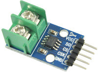
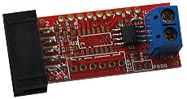
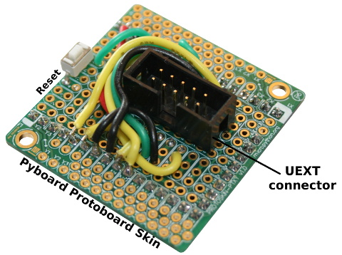
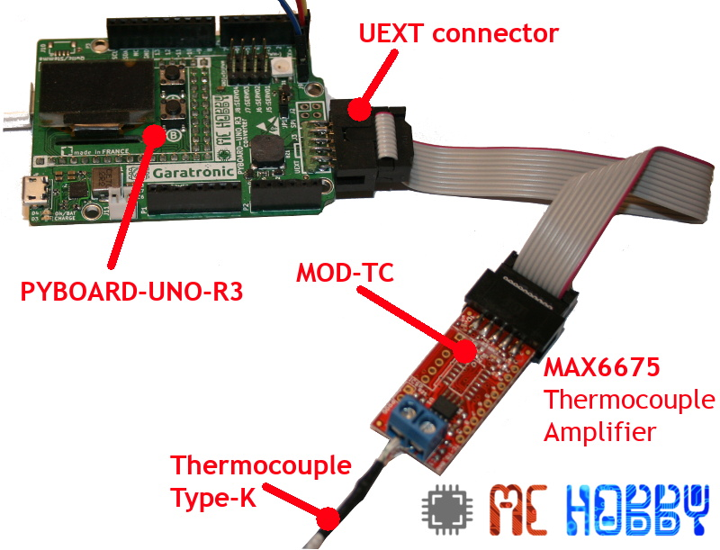
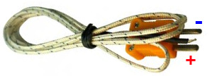

[This file also exists in ENGLISH](readme_ENG.md)

# Utiliser un MAX6675 (amplificateur thermocouple Type-K) pour lire la température avec MicroPython

Le MAX6675 échantillonne le signal en provenance d'une d'un thermocouple Type-K et produit des données avec une résolution 12-bits (SPI en sens unique, SPITM-compatible, en lecture seule).

Ce convertisseur à une résolution de 0.25°C, permettant ainsi de lire une température aussi élevée que +1024°C (avec un thermocouple protégé avec une fibre de verre) et expose une précision de 8 LSBs pour une gamme de température de 0°C à +700°C.

Le MAX6675 est très populaire et est présent sur de nombreux breakouts.



Le module MOD-TC d'Olimex utilise un MAX6675 sur une carte exposant un connecteur UEXT pour faciliter la connexion avec des cartes microcontrôleurs exposant un UEXT.



# Bibliothèque

Cette bibliothèque doit être copiée sur la carte MicroPython avant d'utiliser les exemples.

Sur une plateforme connectée:

```
>>> import mip
>>> mip.install("github:mchobby/esp8266-upy/max6675")
```

Ou via l'utilitaire mpremote :

```
mpremote mip install github:mchobby/esp8266-upy/max6675
```

# Brancher

##  Breakout MAX6675 sur PyBoard

__To do__

## MOD-TC (MAX6675) : Port UEXT sur Pyboard

Il est possible de préparer un [breakout UEXT pour Pyboard](https://github.com/mchobby/pyboard-driver/tree/master/UEXT) pour brancher facilement des cartes UEXT sur la Pyboard.



Il est possible de connecter le module MOD-TC par l'intermédiaire de l'adaptateur [PYBOARD-UNO-R3](https://github.com/mchobby/pyboard-driver/tree/master/UNO-R3).


# Tester

## Attention au sens de raccordement du thermocouple
Il y a un sens de connexion sur un thermocouple.

Par exemple, aux alentour de 24...27°C, un Type-K produit à peu près le même résultat lorsqu'il est connecté à l'endroit ou à l'envers.
Sans contrôle attentif, l'erreur de raccordement pourrait passer totalement inaperçu lors d'un test préliminaire.

__Par contre, si le capteur retourne une température diminuant alors qu'elle devrait augmenter alors c'est que le thermocouple est monté à l'envers.__



Dans ce cas, __inverser les deux points de branchement__ du thermocouple sur le bornier :-)

## Bibliothèque max6675

Avant d'utiliser le script d'exemple, il est nécessaire de transférer la __bibliothèque max6675__ sur votre carte micropython.
* Copiez le fichier `max6675.py` sur la carte micropython.

Vous pouvez également transférer les scripts de test `test*.py` sur la carte PyBoard.

## Exemple avec MOD-TC

Le script `test_max6675_uext.py` permet de tester le module MOD-TC d'Olimex.

``` python
from max6675 import MAX6675
from time import sleep

print( "MAX6675 - Lecture du thermocouple")
# Adaptater PYBOARD-UEXT -> cs_pin = "Y5"
# sensor = MAX6675( data_pin = "Y7", clk_pin = "Y6" , cs_pin="Y5" )

# Adaptater PYBOARD-UNO-R3 -> cs_pin = "X8"
sensor = MAX6675( data_pin = "Y7", clk_pin = "Y6" , cs_pin="X8" )


# Attendre que le MAX6675 se stabilise
sleep( 0.500 )

while True:
	print( "C = %s" % sensor.temperature )
	sleep(1)
```

Ce qui produit le résultat suivant lorsque le script est exécuté

```
C = 24.25  --> température ambiante
C = 23.75
C = 24.0
C = 23.75
C = 24.0
C = 26.0   --> contact avec doigt
C = 28.25
C = 29.5
C = 30.5   --> retirer doigt
C = 28.75
C = 28.5
C = 27.75
C = 27.0
C = 26.0
C = 25.5
C = 26.0
C = 25.5
C = 24.75  --> Temperature ambiante
C = 24.5
C = 24.75
C = 24.75
...
```

## Exemple avec un breakout MAX6675

__To do__

# Où acheter
* [MicroPython board](https://shop.mchobby.be/fr/56-micropython) @ MCHobby
* [MOD-TC with MAX6675](https://shop.mchobby.be/fr/nouveaute/1623-mod-tc-interface-thermo-couple-type-k-avec-max6675-et-connecteur-uext-3232100016231-olimex.html) @ MCHobby
* [MOD-TC with MAX6675](https://www.olimex.com/Products/Modules/Sensors/MOD-TC/open-source-hardware) @ Olimex
