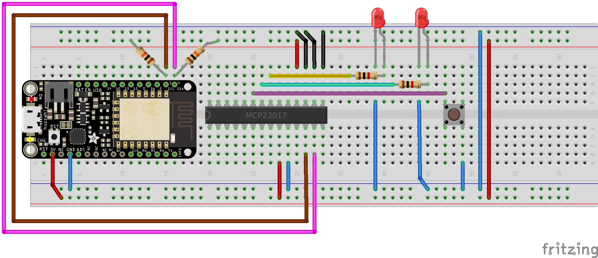
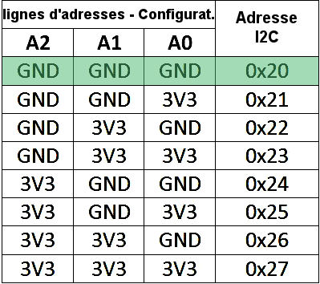

# Ajouter des GPIO avec le mcp230xx (I2C)

Ajout de GPIO sous MicroPython grâce à la série de composant I2C "GPIO expanders MCP23017" et "MCP23008" sur bus I2C . Travail dérivé de  Adafruit_MCP230xx.py disponible sur https://github.com/adafruit/Adafruit_Python_GPIO

Le port MicroPython réalisé par ShrimpingIt sur son GitHub https://github.com/ShrimpingIt/micropython-mcp230xx (merci à ShrimpingIt pour son magnifique travail)

Modifié pour:
* Recevoir le bus I2C en paramètre (compatibilité avec les autres bibliothèques dans ce dépôt).
* Epuration (eliminer les constantes non utilisée, compacter le code, réduction des commentaires).
* Schéma de raccordement Feather ESP8266
* Exemples

A été testé pour sur ESP8266 sous 1.8.7 et 1.9.1 avec MCP23017 (uniquement). Devrais également fonctionner avec le MCP23008.

## Raccordement



Attention au placement: Il faut utiliser le détrompeur du MCP23017 pour placer le circuit intégré dans le bon sens!

Branchement du MCP23017
* 9 =>  3.3V (alimentation)
* 10 => GND (masse)
* 12 => ESP8266 GPIO5 [I2C SCL]
* 13 => ESP8266 GPIO4 [I2C SDA]
* 18 => 3.3V (activation du module)

Il faut également ajouter les résistances pull-up du bus I2C.
* ESP8266 GPIO5 [I2C SCL] --( R 10kOhms )--> 3.3V  
* ESP8266 GPIO4 [I2C SDA] --( R 10kOhms )--> 3.3V

L'adresse du MCP23017 est fixée à l'aide des broches 15, 16, 17. Pour l'adresse 0x20, il faut effectuer les branchements suivants:
* 15 => GND
* 16 => GND
* 17 => GND

Bien que le MCP23017 soit souvent utilisé sous 5V, il est recommander l'alimenter en 3.3V afin que les niveaux logiques SDA et SCL soient compatible avec l'ESP8266 (soit logique 3.3V).

# Exemples

L'exemple suivant démontre comment modifier l'état des sorties 0 et 1 sur le MCP23017. Les Leds qui y sont branchées clignoterons en alternance.

```python
from time import sleep
from machine import I2C, Pin
from mcp230xx import MCP23017

# Création bus I2C et MCP23017
i2c = I2C( sda=Pin(4), scl=Pin(5), freq=20000 )
mcp = MCP23017( i2c=i2c )

# Configurer les broches 0 et 1 en sortie
mcp.setup( 0, Pin.OUT )
mcp.setup( 1, Pin.OUT )

for i in range( 10 ):
    # Activer sortie 0
    mcp.output( 0, True )
    sleep( 0.5 )
    mcp.output( 1, True )
    sleep( 0.5 )
    # Désactiver sortie 1
    mcp.output( 0, False )
    sleep( 0.5 )
    mcp.output( 1, False )
    sleep( 0.5 )
```

L'exemple suivant affiche "Press!" lorsque le bouton branché sur l'entrée 3 est pressé.

Activation de la résistance Pull-Up sur entrée 3. Donc:
* L'entrée 3 est à la masse lorsque le bouton est pressé!
* L'entrée 3 est au niveau haut lorsque le bouton est relâché.

Note: l'entrée 3 est lue à l'aide de l'instruction __mcp.input(3)__

```python
from time import sleep,time
from machine import I2C, Pin
from mcp230xx import MCP23017

# Création bus I2C et MCP23017
i2c = I2C( sda=Pin(4), scl=Pin(5), freq=20000 )
mcp = MCP23017( i2c=i2c )

mcp.setup( 3, Pin.IN ) # broche 3 en entrée
mcp.pullup( 3, True )  # Activer la résistance pull-up sur entrée 3

Print( "Appuyer sur bouton" )
start = time()
while (time()-start) < 20: # pendant 20 sec max
    # mcp.input(3) retourne état de la broche
    print( '%s : etat = %s' % (time(), '...' if mcp.input(3) else 'Press!') )
    sleep( 0.5 )
```

L'exemple suivant montre comment modifier plusieurs broches en une seule opération en utilisant un dictionnaire.

Par exemple:  { 0 : True, 1 : False }

```python
from machine import I2C, Pin
from mcp230xx import MCP23017

# Création bus I2C et MCP23017
i2c = I2C( sda=Pin(4), scl=Pin(5), freq=20000 )
mcp = MCP23017( i2c=i2c )

# controle de quelques broches en sortie
pins = [10, 11, 12, 13, 14, 15]
valeurs = {}
for pin_num in pins:
    mcp.setup( pin_num, Pin.OUT )
    valeurs[pin_num] = True
# activer toutes les broches en une seule opération
mcp.output_pins( valeurs )
```

L'exemple suivant montre comment lire plusieurs broches en une seule opération.

```python
from time import sleep
from machine import I2C, Pin
from mcp230xx import MCP23017

# Création bus I2C et MCP23017
i2c = I2C( sda=Pin(4), scl=Pin(5), freq=20000 )
mcp = MCP23017( i2c=i2c )

# Surveille plusieurs broches d'entrée et affiche les différentes valeurs
pins = [3,4,5,6]
for pin_num in pins:
    mcp.setup(pin_num, Pin.IN)
    mcp.pullup(pin_num, True)
while True:
    print( mcp.input_pins(pins) )
    sleep( 1 )
```

La méthode ```input_pins(pins_list)``` retourne une liste de valeurs pour les différentes entrées ```pins_list```

Ce dernier script retourne le résultat suivant:

```python
[True, True, True, True]
[True, True, True, True]
[True, True, True, True]
[False, True, True, True]
[False, True, True, True]
[False, True, True, True]
[False, True, True, True]
[True, True, True, True]

```

Où la valeur passant de True à False correspond à l'entrée 3. Valeur passant a False lorsque le bouton est pressé.

## Brochage du MCP23017


## Adresses du MCP23017

Il est possible d'utiliser plusieurs MCP23017 sur un même bus I2C en modifiant l'adresse du composant à l'aide des broches d'adresses A0, A1, A2.

Le MCP23017 est communément utilisé avec l'adresse 0x20 (A0, A1 et A2 à la masse/GND).



Le constructeur par défaut utilise l'adresse 0x20 (A0, A1 et A2 à la masse/GND). Cela signifie que MCP23017( i2c ) est équivalent à MPC23017( i2c, address=0x20 ).

Il est cependant possible de préciser l'adresse du module avec le paramètre "address".

```python
MPC23017( i2c, address=0x26 )
```
