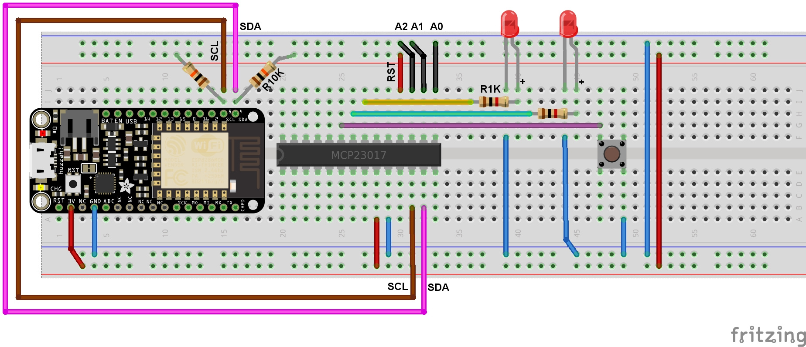
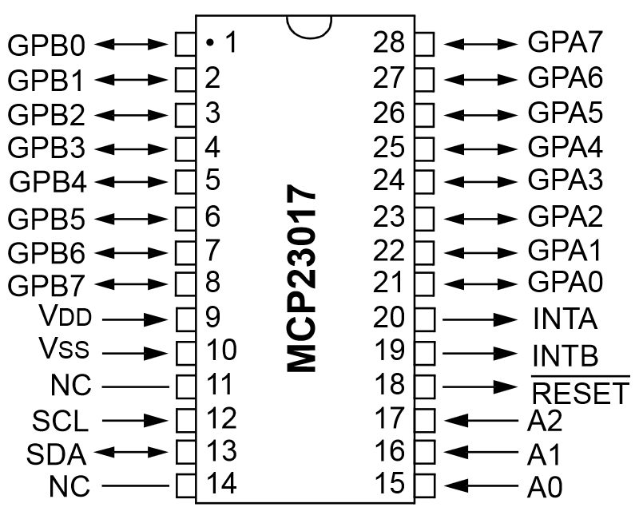

[Ce fichier existe également en FRANCAIS ici](readme.md)

# Add GPIOs with the mcp230xx (I2C)

Add GPIO to your MicroPython microcontroler thanks to the I2C "GPIO expanders MCP23017" & "MCP23008". This work is derivated from Adafruit_MCP230xx.py available at https://github.com/adafruit/Adafruit_Python_GPIO

The MicroPython portage was made by [ShrimpingIt on this repository](https://github.com/ShrimpingIt/micropython-mcp230xx). Thanks to ShrimpingIt for this nice work.

The initial library have been modified for:
* Get the I2C bus as parameter (make it plateform agnostique).
* Code review (removing unused code, make it more compact, reducing comment).
* Append wiring
* Append examples

MCP23017 class have been tested. Should also work with MCP23008 (untested)..

# Library

The library must be copied on the MicroPython board before using the examples.

On a WiFi capable plateform:

```
>>> import mip
>>> mip.install("github:mchobby/esp8266-upy/mcp230xx")
```

Or via the mpremote utility :

```
mpremote mip install github:mchobby/esp8266-upy/mcp230xx
```

# Wiring



Notice: the chip have an "half moon" indicator. Use this to place the MCP23017 in the right orientation!

MCP23017 wiring
* 9 =>  3.3V (power)
* 10 => GND (ground)
* 12 => ESP8266 GPIO5 [I2C SCL]
* 13 => ESP8266 GPIO4 [I2C SDA]
* 18 => 3.3V (activate the chip)

Pull-up resistor also need to be placed on the I2C lines.
* ESP8266 GPIO5 [I2C SCL] --( R 10kOhms )--> 3.3V  
* ESP8266 GPIO4 [I2C SDA] --( R 10kOhms )--> 3.3V

The MCP23017 I2C address is set with the 15, 16, 17 pins. To have the address 0x20, you will need to use the following link:
* 15 => GND
* 16 => GND
* 17 => GND

The MCP23017 is often used with 5V but can also be used with 3.3V (which is required when using 3.3V based microcontroler).

# Test

## Test 1

The following example shows how to change output state for 0 and 1 on the MCP23017. LEDs that are wired on the MCP will blink as state changes.

```python
from time import sleep
from machine import I2C, Pin
from mcp230xx import MCP23017

# Création bus I2C et MCP23017
i2c = I2C( sda=Pin(4), scl=Pin(5), freq=20000 )
mcp = MCP23017( i2c=i2c )

# Configurer les broches 0 et 1 en sortie
mcp.setup( 0, Pin.OUT )
mcp.setup( 1, Pin.OUT )

for i in range( 10 ):
    # Activer sortie 0
    mcp.output( 0, True )
    sleep( 0.5 )
    mcp.output( 1, True )
    sleep( 0.5 )
    # Désactiver sortie 1
    mcp.output( 0, False )
    sleep( 0.5 )
    mcp.output( 1, False )
    sleep( 0.5 )
```

## Test 2

The next example display the text "Press!" when the button on the input 3 is triggered.

Activates the pull-up on the input 3. As a result:
* The input 3 is down when the button is pressed!
* The input 3 is hight when the button is not pressed.

Notice: The input 3 is read with instruction __mcp.input(3)__

```python
from time import sleep,time
from machine import I2C, Pin
from mcp230xx import MCP23017

# Création bus I2C et MCP23017
i2c = I2C( sda=Pin(4), scl=Pin(5), freq=20000 )
mcp = MCP23017( i2c=i2c )

mcp.setup( 3, Pin.IN ) # broche 3 en entrée
mcp.pullup( 3, True )  # Activer la résistance pull-up sur entrée 3

Print( "Appuyer sur bouton" )
start = time()
while (time()-start) < 20: # pendant 20 sec max
    # mcp.input(3) retourne état de la broche
    print( '%s : etat = %s' % (time(), '...' if mcp.input(3) else 'Press!') )
    sleep( 0.5 )
```

## Test 3

The following example show how to modify several pins with only one call (and using a dictionnary).

EG:  { 0 : True, 1 : False }

```python
from machine import I2C, Pin
from mcp230xx import MCP23017

# Création bus I2C et MCP23017
i2c = I2C( sda=Pin(4), scl=Pin(5), freq=20000 )
mcp = MCP23017( i2c=i2c )

# controle de quelques broches en sortie
pins = [10, 11, 12, 13, 14, 15]
valeurs = {}
for pin_num in pins:
    mcp.setup( pin_num, Pin.OUT )
    valeurs[pin_num] = True
# activer toutes les broches en une seule opération
mcp.output_pins( valeurs )
```

## Test 4

The following example shows how to read several pins with a single operation.

```python
from time import sleep
from machine import I2C, Pin
from mcp230xx import MCP23017

# Création bus I2C et MCP23017
i2c = I2C( sda=Pin(4), scl=Pin(5), freq=20000 )
mcp = MCP23017( i2c=i2c )

# Surveille plusieurs broches d'entrée et affiche les différentes valeurs
pins = [3,4,5,6]
for pin_num in pins:
    mcp.setup(pin_num, Pin.IN)
    mcp.pullup(pin_num, True)
while True:
    print( mcp.input_pins(pins) )
    sleep( 1 )
```

The  ```input_pins(pins_list)``` method resturn a list of values with one entry for each item in the  ```pins_list```

When running, the script will display the following in the REPL session

```python
[True, True, True, True]
[True, True, True, True]
[True, True, True, True]
[False, True, True, True]
[False, True, True, True]
[False, True, True, True]
[False, True, True, True]
[True, True, True, True]

```

where each of the first True/False value of each line match the value of the input 3. The value is False when the button is pressed.

# Ressources

## MCP23017 Pinout



## MCP23017 I2C address

You can use several MCP23017 on the same I2C bus as long as each of them have a unique address on the bus. Address can be changed with the A0, A1, A2.

The MCP23017 is usually use at address 0x20 (A0, A1 & A2 grounded).


The constructor use the default address 0x20. The call to `MCP23017( i2c )` is the same as `MPC23017( i2c, address=0x20 )` .

You can create the MCP23017 class to use another I2C address by specifing a value for the  `address` parameter.

```python
MPC23017( i2c, address=0x26 )
```
