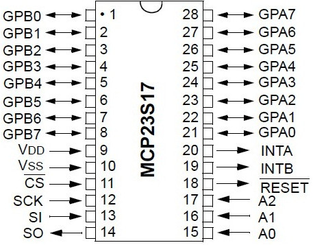
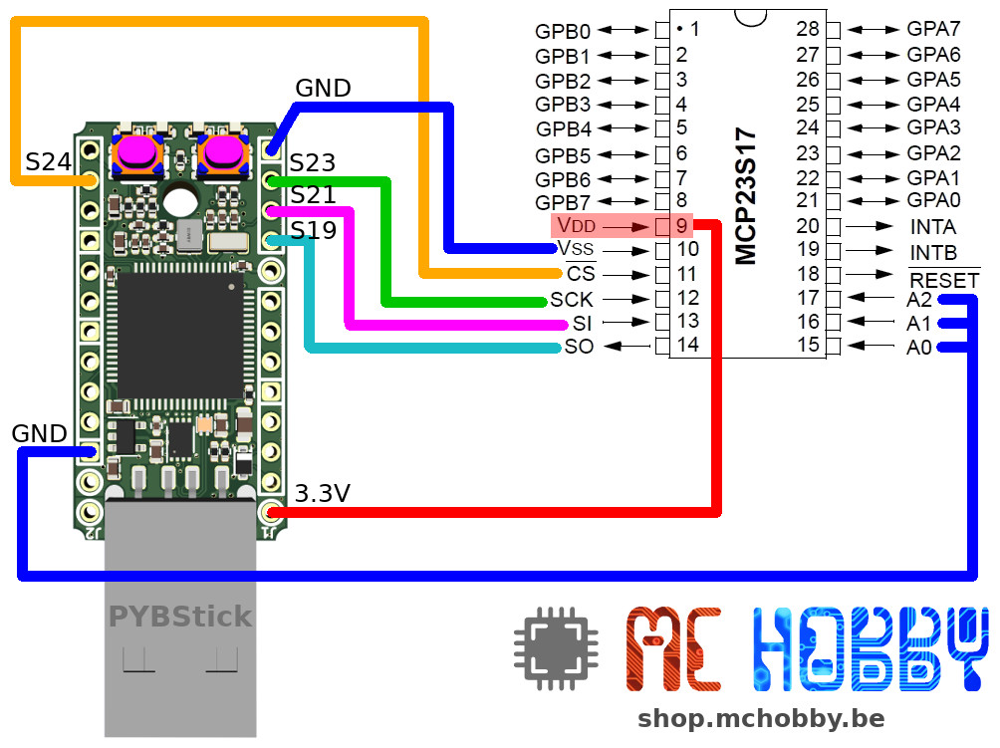
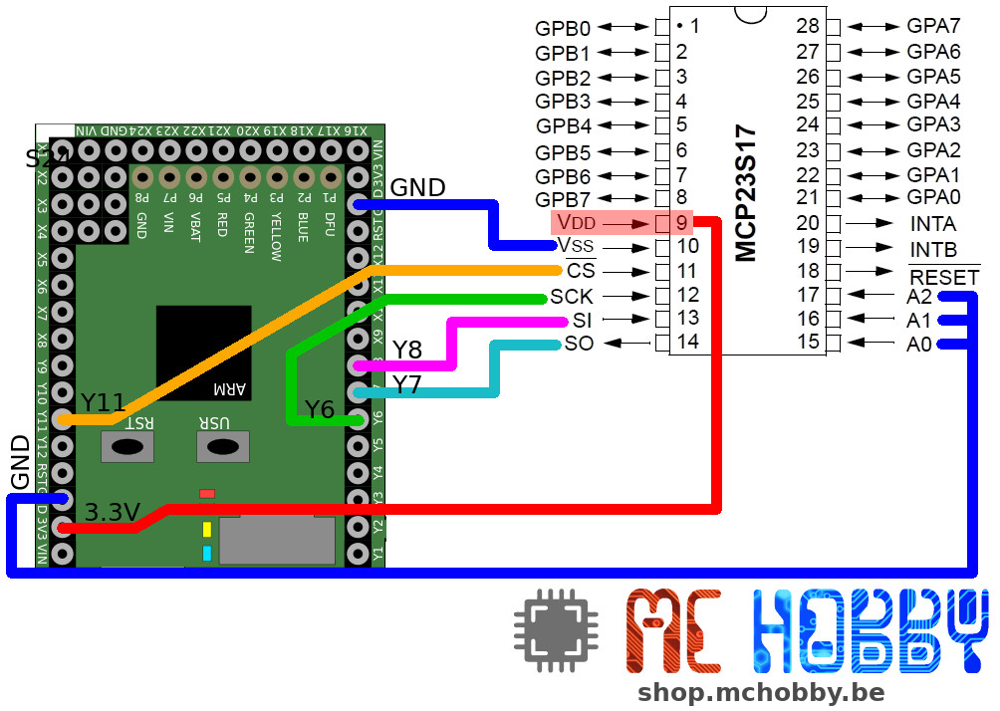

[Ce fichier existe également en FRANCAIS](readme.md)

# Add GPIOs with the mcp23Sxx (SPI)

The MCP23S17 is the SPI équivalent of the [MCP23017 which runs over I2C bus](https://github.com/mchobby/esp8266-upy/tree/master/mcp230xx).

The MCP23S17 allows to add 16 GPIOs to your MicroPython microcontroler.

The SPI uses 4 channels: MISO, MOSI, CLK & CE. This last CE signal (Chip Enabled) is used to activate the component on the SPI bus as many components can share the SPI bus (so the microcontroler needs to activates on target ship). The CE signal is also used to control SPI transaction on the target component, so it must often be wired even if only one component is wired to the bus.

The MCP23S17 do have 3 address bits to change the hardware ID (device_id) of the component as the MCP23S17 protocol include the device_id while exchanging data between the Host <-> MCP.

## Compatibility with the MCP23017

The MCP23S17 driver does expose the same API as the [MCP23017 (i2c)](https://github.com/mchobby/esp8266-upy/tree/master/mcp230xx), so you can interchange the componants and adapts the script (and wiring) to use the proper bus.

## Test

This driver has been tested against the [HAT PiFace Digital](https://shop.mchobby.be/fr/pi-hats/221-piface-digital-2-pour-raspberry-pi-3232100002210.html) based on a MCP23S17 at heart.

The various [examples](examples) scripts will help you with the usage of the [mcp23Sxx.py](lib) library.

# Wiring

Here how to wire the MCP23S17 to a MicroPython PYBStick board.

The schematic here below wires the MCP23S17 to the MicroPython Pyboard.

