# Utiliser un BUS CAN avec MCP2515 sous MicroPython

[This file also exists in ENGLISH](readme_ENG.md)


Le bus CAN (Controller Area Network) est un réseau de communication deux fils permettant la transmission fiable de données (0 à 64 bits). Ce bus est utilisé dans un large éventail d'applications industrielles & robotiques, applications automobiles ainsi que les modèles réduits ferroviaires.

# Breakout CAN
Le breakout CAN-SPI-BRK est un contrôleur CAN utilisant un MCP2515 interfacé sur un us SPI. 

Le CAN-SPI-BRK est conçu autour d'une logique 3V3 et est prêt à l'usage sur bus CAN.

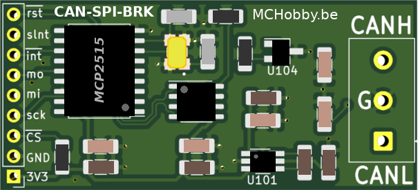

Le contrôleur CAN est capable de gérer le _buffering_ et la transmission de 3 messages en sortie ainsi que la réception de 2 messages en entrée. Le MCP2515 est également capabnle d'effectuer des opérations de filtrage sur les messages réceptionnés.

La carte breakout propose également:

* La résistance de terminaison de 120Ω (peut-être désactivée).
* Un transceiver pour convertir les signaux du MCP2515 vers CAN-H et CAN-L.
* Une protection ESD pour les lignes CAN-H et CAN-L .
* Un régulateur step-up de 5V pour alimenter le bus CAN (100mA max)

## Credit
Cette librairie utilisée avec le breakout est basée sur la travail de _capella-ben_ et son dépôt [microPython_MCP2515](https://github.com/capella-ben/microPython_MCP2515). Travail publié sous la licence MIT.

Cette implémentation et documentation attachée préserve la me license MIT.

# Configuration CAN minimale
Il est nécessaire d'établir une configuration matérielle et logicielle minimale pour transmettre des données sur votre bus.

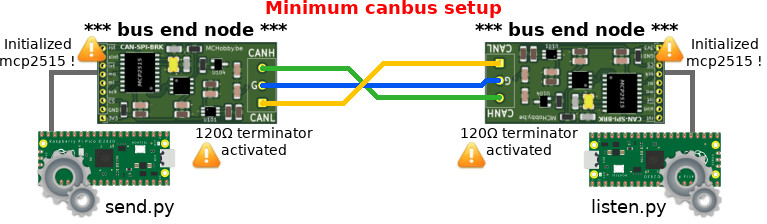

Voici les règles à suivre:

* Connecter ensembles les points CAN-H (de même pour CAN-L). Partager une masse commune n'est pas une obligation mais une bonne pratique recommandée.
* Chaque noeud en fin du bus doit avoir la résistance de terminaison activée.
* Les deux noueuds doivent être alimentés et __initialisés par logiciel__.

Il est crucial d'avoir les deux premiers noeuds (qui sont aussi les fins de bus) correctement initialisés pour disposer d'un bus CAN en état de marche. Cela permet au noeud émetteur d'obtenir un bit ACK pendant la transmission du message (sinon la trame CAN sera envoyée encore et encore sur le bus).

# A propos du bus CAN
Le bus CAN (Controller Area Network) est une bus/réseau de communication deux fils permettant une transmission de donnée fiable. Normalisé par l'ISO11898, le bus CAN supporte des Node ID (identifiant de noeud) encodé sur 11bits (CAN 2.0A) ou 29 bits (CAN 2.0B). Le Node ID est un identifiant fonctionnel désignant le __type de donnée/message__ envoyé sur le bus (ex: température de l'huile moteur, rapport de vitesse actuel, température de l'air, etc).

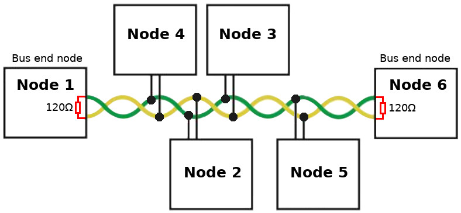

Sur un bus CAN, un noeud publiant un message débute la communication à n'importe quel moment.

Le trame CAN permet de transporter une charge de données entre 0 et 64 bits (8 octets) et une gestion automatique des priorités (arbitration) basé sur le NodeID emit. Dans une voiture, les messages de freinage d'une voiture, sont plus importants que ceux concernant le niveau d'essence (ou les clignotants). 

Le NodeID est utilisé comme identification fonctionnelle des données (le __type de message__). les noeuds à l'écoute sur le bus utilisent des filtres pour capturer les messages d'intérêt (sinon, en mode d'écoute _listen_, tous les messages de passage sur le bus sont capturés).

Grâce à sa flexibilité et sa fiabilité, le bus CAN est aujourd'hui utilisé dans de nombreuses applications industrielles. Il est utilisé dans les applications embarquées et automobiles.

Le standard CAN initial à connu plusieurs évolutions majeures (ex: CAN-FD, CAN-XL, SAE J1939, ISO 11898-2, CANopen).

## D'un point de vue électrique

Le bus CAN est basé sur un signal différentiel transmit par l'intermédiaire d'une paire torsadée (nommés CAN-High et CAN-Low).
 
Le signal final est constitué par la différence entre CAN-High et CAN-Low. Cette astuce permet d'obenir un signal particulièrement résistant au bruit. 

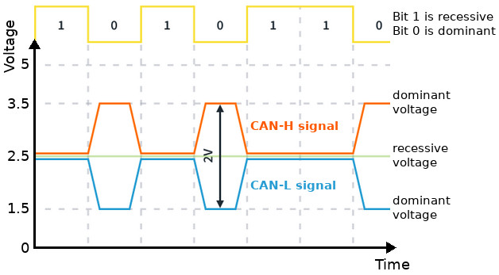

Lorsque d'aucune action ne modifie l'état du signal, celui-ci est centré sur 2.5V . Ce dernier est appelé tension récessive correspondant à un bit 1 (ou bit _High_1). Le Bit 1 est aussi appelé bit recessive (disons "valeur par défaut").

Lorsque la tension sur le bus est modifiée alors une différence de 2V apparaît entre CAN-H et CAN-L. Cette action utilise un tension dominante pour créer le bit 0 (aussi appelé "bit dominant"). 

Durant une communication sur le bus CAN, le bit 1 est une valeur par défaut tandis que le bit 0 résulte d'une modification de tension. Cela signifie que la transmission de bit 0 (_LOW_, bit dominant) est prioritaire sur la transmission d'un bit 1 (_HIGH_, bit récessif). 

Si plusieurs noeuds partagent un même bus, le noeud prioritaire indiquera sa présence en plaçant un bit dominant au moment adéquant.

## Trame CAN
Avoir une idée, même sommaire, d'une trame CAN (_frame_ en anglais) est toujours une savoir pertinent en cas de problème.

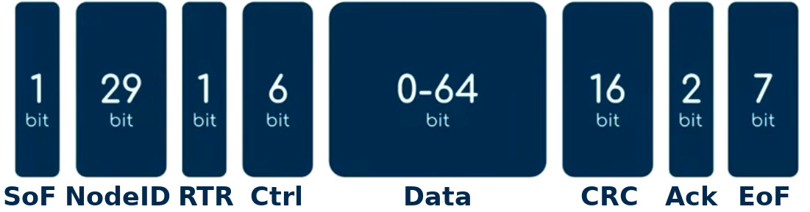

* __SoF__ : _Start of Frame_ début de la trame (1 bit)
* __NodeID__ : il identifie le __type de message__ et les données émisses sur le bus. Initialement encodé sur 11 bits avec CAN 2.0A, il à été étendu à  29bits avec CAN 2.0B (voir propriété `extended=True`. __Remarque:__ Le contenu de ce champs est utilisé en cas d'arbritation!
* __RTR__ : _Remote Transmission Request_ (1 bit). Trame de type spécifique utilisé par un noeud tier, trame sans données, qui est utilisé pour réclamer des données en provenance du NodeID. Le noeud destinataire (disons "le noeud capteur") est programmé pour attendre le message RTR pour transmettre ses données sur le bus.
* __Ctrl__ : champ de Controle contenant le "_code longueur_" pour les données (encodé sur 4 bits) + 2 bits réservés.
* __Data__ : de 0 à 64 bits (jusqu'à 8 octets/bytes) envoyé en MSBF.
* __CRC__ : _Cyclic Redundancy Code_ code de vérification calculé sur les bits précédents cette zone. Le CRC est utilisé pour vérifier la préservation de l'intégrité integrity de la trame durant l'émission de celle-ci.
* __ACK__ : 2 bits constituant le slot d'acquittement (_ACK slot_) + délimiteur d'acquittement (_ACK delimiter_). L' _ACK slot_ est la position où le noeud réceptionnant le message peut informer le réseau de l'exactitude du CRC réceptionné (avec un bit dominant écrit dans l' _ACK slot_). Si aucun ACK est réceptionné alors cela signifie que __soit__ aucun matériel CAN (mcp2515) était présent pour réceptionner la trame, __soit__ la trame a été corrompue durant la transmission. Dans pareil cas, la trame sera automatiquement re-émit par l'émetteur matériel (mcp2515).
* __EoF__ : _End of Frame_ (7 bits), fin de trame.

## Signification du NodeID

Pour rappel: le NodeID identifie le __type de message__ contenu dans la trame.

Lorsque le message est intimement lié à un périphérique spécifique alors NodeID est comparable à '_l'adresse du noeud_' ou le périphérique (ex: vitesse des roues).

Cependant, il faut garder à l'esprit qu'un périphérique peut être responsable de plusieurs messages, donc plusieurs NodeID (ex: une station météo qui envoi des messages pour la température, l'humidité, la pression atmosphérique, vitesse du vent, la luminosité, l'index UV). En conséquence, plusieurs NodeID peuvent être associés à un seul périphérique physique (d'où l'importance de cette notion NodeID=type-de-message).

## NodeID et arbitrage
Le périphérique émettant avec __le NodeID le plus bas aura toujours la priorité__ sur le bus.

Les message envoyés sur le bus peut-être envoyé a tout moment par un des participants (accès décentralisé). La premier participant a commencé par l'émission d'un bit SoF, état que les autres potentiel participants voulant émettre peuvent espionner! 

Lorsque l'initiateur du message envoi son NodeID bit par bit, les autres participant écoutent toujours activement cette transmission sur le bus.

L'arbitrage CAN résout l'accès au bus en effectuant une comparaison bit-à-bit du NodeID. Qu'il soit initiateur du message ou un participant alternatif désirant émettre sur le bus. 

Lorsqu'un autre participant avec un NodeID inférieur à l'initiateur désire insérer sa propre communication, il écrit son bit 0 (dominant) là où l'initiateur place un bit 1 (récessif, bit par défaut). Ce nouveau participant avec un NodeID inférieur prend donc automatiquement le pas sur la communication tandis que l'initiateur voit un bit 0 apparaître sur le bus là où il laissait un 1 prendre place. L'initiateur se dégage donc immédiatement de la communication et attendra une prochaine opportunité de transmettre son propre message.

## Créer un bus CAN
Le bus est réalisé à l'aide d'une paire de fil torsadé connectant les CAN_H ensembles et les CAN_L ensembles.

Connecter les masses entre les noeuds n'est pas requis. Cepndant, partager une masse commune entre les périphériques locaux fait partie des "bonnes pratiques".

__Seuls les deux noeuds à chaque fin du bus CAN doivent avoir leur résistance de terminaison de 120Ω activée__. Tous les noeuds intermédiaires connectés sur le bus ne peuvent pas avoir de résistance de terminaison.

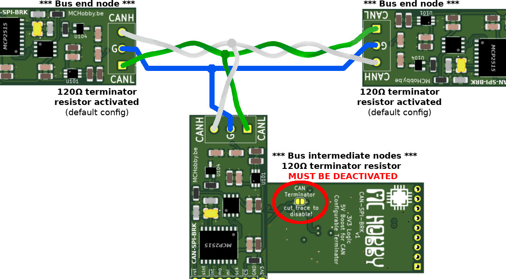

# Brancher 
## CAN Breakout sur Pico
Un bus SPI  (Mosi, Miso, SCK, CSn) est nécessaire sur votre microcontrôleur pour y connecter un breakout CAN à base de MCP2515.

La broche _silent_ (slnt) est optionnelle. Elle peut être utilisée pour basculer la carte en mode silencieux (écoute du bus uniquement, pratique pour le débogage).

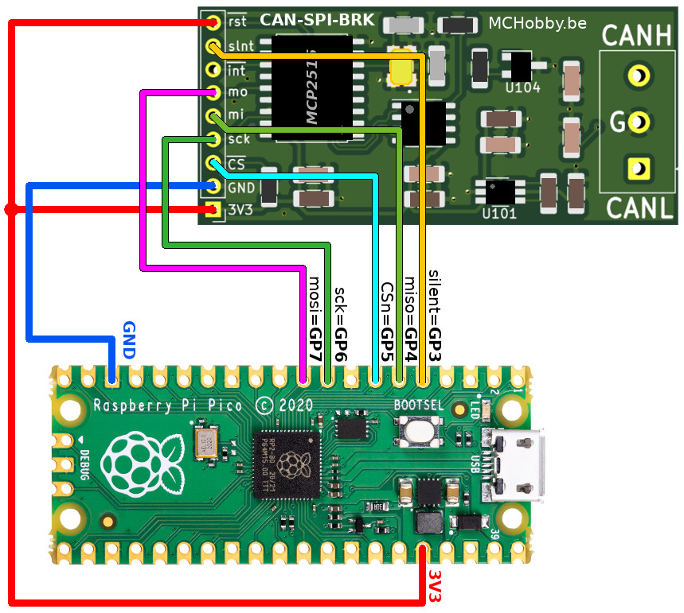

Si elle n'est pas utilisée, la broche _reset_ (rst) peut être connectée sur 3.3V .

La résistance de terminaison de 120Ω est active par défaut. Elle peut être désactivée en sectionnant le cavalier à l'arrière de la carte.

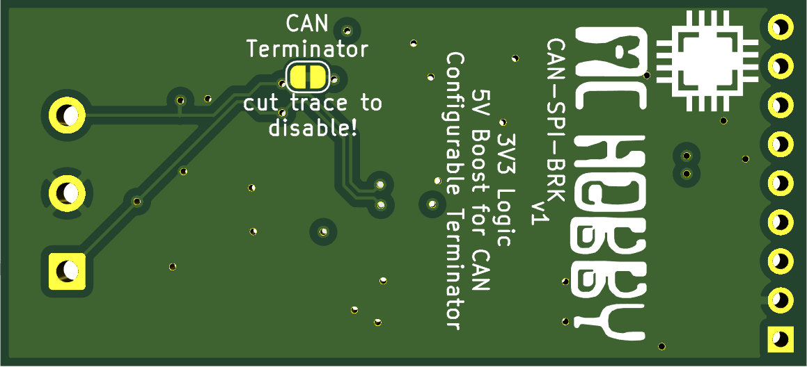

# Tests basiques
Pour rappel, avant de tester le breakout, il est nécessaire de réaliser un bus CAN opérationnel (voir ci-avant dans le document pour plus de détails).


## Test en boucle fermée (loopback)
L'exemple [basic/loopback.py](examples/basic/loopback.py) permet de vérifier la connexion SPI entre le breakout MCP2515 het votre microcontrôleur.

Ce test configure le MCP2515, et active le mode _loopback_ avant d'envoyer des messages (qui son immédiatement lu en retour).

## Ecoute du bus CAN
SI vous créez votre propre bus CAN d'essai ALORS les deux extrémités doivent être des noeuds actifs et initialisés! 

Une façon intéressante de tester un tel bus CAN est d'y activer un noeud __listener__ (qui écouter les messages) à un bout et d'utiliser un noeud __sender__ (qui envoi des messages) à l'autre bout.

Le script d'exemple [basic/listen.py](examples/basic/listen.py) écoute les messages transitant sur le bus CAN et affiche le contenu.

Ce script présente:

* le NodeID du message (extended=True signifie que nodeID est codé sur 29 bits sinon il est codé sur 11 bits).
* le message CAN avec information du champ _data_ (de 0 à 8 octets/bytes).
* le message RTR (_Remote Transmission Request_) avec la donnée _length_ tel qu'encodée par initiateur du message.

``` python
from machine import SPI, Pin
from canio import Message, RemoteTransmissionRequest
from mcp2515 import MCP2515
from time import sleep_ms

NODE_ID = 0x4444BBBB # NodeID : identifie le type de message

spi = SPI( 0, mosi=Pin.board.GP7, miso=Pin.board.GP4, sck=Pin.board.GP6 )
cs = Pin( Pin.board.GP5, Pin.OUT, value=True )
silent = Pin( Pin.board.GP3, Pin.OUT, value=False )

canbus = MCP2515( spi, cs, debug=False)  

print('Listening...')
while True:
    with canbus.listen(timeout=1.0) as listener:
        message_count = listener.in_waiting()
        if message_count == 0:
            continue
        print(message_count, "messages available")
        for _i in range(message_count):
            msg = listener.receive()
            # Affiche le node ID du message
            print("Message from ", hex(msg.id), "extended:", msg.extended)
            if isinstance(msg, Message):
                print("message data:", msg.data)
            if isinstance(msg, RemoteTransmissionRequest):
                print("RTR length:", msg.length)
            print("")
```

## Ecrire sur le CAN - un simple message
Le script d'exemple [basic/send_single.py](examples/basic/send_single.py) envoi un unique message sur le bus CAN. 

Le message est réputé comme "envoyé" lorsqu'il est transféré dans le buffer du MCP2515. Cela ne signifie pas pour autant que le message a déjà été transmit sur le bus CAN. C'est la couche matérielle du MCP2515 qui est responsable de cette partie de l'envoi.

Par conséquent, le script vérifie également la propriété `canbus.transmit_error_count` qui indique le nombre d'erreur de transmission sur le support physique.

__Remarque:__ si des erreurs de transmissions sont reportées alors vérifier l'autre bout du bus (le noeud est probablement inactif).

``` python
from machine import SPI,Pin
from canio import Message, RemoteTransmissionRequest
from mcp2515 import MCP2515
from time import sleep_ms

NODE_ID = 0x1234ABCD # NodeID : Identifies the type of message/data

# Raspberry Pico
spi = SPI( 0, mosi=Pin.board.GP7, miso=Pin.board.GP4, sck=Pin.board.GP6 )
cs = Pin( Pin.board.GP5, Pin.OUT, value=True )
silent = Pin( Pin.board.GP3, Pin.OUT, value=False ) 
canbus = MCP2515( spi, cs, debug=False)

print('Sending single message...')

# Envoi d'un message (extended=True indique que NodeID est codé sur 29 bits)
message = Message(id=NODE_ID, data="test".encode("utf-8"), extended=True)
# Send_success indique que le message est stocké dans le TX Buffer du MCP2515
# Cela ne signifie pas qu'il est déjà émit sur le bus!
send_success = canbus.send(message) 
print("Send success:", send_success ) 

sleep_ms( 500 ) # Attendre un peu avec de vérifier l'émission!

print( 'transmit_error_count :', canbus.transmit_error_count )
if canbus.transmit_error_count>=100: # Count va jusque 128 max
	raise Exception("Too much transmission error! Is there a receiver on the bus?")

print("That s all folks!")
```

LORSQU'UNE erreur de communication survient sur le bus ALORS le MCP2515 ne libère pas le buffer alloué à la transmission du message. Le MCP2515 essaye d'envoyer le message encore et encore jusqu'à une émission réussie! (ensuite, le buffer d'émission est libéré).

LORSQUE `canbus.send(message)` retourne False ALORS cela signifie qu'un buffer d'émission ne peut pas être alloué sur le MCP2515. Tous les buffer d'émission alloués indique qu'il y a probablement trop d'erreur de transmission sur le bus.

## Ecrire sur le CAN - envoi continu de messages

Le script d'exemple [basic/send.py](examples/basic/send.py) continuellement envoi des messages multiples sur le bus CAN. 

Ce script envoi des messages sous __DEUX NodeID DISTINCTS__.

``` python
from machine import SPI,Pin
from canio import Message, RemoteTransmissionRequest
from mcp2515 import MCP2515
from time import sleep_ms

NODE_ID = 0x1234ABCD # NodeID : Identifies the type of message/data

# Raspberry Pico
spi = SPI( 0, mosi=Pin.board.GP7, miso=Pin.board.GP4, sck=Pin.board.GP6 )
cs = Pin( Pin.board.GP5, Pin.OUT, value=True )
silent = Pin( Pin.board.GP3, Pin.OUT, value=False ) 

canbus = MCP2515( spi, cs, debug=False) 

print('Sending...')
i = 0
while True:
    # fonctionnement usuel = mix d'écouter + envoi
    with canbus.listen(timeout=1.0) as listener:
        # envoi un message
        message = Message(id=NODE_ID, data=str(i).encode("utf-8"), extended=True)
        send_success = canbus.send(message)
        print("Send 1 success:", send_success)

        sleep_ms(30)

        # Envoi un second message comme noeud (0xAA)
        message = Message(id=0xAA, data=str(1000+i).encode("utf-8"), extended=True)
        send_success = canbus.send(message)
        print("Send 2 success:", send_success)

        sleep_ms(1000)
        i = i + 1
```

# Test RTR (Remote Transmission Request)
Le flag Remote Transmission Request (RTR) est un bit spécial de la trame CAN utilisé pour demander une transmission d'information au NodeID.

Le __message RTR ne contient aucune données !__ Cependant, le champ de contrôle de la trame CAN contient des bits pour encoder la DLC (_Data Length Code_) permettant de transmettre une valeur numérique entre 0 et 8. 

Donc, le __message RTR peut transporter une valeur supplémentaire (entre 0 et 8) encodé dans la DLC__.

## Scenario de test

Le scénario de test est basé sur un périphérique d'affichage (__display node__) et un périphérique capteur (__sensor node__) connectés à l'aide d'un bus CAN.

* __sensor_node__ : (NodeID=0x100A002F) ATTEND une requête RTR PUIS effectue une mesure et retourne une valeur (type float, 4 octets/bytes, encodage C style).
* __display_node__ : (pas de NodeID) Demande un échantillon de données toutes les 15sec au sensor_node (avec un message RTR). Affiche la valeur envoyée par sensor_node en réponse au RTR (NodeID=0x100A002F). 

Les images suivante présente la progression des messages du scenario RTR.

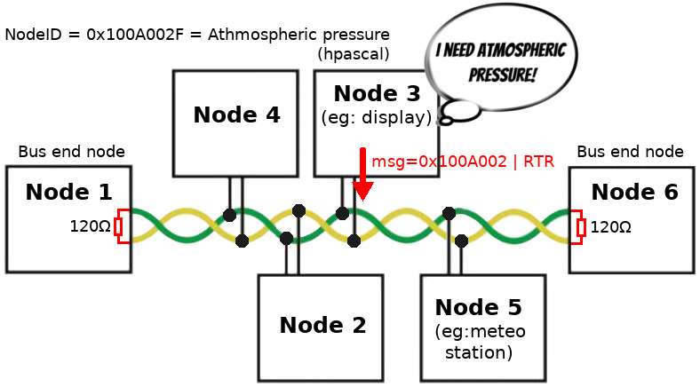

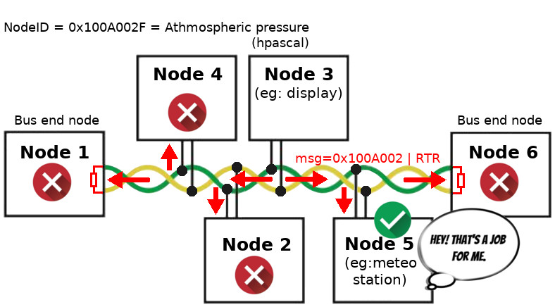

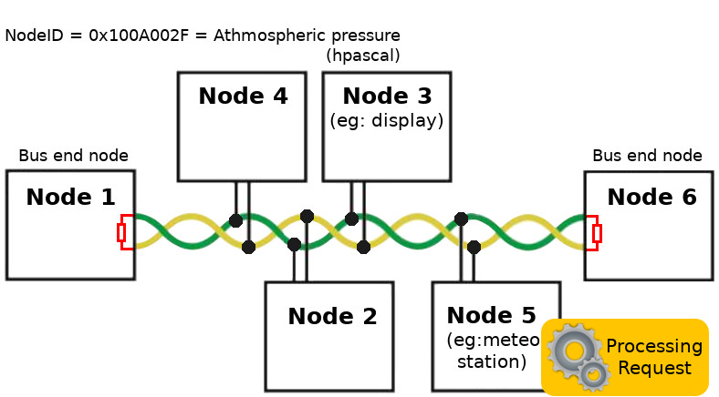

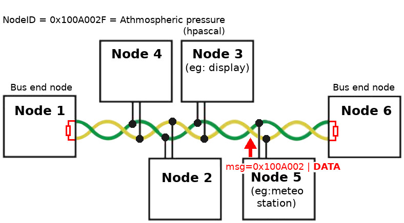

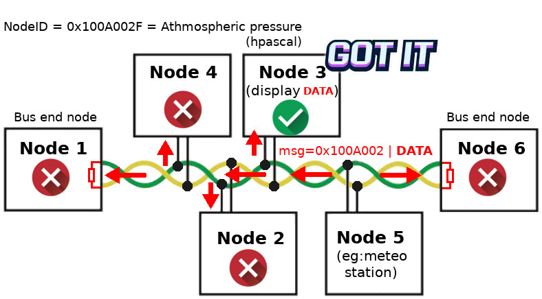

## Sensor_node
Le but initial était de mesurer la pression atmospherique. Pour finir, il était plus simple de mesurer la température interne du Raspberry Pico.

Le script d'exemple [RTR/sensor-node.py](examples/RTR/sensor-node.py) effectue les opérations suivantes:

* Ecoute le bus CAN en permanence et détecte les messages entrants.
* Vérifie si le message entrant est une requête RTR pour sensor_node (NodeID=0x100A002F).
* SI aucun RTR est réceptionné ALORS le noeud recommence une écoute du bus CAN.

``` python
from machine import SPI,Pin,ADC, idle
from canio import Message, RemoteTransmissionRequest
from mcp2515 import MCP2515
from time import sleep_ms
import struct

atm_pressure_node_id = 0x100A002F # NodeID : Identifies the type of message/data

# Raspberry Pico
spi = SPI( 0, mosi=Pin.board.GP7, miso=Pin.board.GP4, sck=Pin.board.GP6 )
cs = Pin( Pin.board.GP5, Pin.OUT, value=True )
silent = Pin( Pin.board.GP3, Pin.OUT, value=False ) # Extra silent Pin for transceiver
canbus = MCP2515( spi, cs, debug=False) 

# Température interne du Pico
sensor = ADC(4) 

print('Sensor node ready for requests...')
sensor_rtr = False # True si un RTR est réceptionné
while True:
    with canbus.listen(timeout=1.0) as listener:
        message_count = listener.in_waiting()
        if message_count == 0:
            continue
        print(message_count, "messages available")
        for _i in range(message_count):
            msg = listener.receive()
            print("Message from ", hex(msg.id), "extended:", msg.extended)
            if isinstance(msg, RemoteTransmissionRequest) and (msg.id==atm_pressure_node_id):
                print("RTR received! length=", msg.length)
                sensor_rtr = True

        if not sensor_rtr:
            idle()
            continue

        # Obtenir la température
        adc_value = sensor.read_u16()
        volt = (3.3/65535) * adc_value
        temperature = 27 - (volt - 0.706)/0.001721
        temperature = round(temperature, 1) # float value
        print( "Measured value", temperature )
        # Convertir le float en binaire
        data = struct.pack('f',temperature) # byte() de longueur=4
        print( "Binary message", data )

        # Envoi du message sur le bus CAN
        message = Message(id=atm_pressure_node_id, data=data, extended=True)
        send_success = canbus.send(message)
        if not send_success:
            print("Send data failure")
        else:
            sensor_rtr = False # wait next RTR message

        idle()
```

La bibliothèque __struct__ est utilisé pour pack/unpack des données Python en leur équivalent C Style (comme C fait l'encodage de ses variables en mémoire). 
Cela permet des échanges de données avec n'importe quel type de système.

Voici les messages affichés dans la session REPL:

```
Sensor node ready for requests...
1 messages available
Message from  0x100a002f extended: True  <--- reception d'un message pour 0x100a002f
RTR received! length= 0                  <--- c'est un message RTR!  "Length" transmited = 0 
Measured value 21.0                      <--- mesure effectuée par le capteur
Binary message b'\x00\x00\xa8A'          <--- données binaires transmises
1 messages available
Message from  0x100a002f extended: True
RTR received! length= 0
Measured value 21.0
Binary message b'\x00\x00\xa8A'
1 messages available
Message from  0x100a002f extended: True
RTR received! length= 0
Measured value 21.0
Binary message b'\x00\x00\xa8A'
1 messages available
Message from  0x100a002f extended: True
RTR received! length= 0
Measured value 22.4
Binary message b'33\xb3A'
1 messages available
Message from  0x100a002f extended: True
RTR received! length= 0
Measured value 23.3
Binary message b'ff\xbaA
```

## display_node 

Le __display_node__ capture les messages avec NodeID=0x100A002F puis decode/unpack le float stocké dans la section données. Enfin, affiche l'information dans la session REPL.

Le script envoi égalent un _Remote Transmission Request_ toutes les 15 secondes à destination du noeud 0x100A002F.

``` python
from machine import SPI, Pin
from canio import Message, RemoteTransmissionRequest
from mcp2515 import MCP2515
import time, struct

atm_pressure_node_id = 0x100A002F 

spi = SPI( 0, mosi=Pin.board.GP7, miso=Pin.board.GP4, sck=Pin.board.GP6 )
cs = Pin( Pin.board.GP5, Pin.OUT, value=True )
silent = Pin( Pin.board.GP3, Pin.OUT, value=False )
canbus = MCP2515( spi, cs, debug=False)

print('Starting Display node...')
print('First sensor request will be issued in 15 secs...')
start = time.ticks_ms()
while True:
    with canbus.listen(timeout=1.0) as listener:
        # Traitement des messages réceptionnés
        message_count = listener.in_waiting()
        for _i in range(message_count):
            msg = listener.receive()
            # Affiche le NodeID du message
            print("Message from ", hex(msg.id), "extended:", msg.extended)
            if isinstance(msg, Message) and (msg.id==atm_pressure_node_id):
                print("message data:", msg.data)
                # Decode le float envoyé par la sensor_node
                values = struct.unpack('f', msg.data ) # retoune toujours un tuple
                print( "Received value =", values[0] )
            print("")

        # Envoi une demande RTR au sensor_node toutes les 15 secondes
        if time.ticks_diff( time.ticks_ms(), start ) >= 15000:
            start = time.ticks_ms()
            msg = RemoteTransmissionRequest( id=atm_pressure_node_id, length=0, extended=True )
            send_success = canbus.send(msg)
            print("RTR send for ID", hex(atm_pressure_node_id) )
```

Les messages suivants sont affichés dans la session REPL lorsque le script est exécuté.

```
Starting Display node...
First sensor request will be issued in 15 secs...
RTR send for ID 0x100a002f
Message from  0x100a002f extended: True
message data: bytearray(b'\x00\x00\xa8A')
Received value = 21.0

RTR send for ID 0x100a002f
Message from  0x100a002f extended: True
message data: bytearray(b'\x00\x00\xa8A')
Received value = 21.0

RTR send for ID 0x100a002f
Message from  0x100a002f extended: True
message data: bytearray(b'\x00\x00\xa8A')
Received value = 21.0

RTR send for ID 0x100a002f
Message from  0x100a002f extended: True
message data: bytearray(b'33\xb3A')
Received value = 22.4

RTR send for ID 0x100a002f
Message from  0x100a002f extended: True
message data: bytearray(b'ff\xbaA')
Received value = 23.3
```

# Filtre et masquage
Un noeud présent sur le bus CAN n'a pas besoin de traiter tous les messages transmit surt le bus CAN. 

Sur un bus CAN vraiment chargé, cela peut provoquer une congestion car la couche applicative pourrait être dans l'incapacité de traiter l'avalanche de messahe. 
Il y a donc un risque de rater des messages vraiment important!

Le MCP2515 peut effectuer __un filtrage matériel__ sur le NodeID des messages réceptionnés. Le filtrage matériel est performant et seul les messages correspondant au filtre sont transmit dans le buffers de réception.

## Scénario de test

Le scénario de test est basé sur le script [filter/master-node.py](examples/filter/master-node.py) envoyant des messages vers plusieurs NodeID. 

Le script [filter/follower-node.py](examples/filter/follower-node.py) écoute le bus CAN et utilise le __filtrage matériel__ pour capturer les messages NodeID="traffic_light_AA01" . 

Le script [filter/follower-mask.py](example/filter/follower-mask.py) utilise également filtre plus un masque afin de capturer un ensemble de messages.

## master-node
Comme visible dans le script [filter/master-node.py](examples/filter/master-node.py), plusieurs messages sont envoyés sur le bus (pour plusieurs NodeID).

``` python
from machine import SPI,Pin,ADC, idle
from canio import Message
from mcp2515 import MCP2515
from time import sleep_ms
import struct

# MAster Node
master_id = 0x1fffffff # Highest Node ID

# Some 29bits Node ID for sending messages the can bus
traffic_light_AA01 = 0x100FAA01 # NodeID : Identifies the type of message/data
traffic_light_AA02 = 0x100FAA02 # NodeID : Identifies the type of message/data

level_crossing_BB01 = 0x100FBB01 

street_light_AA01   = 0x1A00AA01
street_light_AA02   = 0x1A00AA02

# Raspberry Pico
spi = SPI( 0, mosi=Pin.board.GP7, miso=Pin.board.GP4, sck=Pin.board.GP6 )
cs = Pin( Pin.board.GP5, Pin.OUT, value=True )
silent = Pin( Pin.board.GP3, Pin.OUT, value=False ) 
canbus = MCP2515( spi, cs, debug=False)  
print('Master node ready...')


def send_message( value, node_id, node_label ):
    """ Envoi d'une valeur (0..255) sur node_id. node_label est utilisé pour afficher des messahes de débogage """
    assert 0<=value<=255 
    print( "Send message to %s" % node_label )
    print("\tvalue :", value)
    data = struct.pack('B', value ) # Unsigned char (1 byte, 0..255 ) to binary
    message = Message(id=node_id, data=data, extended=True)
    send_success = canbus.send(message)
    if send_success:
        print("\tSent!")
    else:
        print("\tSend data failure")
    print( "" )


send_message(  67, traffic_light_AA01, "traffic_light_AA01")
send_message(   1,  street_light_AA02, "street_light_AA02")
send_message(  88,level_crossing_BB01, "level_crossing_BB01")
send_message( 129, traffic_light_AA02, "traffic_light_AA02")
```

## follower-node

Le script [filter/follower-node.py](examples/filter/follower-node.py) utilise un objet __Match__ pour filtrer les message sur un node_id spécifique.

La référence de l'objet __Match__ est stocké dans une variable afin d'éviter les recréations inutiles lors des appels successifs à `listen()` .

``` python
from machine import SPI, Pin
from canio import Message, Match
from mcp2515 import MCP2515
import time, struct

spi = SPI( 0, mosi=Pin.board.GP7, miso=Pin.board.GP4, sck=Pin.board.GP6 )
cs = Pin( Pin.board.GP5, Pin.OUT, value=True )
silent = Pin( Pin.board.GP3, Pin.OUT, value=False ) 
canbus = MCP2515( spi, cs, debug=False)

traffic_light_AA01 = 0x100FAA01 #  29bits Node ID 

# Prépare un objet de filtrage (match), extended=True parce que 
# le nodeID est codé sur 29bits
_match1 = Match( address=traffic_light_AA01, extended=True )


print('Listening on %s node...' % hex(_match1.address))
while True:
    with canbus.listen(matches=[_match1] ,timeout=1.0) as listener:
        # Traite les messages réceptionnés
        message_count = listener.in_waiting()        
        for _i in range(message_count):
            msg = listener.receive()
            # Affiche le NodeID
            print("Message for ", hex(msg.id), "extended:", msg.extended)
            print("\tdata:", msg.data)
            # Decode la valeur stockée 
            values = struct.unpack('B', msg.data ) # Retourne un Tuple
            print( "\tvalue:", values[0] )
            print("")
```

Ce qui produit le résultat suivant dans la sessions REPL. Seul les messages du NodeID "traffic_light_AA01" sont réceptionnés par `listen()`.

```
Listening on 0x100faa01 node...
	Read Buffer 0
Message for  0x100faa01 extended: True
	data: bytearray(b'C')
	value: 67
```

## follower-mask
Le script [filter/follower-mask.py](examples/filter/follower-mask.py) utilise un objet __Match__ pour filtrer les message d'un node_id (utilisé comme base) + un __masque (mask)__ pour élargir la sélection.

Le but est de capturer tous les messages _traffic_light_Axxx_ .

```
traffic_light_AA01 = 0x100FAA01
traffic_light_AA02 = 0x100FAA02
```

Donc, seule les 17 first bits du NodeID doivent correspondre à l'adresse mentionnée dans le filtre. Les 12 derniers bits doivent être ignorés dans la comparaison.

Seul l'objet __Match__ est créé de façon différente, le paramètre additionnel __mask__ permet d'indiquer lesquels des 29bits seront utilisés pour filtrer le NodeID.
```
_match1 = Match( address=traffic_light_AA01, mask=0b1111_11111111_11110000_00000000, extended=True )
```

Cette fois, plusieurs messages sont capturés par le script.

```
Listening on 0x100faa01 node with mask 0b1111111111111111000000000000 ...
	Read Buffer 0
Message for  0x100faa01 extended: True
	data: bytearray(b'C')
	value: 67

	Read Buffer 0
Message for  0x100faa02 extended: True
	data: bytearray(b'\x81')
	value: 129
```
# Liste d'achat
Tous les tests on été conduit avec la carte __CAN_SPI_BRK__ produite par MC Hobby.

* [CAN_SPI_BRK](https://shop.mchobby.be/fr/nouveaute/2881-breakout-can-bus-alim-du-bus-3v3-spi-.html) de MC Hobby
