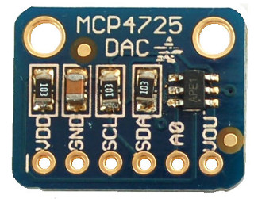
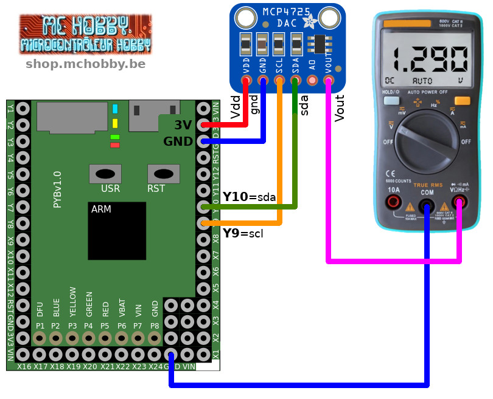
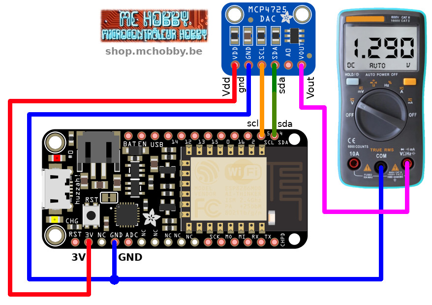
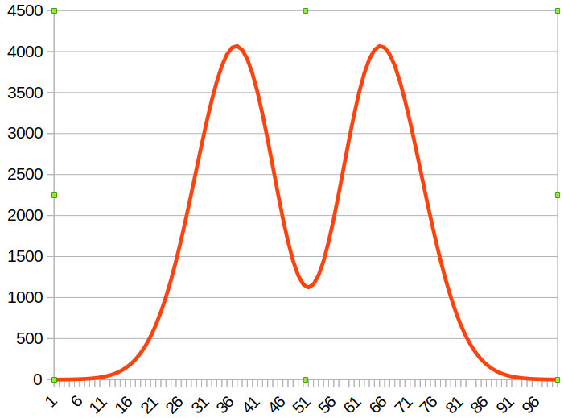
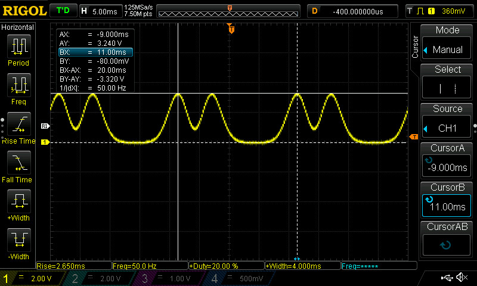

[This file also exists in ENGLISH](readme_ENG.md)

# Add a DAC output to your MicroPython board with the Adafruit MCP4725 (ADA935)

Lot of microcontroleur have an ADC to read analog voltage but really few of them have DAC to generate TRUE analog voltage.

Thank to the MCP4725, it is now possible to generate arbitrary output voltage over an I2C bus connection. With good I2C bandwidth, it is even possible to generate arbitrary waveform, a sine ware of a adjustable bias point.



 Working with logic 3.3V or 5V. The breakout offers an A0 address pin (LOW by default), so you can connect two of these DACs on one I2C bus.

# Wiring²

## MicroPython Pyboard



## Feather ESP8266 sous MicroPython



# Testing

To use this board it will be necessary to install the `mcp4725.py` library on the MicroPython board.

The following code will initialze the DAC output a VDD/3 = 3.3/2 = 1.65 V.

```
from machine import I2C
from mcp4725 import MCP4725
from time import sleep

# Pyboard - SDA=Y10, SCL=Y9
i2c = I2C(2)
# ESP8266 under MicroPython
# i2c = I2C(scl=Pin(5), sda=Pin(4))

mcp = MCP4725( i2c = i2c )
# Set the output to VDD/2 (so 3.3/2 = 1.65V)
# Value is 16 bits, 0 to 65535
mcp.value = int(65535/2)
print( "Output @ 1.65v")
```

This second exemple will use the DAC DAC to create a voltage ramp from 0 to VDD (0 to 65535) as fast as possible.

```
from machine import I2C
from mcp4725 import MCP4725
from time import sleep

# Pyboard - SDA=Y10, SCL=Y9
i2c = I2C(2)
# ESP8266 under MicroPython
# i2c = I2C(scl=Pin(5), sda=Pin(4))

mcp = MCP4725( i2c = i2c )
while True:
	# Make a ramp as fast as possible
	for i in range( 65535 ): # 16 bits
		mcp.value = i
```

The DAC is mainly limited by the I2C bus bandwidth. The 65535 samples are sent in 11 seconds, so 5957 samples per second or one smaple every 167µSec!

So quite enough to generate a signal with a timer at 5 KHz (200µS for each sample).

## The camel wafeform
I wanted to draw a waveform with a double hump like a camel.

So I did find [this beautiful function on math.stackexchange.com](https://math.stackexchange.com/questions/3093278/function-approximating-camels-humps). Thank guys!

I made some home working to sample 100 values out of it. All value in a range of 0-4095 for an external DAC. Please see the `docs/camel-function.ods` LibreOffice calc sheet.

From that point, it is already possible to see a formal chart result:



The calculate samples were injected into the `examples/camel.py` test script to generates the camel waveform on the MCP4725 I2C DAC.

Here is the result my scope capture of 50 Hz Camel Waveform. Whoa glorious!




# Ressources and sources
* Source: [MicroPython-adafruit-bundle](https://github.com/adafruit/micropython-adafruit-bundle/tree/master/libraries/drivers) (Adafruit, GitHub)

## I2C Address
__The default address is 0x62__ .

This can be tuned wiht the A0 address bit available on the breakout.

# Shopping list
* [Adafruit MCP4725 (ADA935)](https://shop.mchobby.be/product.php?id_product=132) @ MC Hobby
* [Adafruit MCP4725 (ADA935)](https://www.adafruit.com/product/935) @ Adafruit
