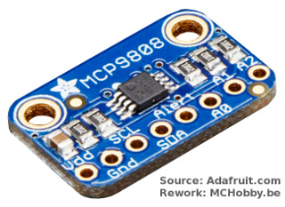
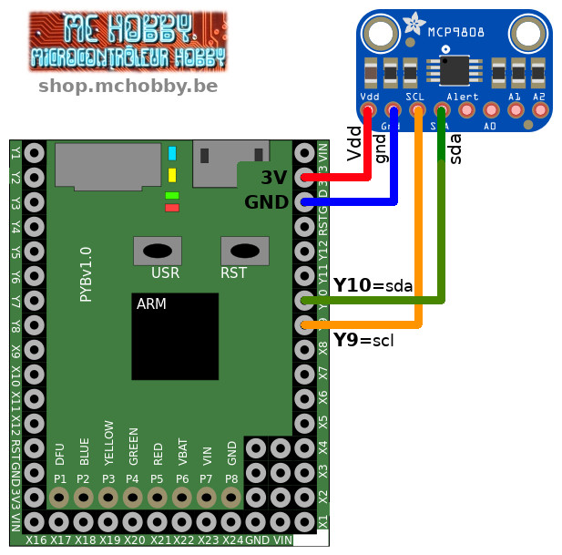
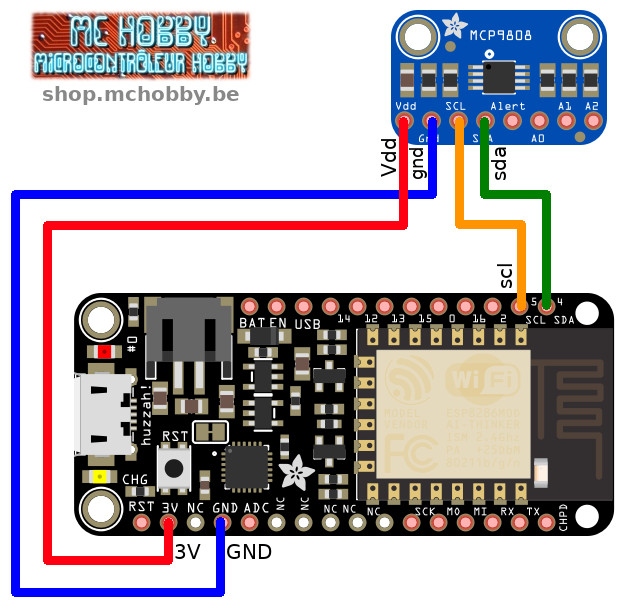

[Ce fichier existe également en FRANCAIS](readme.md)

# Measure température with high precision with the Adafruit MCP9808 (ADA1782) and MicroPython

This temperature sensor is one of the most precise existing on the market. The MCP9808 have an accuracy of +/-0.25°C within a temperature range of -40°C to +125°C.



This sensor work over the I2C bus and have 3 address pins. So, it is possible to wire up to 8 sensor on a single I2C bus.

* Easy setup and control via i2C bus
* Typical accuracy of 0.25°C within the -40°C...125°C range (0.5°C max certified  between -20°C to 100°C)
* 0.0625°C resolution
* 2.7V to 5.5V (power and logic)
* curent: 200 μA (typical)

# Wiring

## MicroPython Pyboard



## Feather ESP8266 on MicroPython



# Testing

If you want to use this sensor, it will be necessary to install the `mcp9808.py` library on the MicroPython board.

The following test code makes a temperature read every seconds.

```
from machine import I2C
from mcp9808 import MCP9808
from time import sleep

# Pyboard - SDA=Y10, SCL=Y9
i2c = I2C(2)
# ESP8266 under MicroPython
# i2c = I2C(scl=Pin(5), sda=Pin(4))

mcp = MCP9808( i2c = i2c )
while True:
    print( "%s °C" % mcp.temperature )
    sleep( 1 )
```

# Ressources et sources
* Source: [MicroPython-adafruit-bundle](https://github.com/adafruit/micropython-adafruit-bundle/tree/master/libraries/drivers) (Adafruit, GitHub)

## I2C Address
__The default address is 0x18__ .

This can be tuned by using the 3 address bits available on the breakout board.

## The Alert pin
This pin can be configured to send an Alert signal when the temperature reach a given level.

Please note that the library does not handle this feature yet!

# Where to buy
* [Adafruit MCP9808 (ADA1782)](https://shop.mchobby.be/product.php?id_product=572) @ MC Hobby
* [Adafruit MCP9808 (ADA1782)](https://www.adafruit.com/product/1782) @ Adafruit
