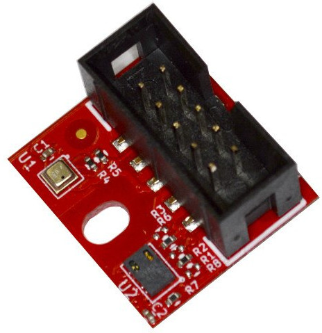
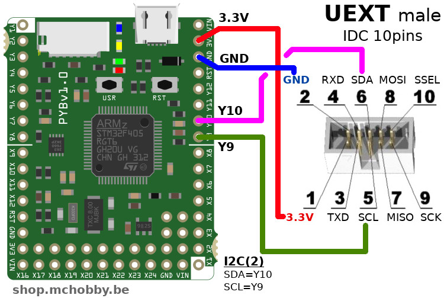

[Ce fichier existe également en FRANCAIS ici](readme.md)

# use an environmental sensor to measure the air quality with MicroPython board

The MOD-ENV board from Olimex features two I2C sensors:
* The BME280 sensor from Bosch -> measure athmospherique pressure, temperature and relative humidity.
* The CCS811 sensor -> measure the air quality eCO2 (Carbon Dioxyde equivalent) and Volatile Organic Compounds (VOC / COV)



# Wire
The sensor can be easily plugged onto a board exposing an UEXT port like the [UEXT adapter for pyboard](https://github.com/mchobby/pyboard-driver/tree/master/UEXT) or the [Pyboard-UNO-R3](https://shop.mchobby.be/fr/nouveaute/1745-adaptateur-pyboard-vers-uno-r3-extra-3232100017450.html).


You can also create the required connections between the Pyboard and one UEXT connector (IDC 10 pins) cirectly on a Pyboard like showned here under. You will only need to plus the Olimex MOD-ENV onto the connector.



# Test
The libraries `bme280.py` and `ccs811.py` must be made available on the MicroPython board.

The libraries are availables in the following repositories:
* `bme280.py` : https://github.com/mchobby/esp8266-upy/tree/master/bme280-bmp280
* `ccs811.py` : https://github.com/mchobby/esp8266-upy/tree/master/ccs811

The [`test.py`](examples/test.py) script is used to demonstrate the sensor usage.

``` Python
import time
import ccs811
import bme280

from machine import I2C

i2c = I2C( 2 )
ccs811 = ccs811.CCS811( i2c )
bme = bme280.BME280( i2c=i2c )

# Check if the sensor returns an error
if ccs811.check_error:
	print( "An error occured!")
	print( "ERROR_ID = %s" % ccs811.error_id.as_text )
	while True:
		time.sleep( 0.100 )

# Wait for the sensor to be ready
while not ccs811.data_ready:
	time.sleep( 0.100 )

while True:
	values = bme.raw_values # Temperature, pressure hPa, %Rel Humidity
	print("CO2: {} PPM, TVOC: {} PPB, Temp: {} C, hPa: {}, Rh {} percent".format(ccs811.eco2, ccs811.tvoc, values[0], values[1], values[2]) )

	time.sleep(0.5)
```

Which produce the following results in a REPL session

```
CO2: 0 PPM, TVOC: 400 PPB, Temp: 24.4 C, hPa: 995.94, Rh 46.49 percent
CO2: 0 PPM, TVOC: 400 PPB, Temp: 24.4 C, hPa: 995.91, Rh 46.48 percent
CO2: 0 PPM, TVOC: 400 PPB, Temp: 24.4 C, hPa: 995.87, Rh 46.52 percent
CO2: 0 PPM, TVOC: 400 PPB, Temp: 24.4 C, hPa: 995.96, Rh 47.09 percent
CO2: 1 PPM, TVOC: 413 PPB, Temp: 24.41 C, hPa: 995.93, Rh 47.44 percent
CO2: 1 PPM, TVOC: 413 PPB, Temp: 24.39 C, hPa: 995.97, Rh 47.6 percent
CO2: 0 PPM, TVOC: 405 PPB, Temp: 24.39 C, hPa: 995.95, Rh 47.59 percent
CO2: 0 PPM, TVOC: 405 PPB, Temp: 24.41 C, hPa: 996.02, Rh 48.13 percent
... Breathing toward the environmental Sensor
... Souffler vers le capteur environnementale
CO2: 8 PPM, TVOC: 454 PPB, Temp: 24.47 C, hPa: 996.02, Rh 51.67 percent
CO2: 8 PPM, TVOC: 454 PPB, Temp: 24.62 C, hPa: 996.04, Rh 53.98 percent
CO2: 8 PPM, TVOC: 454 PPB, Temp: 24.78 C, hPa: 996.08, Rh 55.22 percent
CO2: 8 PPM, TVOC: 454 PPB, Temp: 24.91 C, hPa: 996.0999, Rh 56.7 percent
CO2: 12 PPM, TVOC: 480 PPB, Temp: 25.04 C, hPa: 996.04, Rh 58.35 percent
CO2: 12 PPM, TVOC: 480 PPB, Temp: 25.18 C, hPa: 995.96, Rh 60.75 percent
CO2: 31 PPM, TVOC: 605 PPB, Temp: 25.32 C, hPa: 996.08, Rh 61.63 percent
CO2: 31 PPM, TVOC: 605 PPB, Temp: 25.44 C, hPa: 996.06, Rh 63.0 percent
CO2: 33 PPM, TVOC: 620 PPB, Temp: 25.54 C, hPa: 996.03, Rh 65.12001 percent
CO2: 33 PPM, TVOC: 620 PPB, Temp: 25.52 C, hPa: 996.06, Rh 62.73 percent
CO2: 18 PPM, TVOC: 523 PPB, Temp: 25.5 C, hPa: 996.02, Rh 59.27 percent
CO2: 18 PPM, TVOC: 523 PPB, Temp: 25.48 C, hPa: 996.0999, Rh 56.72 percent
```

The enhanced example [`test_enh.py`](examples/test_enh.py) also push the environmental data to the CCS811 sensor every quarter.

# Shopping list
* [MOD-ENV : Environmental sensor](https://shop.mchobby.be/fr/uext/1780-capteur-environnementale-tout-en-un-bme280-ccs811-3232100017801.html) @ MCHobby
* [MOD-ENV : Environmental sensor](https://www.olimex.com/Products/Modules/Sensors/MOD-ENV/open-source-hardware) @ Olimex
