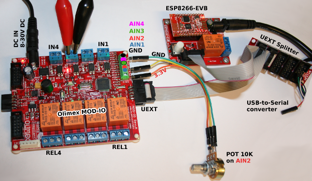

# Use an Olimex MOD-IO and MOD-IO2 with ESP8266 under MicroPython

## MOD-IO
MOD-IO est une carte d'interface d'Olimex utilisant le port UEXT. 


Cette carte expose.
* 4 relais,
* 4 entrée digitale opto isolée (compatible avec le 24V industriel)
* 4 entrée analogiques (0 - 3.3V)
* Prévu pour être chainâble
* Interface I2C (adresse 0x58 par défault)
* Addresse modifiable (stockée en EEProm)
* Alimentation: 8-30VDC

__Où acheter__
* Shop: [UEXT Expandable Input/Output board (MOD-IO)](http://shop.mchobby.be/product.php?id_product=1408)
* Shop: [Module WiFi ESP8266 - carte d'évaluation (ESP8266-EVB)](http://shop.mchobby.be/product.php?id_product=1408)
* Shop: [UEXT Splitter](http://shop.mchobby.be/product.php?id_product=1412)
* Shop: [Câble console](http://shop.mchobby.be/product.php?id_product=144)
* Wiki: not defined yet 

# ESP8266-EVB sous MicroPython
Avant de se lancer dans l'utilisation du module MOD-IO sous MicroPython, il faudra flasher votre ESP8266 en MicroPython.

Nous vous recommandons la lecture du tutoriel [ESP8266-EVB](https://wiki.mchobby.be/index.php?title=ESP8266-DEV) sur le wiki de MCHobby.

Ce dernier explique [comment flasher votre carte ESP8266 avec un câble console](https://wiki.mchobby.be/index.php?title=ESP8266-DEV).

## Port UEXT

Sur la carte ESP8266-EVB, le port UEXT transport le port série, bus SPI et bus I2C. La correspondance avec les GPIO de l'ESP8266 sont les suivantes.


# MOD-IO Raccordement
 
Pour commencer, j'utilise un [UEXT Splitter](http://shop.mchobby.be/product.php?id_product=1412) pour dupliquer le port UEXT. J'ai en effet besoin de raccorder à la fois le câble console pour communiquer avec l'ESP8266 en REPL __et__ raccorder le module MOD-IO.


J'ai ensuite effectuer les raccordements suivant sur la carte MOD-IO:



* L'opto-coupleur IN3 est activé à l'aide d'une tension de 16V (choisi arbitrairement entre 5 et 24V DC)
* Un potentiomètre de 10K est branché sur l'entrée analogique 2 (AIN-2) avec une tension fixée à 1.129v
* Les relais 1 et 3 (sur les 4 relais à disposition) sont activés.

# Code de test

## Bibliothèque modio

Avant d'utiliser le script d'exemple, il est nécessaire de transférer la __bibliothèque modio__ sur votre carte micropython.
* Copiez le fichier `modio.py` sur la carte micropython.

Vous pouvez également transférer le script de test `test.py` sur la carte PyBoard. 

La bibliothèque offre les fonctionalités suivantes

__Membres:__
* `carte.relais[index] = True` : (indexed property) Fixe l'état du relais.
* `v = carte.relais[index]`    : (indexed property) Retourne l'état du relais.
* `carte.relais`        : (property) Retourne l'état de tous les relais.
* `carte.relais = True` : (property) Change l'état de tous les relais (accepte également une liste de 4 entrées).
* `carte.input[3]`      : (indexed property) Lit une entrée opto-coupleur (True/False).
* `carte.inputs`        : (property) Lit toutes les entrées optocouplers (liste avec 4 entrées).
* `carte.analogs[3]`    : (indexed property) Lit une entrée analogique. Retourne une tension.
* `carte.analogs.raw = True`: (property) bascule la lecture analogique en lecture brute (retourne un entier 10 bits, de 0 à 1023).

__Methodes:__
* `carte.change_address( 0x22 )` : méthode qui change l'adresse I2C de la carte MOD-IO sur le bus. Fixe la nouvelle adresse à 0x22 (à la place de la valeur par défault 0x58). __Le bouton "BUT" doit être maintenu enfoncé pendant l'envoi de la commande!


## Exemple avec MOD-IO
```
# Utilisation du MOD-IO d'Olimex avec un ESP8266 sous MicroPython
#
# Shop: http://shop.mchobby.be/product.php?id_product=1408
# Wiki: not defined yet

from machine import I2C, Pin
from time import sleep_ms
from modio import MODIO

i2c = I2C( sda=Pin(2), scl=Pin(4) )
brd = MODIO( i2c ) # default address=0x58

# === Read Analog Input ===========================
for input_index in range( 4 ):
    print( 'Analog %s : %s Volts' %( input_index,brd.analogs[input_index] ) ) 

brd.analogs.raw = True
for input_index in range( 4 ):
    print( 'Analog %s : %s of 1023' %( input_index,brd.analogs[input_index] ) ) 

print( 'Read RAW alls analogs in one shot' )
print( brd.analogs.states )

print( 'Read VOLTS alls analogs in one shot' )
brd.analogs.raw = False # Switch back to voltage conversion 
print( brd.analogs.states )

# === OptoIsolated Input ==========================
print( 'Read all OptoIsolated input' )
print( brd.inputs.states )
print( 'Read OptoIsolated input #3' )
print( brd.inputs[2] )

# === RELAIS ======================================
# Set REL1 and REL3 to ON (Python is 0 indexed)
print( 'Set relay by index' )
brd.relais[0] = True
brd.relais[2] = True
print( 'Relais[0..3] states : %s' % brd.relais.states ) 
sleep_ms( 2000 )
# switch all off
brd.relais.states = False 

print( 'one relay at the time')
for irelay in range( 4 ):
    print( '   relay %s' % (irelay+1) )
    brd.relais[irelay] = True # Switch on the relay
    sleep_ms( 1000 )
    brd.relais[irelay] = False # Switch OFF the relay
    sleep_ms( 500 )

print( 'Update all relais at once' )
brd.relais.states = [True, True, False, True]
sleep_ms( 2000 )
print( 'Switch ON all relais' )
brd.relais.states = True
sleep_ms( 2000 )
print( 'Switch OFF all relais' )
brd.relais.states = False

print( "That's the end folks")
```

Ce qui produit le résultat suivant :

```
MicroPython v1.9.4-8-ga9a3caad0 on 2018-05-11; ESP module with ESP8266
Type "help()" for more information.
>>> 
>>> import test
Analog 0 : 0.403226 Volts
Analog 1 : 0.0 Volts
Analog 2 : 1.00968 Volts
Analog 3 : 0.254839 Volts
Analog 0 : 126 of 1023
Analog 1 : 0 of 1023
Analog 2 : 313 of 1023
Analog 3 : 80 of 1023
Read RAW alls analogs in one shot
[126, 0, 313, 80]
Read VOLTS alls analogs in one shot
[0.403226, 0.0, 1.00645, 0.258064]
Read all OptoIsolated input
[False, False, False, False]
Read OptoIsolated input #3
False
Set relay by index
Relais[0..3] states : [True, False, True, False]
one relay at the time
   relay 1
   relay 2
   relay 3
   relay 4
Update all relais at once
Switch ON all relais
Switch OFF all relais
That's the end folks
>>>
```

# Changer l'adresse I2C de la carte MOD-IO

L'exemple suivant montre comment changer l'adresse courante de la carte MOD-IO (0x58) vers 0x22.

ATTENTION: Il faut maintenir le bouton BUT enfoncé pendant l'exécution de la commande `change_address()` .

```
# Modifier l'adresse de MOD-IO d'Olimex vers 0x22
#
# Shop: http://shop.mchobby.be/product.php?id_product=1408

from machine import I2C, Pin
from modio import MODIO

i2c = I2C( sda=Pin(2), scl=Pin(4) )
brd = MODIO( i2c, addr=0x58 )
brd.change_address( 0x22 )
```

Etant donné que le changement d'adresse est immédiat, la carte produira un ACK sous l'adresse 0x22 alors que la commande est émise sous l'adresse 0x58.
Par conséquent, la réponse ne sera jamais reçue (comme attendue) par le microcontroleur. Il en résulte le message d'erreur `OSError: [Errno 110] ETIMEDOUT` (tout à fait normal dans cette circonstance).

Un `i2c.scan()` permet de confirmer le changement d'adresse.

