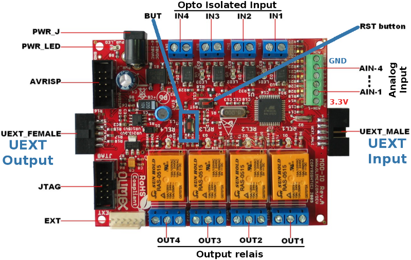

[Ce fichier existe également en FRANCAIS](readme.md)

# Use an Olimex MOD-IO with MicroPython

MOD-IO est une carte d'extension d'Olimex disposant d'un port UEXT.



The MOD-IO module did feature.
* 4 relay,
* 4 inputs with opto-coupler (compatible with 24V industrial standard)
* 4 analog input (0 - 3.3V)
* Daisy-chain design
* I2C interface (default address 0x58)
* Updatable I2C address (stored into EEProm)
* Power supply: 8-30VDC

# ESP8266-EVB under MicroPython
Avant de se lancer dans l'utilisation du module MOD-IO sous MicroPython, il faudra flasher votre ESP8266 en MicroPython.

We do recommend to read the [ESP8266-EVB article](https://wiki.mchobby.be/index.php?title=ESP8266-DEV) on the MCHobby WIKI.

That article explains [how to flash you ESP8266 board with a Console cable](https://wiki.mchobby.be/index.php?title=ESP8266-DEV).

## UEXT port

The ESP8266-EVB board, the UEXT port ship UART/serial lines, SPI & I2C bus as well as 3.3V power. Here the corresponding GPIO for the ESP8266-EVB.


# Library

The library must be copied on the MicroPython board before using the examples.

On a WiFi capable plateform:

```
>>> import mip
>>> mip.install("github:mchobby/esp8266-upy/modio")
```

Or via the mpremote utility :

```
mpremote mip install github:mchobby/esp8266-upy/modio
```

## Detail of modio library

Avant d'utiliser le script d'exemple, il est nécessaire de transférer la __bibliothèque modio__ sur votre carte micropython.

La bibliothèque offre les fonctionnalités suivantes

__Membres:__
* `booard.relais[index] = True` : (indexed property) change the relay state.
* `v = booard.relais[index]`    : (indexed property) Returns the relay state.
* `booard.relais`        : (property) Return state of all the relays.
* `booard.relais = True` : (property) Change state of all the relays (also accept a list of 4 items).
* `booard.input[3]`      : (indexed property) Read an opto-isolated input (True/False).
* `booard.inputs`        : (property) read all opto-coupler input (return a List with 4 entry).
* `booard.analogs[3]`    : (indexed property) Read an analogic input. Returns a voltage.
* `booard.analogs.raw = True`: (property) swap analog reading from voltage to raw value (10 bits integer, from 0 to 1023).

__Methodes:__
* `booard.change_address( 0x22 )` :Change the I2C address of the MOD-IO board. This example set it to 0x22 (instead of the default address 0x58). __The "BUT" button must be pressed down while this command is issued!

# Wiring

Pour commencer, j'utilise un [UEXT Splitter](http://shop.mchobby.be/product.php?id_product=1412) pour dupliquer le port UEXT. J'ai en effet besoin de raccorder à la fois le câble console pour communiquer avec l'ESP8266 en REPL __et__ raccorder le module MOD-IO.


J'ai ensuite effectuer les raccordements suivant sur la carte MOD-IO:


* L'opto-coupleur IN3 est activé à l'aide d'une tension de 16V (choisi arbitrairement entre 5 et 24V DC)
* Un potentiomètre de 10K est branché sur l'entrée analogique 2 (AIN-2) avec une tension fixée à 1.129v
* Les relais 1 et 3 (sur les 4 relais à disposition) sont activés.

# Tester

## MOD-IO example
```
from machine import I2C, Pin
from time import sleep_ms
from modio import MODIO

i2c = I2C( sda=Pin(2), scl=Pin(4) )
brd = MODIO( i2c ) # default address=0x58

# === Read Analog Input ===========================
for input_index in range( 4 ):
    print( 'Analog %s : %s Volts' %( input_index,brd.analogs[input_index] ) )

brd.analogs.raw = True
for input_index in range( 4 ):
    print( 'Analog %s : %s of 1023' %( input_index,brd.analogs[input_index] ) )

print( 'Read RAW alls analogs in one shot' )
print( brd.analogs.states )

print( 'Read VOLTS alls analogs in one shot' )
brd.analogs.raw = False # Switch back to voltage conversion
print( brd.analogs.states )

# === OptoIsolated Input ==========================
print( 'Read all OptoIsolated input' )
print( brd.inputs.states )
print( 'Read OptoIsolated input #3' )
print( brd.inputs[2] )

# === RELAIS ======================================
# Set REL1 and REL3 to ON (Python is 0 indexed)
print( 'Set relay by index' )
brd.relais[0] = True
brd.relais[2] = True
print( 'Relais[0..3] states : %s' % brd.relais.states )
sleep_ms( 2000 )
# switch all off
brd.relais.states = False

print( 'one relay at the time')
for irelay in range( 4 ):
    print( '   relay %s' % (irelay+1) )
    brd.relais[irelay] = True # Switch on the relay
    sleep_ms( 1000 )
    brd.relais[irelay] = False # Switch OFF the relay
    sleep_ms( 500 )

print( 'Update all relais at once' )
brd.relais.states = [True, True, False, True]
sleep_ms( 2000 )
print( 'Switch ON all relais' )
brd.relais.states = True
sleep_ms( 2000 )
print( 'Switch OFF all relais' )
brd.relais.states = False

print( "That's the end folks")
```

Which produce the following :

```
MicroPython v1.9.4-8-ga9a3caad0 on 2018-05-11; ESP module with ESP8266
Type "help()" for more information.
>>>
>>> import test
Analog 0 : 0.403226 Volts
Analog 1 : 0.0 Volts
Analog 2 : 1.00968 Volts
Analog 3 : 0.254839 Volts
Analog 0 : 126 of 1023
Analog 1 : 0 of 1023
Analog 2 : 313 of 1023
Analog 3 : 80 of 1023
Read RAW alls analogs in one shot
[126, 0, 313, 80]
Read VOLTS alls analogs in one shot
[0.403226, 0.0, 1.00645, 0.258064]
Read all OptoIsolated input
[False, False, False, False]
Read OptoIsolated input #3
False
Set relay by index
Relais[0..3] states : [True, False, True, False]
one relay at the time
   relay 1
   relay 2
   relay 3
   relay 4
Update all relais at once
Switch ON all relais
Switch OFF all relais
That's the end folks
>>>
```

# Change the MOD-IO I2C address

The following example shows how to change the MOD-IO address (default 0x58) to 0x22.

NOTICE: The button "BUT" (or "Prog" jumper) must be closed while issuing the `change_address()` command.

```
# Change the MOD-IO I2C address to 0x22
#
from machine import I2C, Pin
from modio import MODIO

i2c = I2C( sda=Pin(2), scl=Pin(4) )
brd = MODIO( i2c, addr=0x58 )
brd.change_address( 0x22 )
```

As the address change is instantaneous then the board will sent the ACK under the newer addess. As the MCU will wait the ACK from the older address, this will result into an error message  `OSError: [Errno 110] ETIMEDOUT` under MicroPython (which is expected in such case).

An `i2c.scan()` command can be used to check the activation of the newer address.

# Shopping List
* Shop: [UEXT Expandable Input/Output board (MOD-IO)](http://shop.mchobby.be/product.php?id_product=1408)
* Shop: [Module WiFi ESP8266 - ESP8266-EVB Evaluation board](http://shop.mchobby.be/product.php?id_product=668)
* Shop: [UEXT Splitter](http://shop.mchobby.be/product.php?id_product=1412)
* Shop: [Console cable](http://shop.mchobby.be/product.php?id_product=144)
