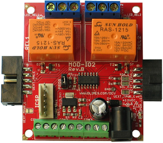
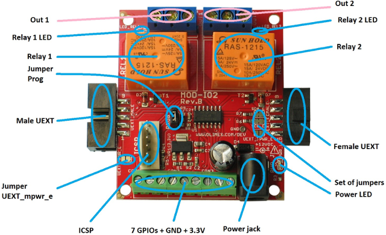
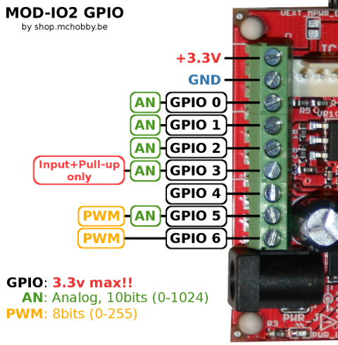

[Ce fichier existe également en FRANCAIS](readme.md)

# Use an Olimex MOD-IO2 with MicroPython

MOD-IO2 is an interface module from Olimex using an UEXT connector to ease connexion.



The module features
* 2 Relay
* 7 GPIOs - 3.3V max
	* 5 analog input (10 bits resolution)
	* 2 PWM output (100 KHz, 8 bits resolution)
* Can be chained
* I2C Interface (default address 0x21)
* Modifiable I2C address (Stored in EEProm)
* Power: 12VDC max

## Board details





# ESP8266-EVB under MicroPython
Avant de se lancer dans l'utilisation du module MOD-IO sous MicroPython, il faudra flasher votre ESP8266 en MicroPython.

We do recommend to read the [ESP8266-EVB article](https://wiki.mchobby.be/index.php?title=ESP8266-DEV) on the MCHobby WIKI.

That article explains [how to flash you ESP8266 board with a Console cable](https://wiki.mchobby.be/index.php?title=ESP8266-DEV).

## UEXT port

The ESP8266-EVB board, the UEXT port ship UART/serial lines, SPI & I2C bus as well as 3.3V power. Here the corresponding GPIO for the ESP8266-EVB.


# Library

The library must be copied on the MicroPython board before using the examples.

On a WiFi capable plateform:

```
>>> import mip
>>> mip.install("github:mchobby/esp8266-upy/modio2")
```

Or via the mpremote utility :

```
mpremote mip install github:mchobby/esp8266-upy/modio2
```

## Details of the modio2 library

Before using the various examples scripts, the __modio2 library__ must be copied to your MicroPython board.

The library offers the following features

__Membres:__
* `board.relais[index] = True` : (indexed property) change the relay state.
* `v = board.relais[index]`    : (indexed property) Returns the relay state.
* `board.relais`          : (property) Return state of all the relays.
* `board.relais = True`   : (property) Change state of all the relays (also accept a list of 4 items).
* `board.gpios.pin_modes` : (property) Returns a list with the pin_mode IN/OUT of each of the GPIO.
* `board.gpios.status`    : (property) Returns a list with the pin status for each IN/OUT  GPIOs (value not relevant for PWM, Analog pins).

__Methodes:__
* `board.change_address( 0x22 )` : Change the I2C address of the MOD-IO board. This example set it to 0x22 (instead of the default address 0x21). __The "BUT" button must be pressed down while this command is issued!
* `board.gpios.pin_mode( gpio, pinmode, pull_up=None )` : Define a GPIO as Pin.IN/Pin.OUT, allow to activate a Pin.PULL_UP resistor.
* `board.gpios.analog( gpio, raw = False )` : Read the voltage of an analog input GPIO. Raw will returns a 10 Bit value (0 to  1023).
* `board.gpios.pwm( gpio, cycle )` : Activates the PWM generator for a given pin and set the 8 bits duty cycle value (0 to 255).
* `board.gpios.pwm_close( gpio )` : ends the PWM feature for a pin (make it acting as input/high impedance).

# Wiring

Firstly, we do use an [UEXT Splitter](http://shop.mchobby.be/product.php?id_product=1412) to duplicates the UEXT. Then we plug the __Console cable__ to communicates with the MicroPython REPL running on the microcontroler.


Then we can plug our UEXT module on another UEXT connector.


# Testing

## MOD-IO2 example
```
from machine import I2C, Pin
from time import sleep_ms
from modio2 import MODIO2

i2c = I2C( sda=Pin(2), scl=Pin(4) )
brd = MODIO2( i2c ) # default address=0x21

# === Manipulate GPIO =============================
print( "Pin_modes")
print( brd.gpios.pin_modes )

print( "GPIO 5 - Analog read")
brd.gpios.pin_mode( 5, Pin.IN )
for i in range(10):
    volt = brd.gpios.analog(5)
    print( "AN7 = %s v" % volt )
    val  = brd.gpios.analog(5, raw=True )
    print( "AN7 = %s / 1023" % val )
    sleep_ms( 1000 )

# GPIO 0 - OUT
print( "GPIO 0 - OUT (On then Off)" )
brd.gpios.pin_mode( 0, Pin.OUT )
brd.gpios[0] = True
sleep_ms( 2000 )
brd.gpios[0] = False

print( "GPIO 1,2,3 - IN" )
brd.gpios.pin_mode( 1, Pin.IN )
brd.gpios.pin_mode( 2, Pin.IN )
brd.gpios.pin_mode( 3, Pin.IN, Pin.PULL_UP ) # pull up mandatory on Pin 3
print( "Pin_modes")
print( brd.gpios.pin_modes )
print( "All inputs state (1/0)" )
print( brd.gpios.states )

# === RELAIS ======================================
# Set REL1 and REL2 to ON (Python is 0 indexed)
print( 'Set relay by index' )
brd.relais[0] = True
brd.relais[1] = False
print( 'Relais[0..1] states : %s' % brd.relais.states )
sleep_ms( 2000 )
# switch all off
brd.relais.states = False

print( 'one relay at the time')
for irelay in range( 2 ):
    print( '   relay %s' % (irelay+1) )
    brd.relais[irelay] = True # Switch on the relay
    sleep_ms( 1000 )
    brd.relais[irelay] = False # Switch OFF the relay
    sleep_ms( 500 )

print( 'Update all relais at once' )
brd.relais.states = [False, True]
sleep_ms( 2000 )
print( 'Switch ON all relais' )
brd.relais.states = True
sleep_ms( 2000 )
print( 'Switch OFF all relais' )
brd.relais.states = False

print( "That's the end folks")
```

Which produces the following :

```
MicroPython v1.9.4-8-ga9a3caad0 on 2018-05-11; ESP module with ESP8266
Type "help()" for more information.
>>> import test2
Pin_modes
['IN', 'IN', 'IN', 'IN', 'IN', 'IN', 'IN']
GPIO 5 - Analog read
AN7 = 1.86452 v
AN7 = 578 / 1023
AN7 = 1.86452 v
AN7 = 578 / 1023
AN7 = 1.86452 v
AN7 = 578 / 1023
AN7 = 1.86452 v
AN7 = 578 / 1023
AN7 = 1.86452 v
AN7 = 578 / 1023
AN7 = 1.86452 v
AN7 = 578 / 1023
AN7 = 1.86452 v
AN7 = 578 / 1023
AN7 = 1.86452 v
AN7 = 578 / 1023
AN7 = 1.86452 v
AN7 = 578 / 1023
AN7 = 1.86452 v
AN7 = 578 / 1023
GPIO 0 - OUT (On then Off)
GPIO 1,2,3 - IN
Pin_modes
['OUT', 'IN', 'IN', 'IN', 'IN', 'IN', 'IN']
All inputs state (1/0)
36
[False, False, True, False, False, True, False]
Set relay by index
Relais[0..1] states : [True, False]
one relay at the time
   relay 1
   relay 2
Update all relais at once
Switch ON all relais
Switch OFF all relais
That's the end folks
>>>
```

## MOD-IO2 PWM example
PWM is only available for GPIO 5 & 6.

On the following example, analog read is made on the GPIO 5 (RAW value from 0 to 1024).

Then the raw value is used to set the PWM duty cycle on GPIO 6 (0 to 255).

```
# Test PWM sur le MOD-IO2 d'Olimex avec un ESP8266 sous MicroPython
#
# Shop: http://shop.mchobby.be/product.php?id_product=1409
# Wiki: https://wiki.mchobby.be/index.php?title=MICROPYTHON-MOD-IO2

from machine import I2C, Pin
from time import sleep_ms
from modio2 import MODIO2

i2c = I2C( sda=Pin(2), scl=Pin(4) )
brd = MODIO2( i2c ) # default address=0x21

print( "GPIO 5 - IN")
brd.gpios.pin_mode( 5, Pin.IN )

print( "GPIO 6 - PWM" )
brd.gpios.pwm( gpio=6, cycle=0 )

cycle=0
while cycle<255:
    val = brd.gpios.analog( 5, raw = True )
    cycle = val // 4 # from 0..1023 to 0..254
    if cycle >= 254: # ensure a 100% duty cycle
        cycle = 255
    brd.gpios.pwm( 6, cycle )
    print( "val=%s -> cycle=%s" %(val,cycle) )
    sleep_ms( 1000 )

print( "That's the end folks")

```

ce qui produit le résultat suivant:

```
MicroPython v1.9.4-8-ga9a3caad0 on 2018-05-11; ESP module with ESP8266
Type "help()" for more information.
>>>
>>> import test2pwm
GPIO 5 - IN
GPIO 6 - PWM
val=698 -> cycle=174
val=698 -> cycle=174
val=620 -> cycle=155
val=614 -> cycle=153
val=597 -> cycle=149
val=429 -> cycle=107
val=325 -> cycle=81
val=314 -> cycle=78
val=120 -> cycle=30
val=282 -> cycle=70
val=496 -> cycle=124
val=494 -> cycle=123
val=701 -> cycle=175
val=880 -> cycle=220
val=978 -> cycle=244
val=979 -> cycle=244
val=982 -> cycle=245
val=1023 -> cycle=255
That's the end folks
>>>  
```
# Change the MOD-IO2 I2C address

The following example wull change the default address of MOD-IO2 to 0x22.

NOTICE: The button "BUT" (or "PROG" jumper) must be close while executing `change_address()` otherwise the new address will not be stored in the EEPROM.

```
from machine import I2C, Pin
from modio2 import MODIO2

i2c = I2C( sda=Pin(2), scl=Pin(4) )
brd = MODIO2( i2c, addr=0x21 )
brd.change_address( 0x22 )
```

As the address change is instantaneous then the board will sent the ACK under the newer addess. As the MCU will wait the ACK from the older address, this will result into an error message  `OSError: [Errno 110] ETIMEDOUT` under MicroPython (which is expected in such case).

An `i2c.scan()` command can be used to check the activation of the newer address.

# Shopping List
* Shop: [UEXT Expandable Input/Output board (MOD-IO2)](http://shop.mchobby.be/product.php?id_product=1409)
* Shop: [Module WiFi ESP8266 - ESP8266-EVB evaluation board](http://shop.mchobby.be/product.php?id_product=668)
* Shop: [UEXT Splitter](http://shop.mchobby.be/product.php?id_product=1412)
* Shop: [Console cable](http://shop.mchobby.be/product.php?id_product=144)
