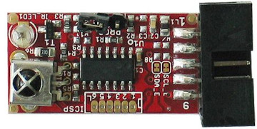
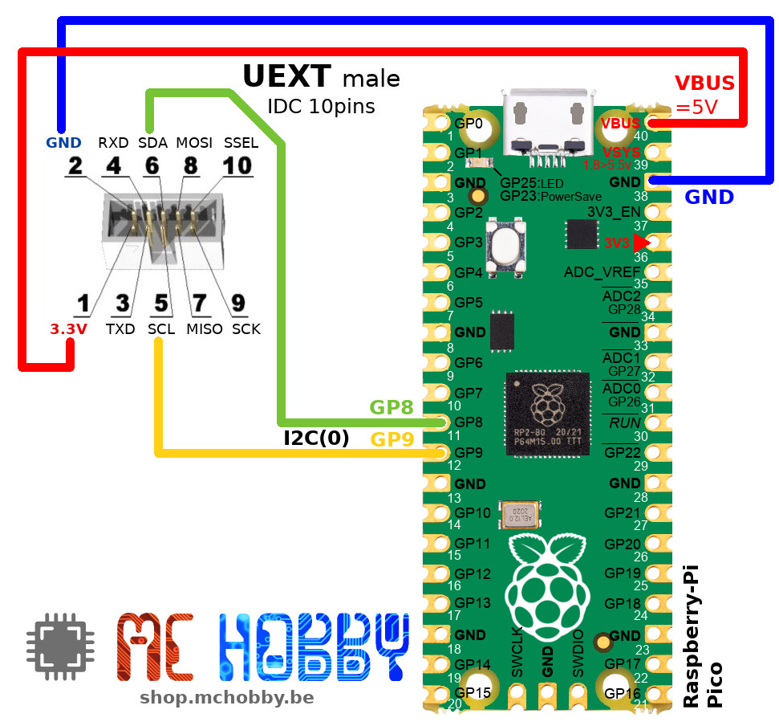
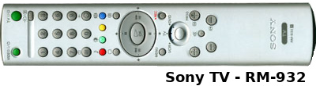

[This file also exists in ENGLISH here](readme_ENG.md)

# Utiliser un émetteur-récepteur infrarouge I2C avec votre carte MicroPython

Ce module I2C permet a un projet de communiquer sur une courte distance (~5m) via infrarouge. Comme il implémente les protocoles RC5 et SIRCS (voir détails plus bas), ce module peut être utilisé pour recevoir des instructions depuis des télécommandes Sony / Philips ou se faire passer pour une telle télécommande.

Les utilisateurs avancés pourrons utiliser une paire de module pour réaliser une communication infrarouge bidirectionnelle afin d'automatiser la communication entre deux modules intelligents (ce que le protocole SIRCS supportera plus facilement).



Ce module supporte deux des protocoles Infrarouge les plus courants:

__Protocole RC5:__

Aussi appelé RC-5, ce protocole binaire fût créé par __Philips__ et permet de contrôler des appareils audio visuels. Il exploite une porteuse à 36 KHz pour envoyer des instructions codées sur 6 bits (0..63) vers des appareils dont l'adresses est codée sur 5 bits (0..31). Cela représente 32*64 = 2048 combinaisons possibles.


__Protocole SIRCS:__

Aussi appelé Cntrl-S, ce protocole binaire fût créé par __Sony__ pour contrôler des appareils audio-visuels. Il exploite une porteuse à 40 KHz pour envoyer des instructions codées sur 7 bits de commande (0..127) et 5 bits d'adresses (0..31). Les bits d'adresses peuvent être élargis à 13 bits mais cla n'est pas supporté par le module IRDA+.

# Brancher
Le capteur se branche très simplement sur une carte équipée d'un port UEXT comme l' [adaptateur UEXT pour pyboard](https://github.com/mchobby/pyboard-driver/tree/master/UEXT), la carte [Pyboard-UNO-R3](https://shop.mchobby.be/fr/nouveaute/1745-adaptateur-pyboard-vers-uno-r3-extra-3232100017450.html) ou le [Pico-Hat pour Raspberry-Pi Pico](https://shop.mchobby.be/fr/pico-rp2040/2037-interface-hat-pour-raspberry-pi-pico-3232100020375.html).

## Mod-Irda sur Pyboard

Bancher un connecteur UEXT (IDC 10 broches) directement sur la Pyboard comme indiqué ci-dessous. Il ne restera plus qu'a brancher le module UEXT.


En utilisant ce câblage, il faut modifier les scripts de tests pour utiliser le bus I2C(2) .

## Mod-Irda sur Pico

Bancher un connecteur UEXT (IDC 10 broches) directement sur la Raspberry-Pi Pico comme indiqué ci-dessous. Il ne restera plus qu'a brancher le module UEXT.



# Tester
La bibliothèque [irdaplus.py](lib/irdaplus.py) doit être copiée sur la carte MicroPython.

## Lecture SIRCS (télécommande Sony)

L'exemple [test_sirc_read.py](examples/test_sirc_read.py) réceptionne et affiche les commandes envoyées par une télécommande Sony.



A noter:
* L'appel de la méthode `read_command()` retourne `None` s'il n'y a rien de réceptionner.
* Le bus I2C a été ralenti à 10K baud pour une meilleure fiabilité de la communication sur le bus.

``` python
from machine import I2C
from time import sleep_ms
from irdaplus import IrdaPlus, MODE_SIRC

# Pico sda=GP8, scl=GP9
i2c = I2C(0, freq=10000 ) # Slow down the bus to improve communication reliability

irda = IrdaPlus( i2c )
print( "SIRCS (SONY) IR Remote decoder" )
print( "IRDA Module ID: %i" % irda.get_id() )

irda.set_mode( MODE_SIRC )
while True:
    decoded = irda.read_command()
    if decoded:
        print( 'device %i, command %i' % decoded )
    sleep_ms( 300 )
```

Ce qui produit le résultat suivant! Des annotations ont été insérées pour indiquer la fonction utilisée sur la télécommande.

``` python
MicroPython v1.14 on 2021-02-05; Raspberry Pi Pico with RP2040
Type "help()" for more information.
>>>
>>> import test_sirc_read
SIRCS (SONY) IR Remote decoder
IRDA Module ID: 84

=== TV ==========
--- On/Off
device 1, command 21
device 1, command 21
--- Vol+ & Vol-
device 1, command 18
device 1, command 19
device 1, command 19
--- Prog+ & Prog-
device 1, command 16
device 1, command 16
device 1, command 17
device 1, command 17
--- Mute
device 1, command 20
device 1, command 20
device 1, command 20
device 1, command 20

--- #0
device 1, command 9
device 1, command 9
--- #1..#9
device 1, command 0
device 1, command 1
device 1, command 2
device 1, command 3
device 1, command 3
device 1, command 4
device 1, command 4
device 1, command 5
device 1, command 5
device 1, command 6
device 1, command 6
device 1, command 7
device 1, command 7
device 1, command 8

=== TV ==========
--- TV: menu
device 1, command 96
--- TV: OK (Play)
device 1, command 101
--- TV: UP (Pause)
device 1, command 116
device 1, command 116
-- TV: DOWN (Stop)
device 1, command 117
device 1, command 117
--- TV: LEFT (Backward)
device 1, command 52
--- TV: RIGHT (Forward)
device 1, command 51

--- TV: Red

--- TV: Green

--- TV: Yellow

--- TV: Blue


=== VCR ==========
--- VCR: Play
device 11, command 26
device 11, command 26
--- VCR: Pause
device 11, command 25
--- VCR: Stop
device 11, command 24
device 11, command 24
--- VCR: Left
device 11, command 27
--- VCR: Right
device 11, command 28

--- VCR:Red (audio)
device 3, command 76
device 3, command 76
--- VCR:Green (brightness)
device 3, command 77
device 3, command 77
--- VCR:Yellow (Nothing received)

-- VCR:Blue (alignment)
device 3, command 79
device 3, command 79
```

## Envoi SIRCS (télécommande Sony)

Le module peut également se faire passer pour une télécommande. Le script [test_sirc_write.py](examples/test_sirc_write.py) envoi des modifications de volume vers un périphérique TV Sony.

``` python
from machine import I2C
from time import sleep, sleep_ms
from irdaplus import IrdaPlus, MODE_SIRC

# Pico sda=GP8, scl=GP9
i2c = I2C(0, freq=10000 ) # Slow down the bus for a more reliable communication

irda = IrdaPlus( i2c )
print( "SIRCS (SONY) IR Remote send command" )
print( "IRDA Module ID: %i" % irda.get_id() )

irda.set_mode( MODE_SIRC )

# Minimal amount of time required by the IRDA+ module to send the IR command
# and being ready again to read the I2C bus.
# Below 30ms, multiples writing on the will hang the I2C bus.
SEND_PAUSE_MS = 30
print( "Send pause ms = %s" % SEND_PAUSE_MS )

# Send Vol+ to Sony TV
print( "Send Vol+" )
for i in range( 20 ):
    irda.send_command( device=1, cmd=18 ) # Maybe 16 on some Sony TV
    sleep_ms( SEND_PAUSE_MS )

sleep( 1 )

# Send Vol- to Sony TV
print( "send Vol-" )
for i in range( 20 ):
    irda.send_command( device=1, cmd=19 ) # Maybe 17 on some Sony TV
    sleep_ms( SEND_PAUSE_MS )
print( "Done!" )
```

## Send/Receive RC5 (Philips remote)

The operations in 'MODE_RC5' (Philips) are identical to 'MODE_SIRCS' mode (Sony).

The only difference can be identified on the `read_command()` method which returns a third `toggle` (True/False) item in the tuple.

``` python
from machine import I2C
from time import sleep_ms
from irdaplus import IrdaPlus, MODE_RC5

# Pico sda=GP8, scl=GP9
i2c = I2C(0, freq=10000 ) # Slow down the I2C bus for a more reliable communication

irda = IrdaPlus( i2c )
irda.set_mode( MODE_RC5 ) # ACTIVATE THE MODE FOR Philips REMOTE

print( "RC5 (PHILIPS) IR Remote decoder" )
print( "Module ID: %i" % irda.get_id() )
while True:
    decoded = irda.read_command()
    if decoded:
        print( 'device %i, command %i, toggle %s' % decoded )
    sleep_ms( 300 )
```

# Shopping list
* [MOD-IRDA+ : infrared module](https://shop.mchobby.be/fr/pico-rp2040/2037-interface-hat-pour-raspberry-pi-pico-3232100020375.html) @ MCHobby
* [MOD-IRDA+ : infrared module](https://www.olimex.com/Products/Modules/Interface/MOD-IRDA+/open-source-hardware) @ Olimex
