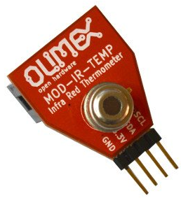
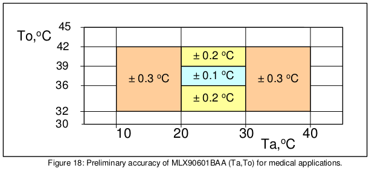
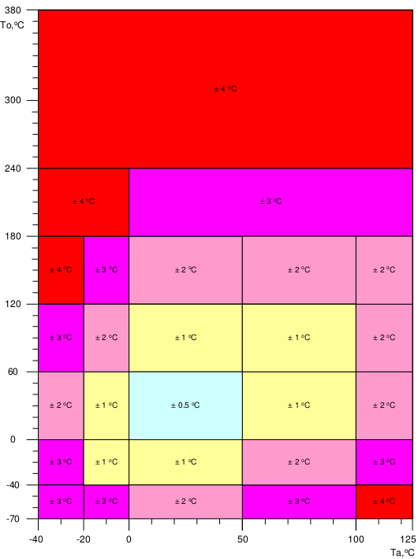
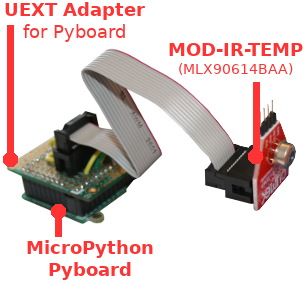
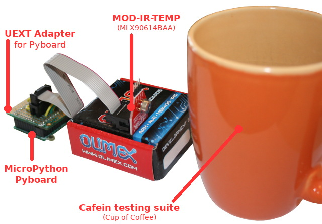

[Ce fichier existe également en FRANCAIS](readme.md)

# Measuring temperature with the NON-CONTACT IR temperature sensor

MOD-IR-TEMP is an infra red thermometer based on Melexis MLX90614BAA chip.



The MLX90614BAA is factory calibrated in wide temperature range:
* -40 to 125 °C for sensor temperature and
* -70 to 380 °C for object temperature.
* the BAA version is for medical application and offers a precision of 0.02°C resolution (in a restricted range).

The MLX90614BAA offers the following precision the medical coverage



The precision also depend of temperature range measured as demonstrates the following image.



# wiring

In this example, we just wired the MOD-IR-TEMP UEXT module on our test Pyboard. But this could be plug as easily with the ESP8266-EVB board.



## Port UEXT

The wiring of an UEXT Port on ESP8266 is described in the [UEXT folder](../UEXT/readme_eng.md) of this GitHub.

The [UEXT adapter for MicroPython Pyboard](https://github.com/mchobby/pyboard-driver/tree/master/UEXT) is also available in the (Pyboard-Driver)[https://github.com/mchobby/pyboard-driver] GitHub.

# Test
To test the sensor just copy the files `mlx90614.py` (the driver) and `mlxtest.py` to the micropython board,

the following command can key key-in from the REPL session `import mlxtest`



Which produce the following result with my cup of coffee:

```
raw_values (Ambiant, Object) (24.25, 24.95001)
Ambiant T°: 24.250 C
Object  T°: 24.950 C

Ambiant T°     Object  T°    
24.250 C        24.950 C       
24.270 C        24.990 C       
24.210 C        24.930 C   
... placing the sensor in the front of the cup
24.990 C        39.670 C       
24.990 C        39.830 C       
25.010 C        39.990 C       
24.990 C        40.090 C       
24.990 C        40.010 C       
24.990 C        40.130 C       
24.990 C        40.130 C       
25.010 C        39.910 C       
24.990 C        39.890 C       
24.970 C        39.950 C       
24.970 C        39.990 C
```

# Where to buy
* Shop: UEXT Module MOD-IR-TEMP (to be defined)
* Shop: [Module WiFi ESP8266 - carte d'évaluation (ESP8266-EVB)](http://shop.mchobby.be/product.php?id_product=668)
* Shop: [UEXT Splitter](http://shop.mchobby.be/product.php?id_product=1412)
* Shop: [Câble console](http://shop.mchobby.be/product.php?id_product=144)
* Shop: [UEXT Module MOD-IR-TEMP](https://www.olimex.com/Products/Modules/Sensors/MOD-IR-TEMP/open-source-hardware) @ OLIMEX
