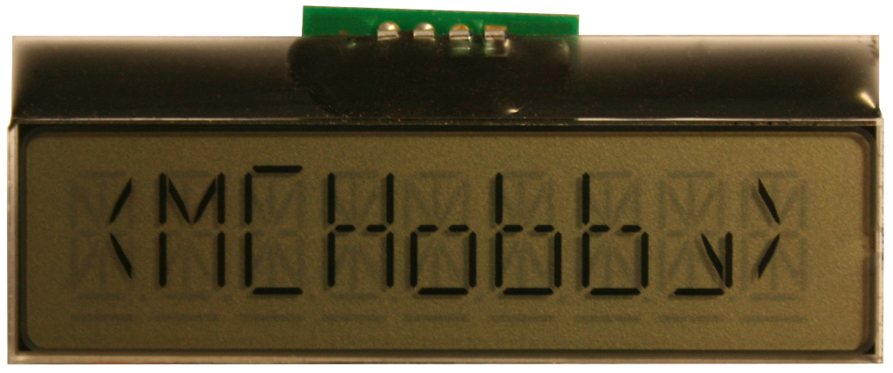
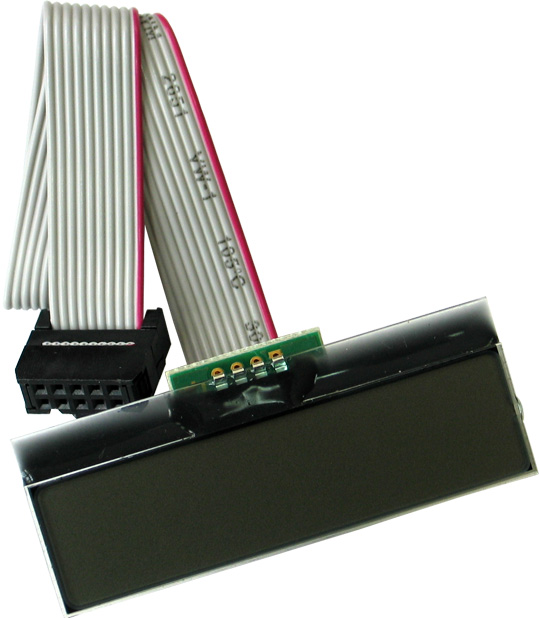
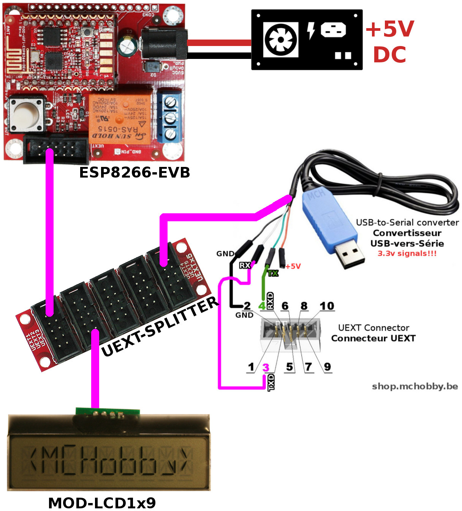
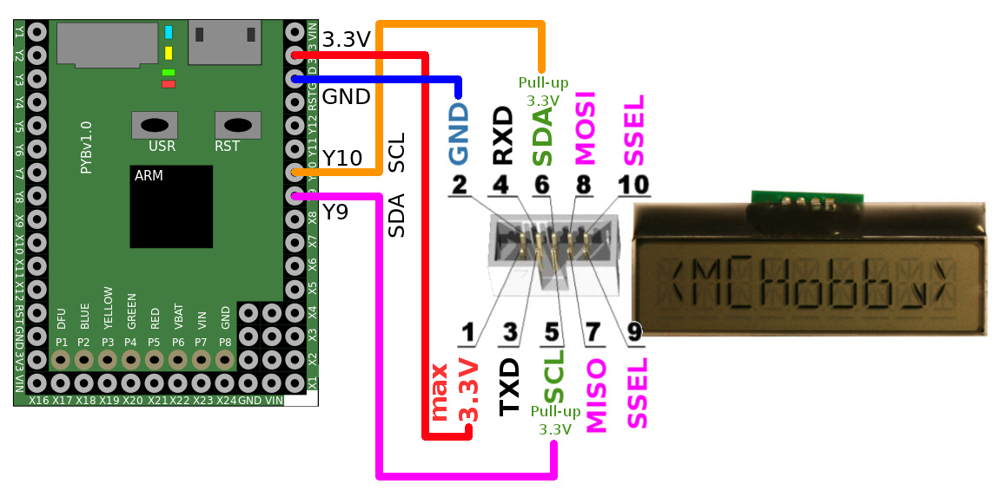

[Ce fichier existe également en FRANCAIS ici](readme.md)

# Using the Olimex's MOD-LCD1x9 with MicroPython

MOD-LCD1x9 is a Alphanumeric display with 9 positions produced by Olimex and fitted with an UEXT connector.





The MOD-LCD1x9 do offers:
* An I2C bus
* A decimal point at each position
* A selection bar (Under Bar) under each character (useful to indicates a selected option).
* An UEXT connector for quick connection

The MicroPython `modlcd19.py` library will allow to manipulates point and under bar (which superseed the Arduino library).

# ESP8266-EVB / Pyboard under MicroPython
Before using the LCD module under MicroPython, you will need to flash MicroPython on your microcontroler board.

If you are using an ESP8266-EVB then read our [ESP8266-EVB](https://wiki.mchobby.be/index.php?title=ESP8266-DEV) article on the MC Hobby Wiki.

The article explains [how to flash the ESP8266 with a console cable](https://wiki.mchobby.be/index.php?title=ESP8266-DEV).

## UEXT port

The ESP8266-EVB board, the UEXT port ship UART/serial lines, SPI & I2C bus as well as 3.3V power. Here the corresponding GPIO for the ESP8266-EVB.


# Library

The library must be copied on the MicroPython board before using the examples.

On a WiFi capable plateform:

```
>>> import mip
>>> mip.install("github:mchobby/esp8266-upy/modlcd1x9")
```

Or via the mpremote utility :

```
mpremote mip install github:mchobby/esp8266-upy/modlcd1x9
```

## Library details

The `modlcd19.py` library offer the following :

__Membres:__
* None

__Methods:__
* `write`  : display a value of type text, float or int on the LCD. See details here below.
* `point`  : Activate the point on the matrix dos^may (`position` from 1 to 9, `enable` True/False/None). You can force the instantaneous display update with `force_update`=True.
* `selection` : Activate the selection bar (under bar) on the display. As for the `point` method, the `enable` parameter can be used to activate the item and `force_update` will force the LCD update immediately.
* `update` : Send the buffer to the LCD (user code should not call this method directly).

__Methode write:__
`write( value, format=None, scrool_time=0.350 )`

Send a value to the LCD.
* `value` is a String: If length is less or equal to 9 chars then is is displayed. Over 9 characters then the text is scrolled on the screen (with scrool_time for each new char displayed).
* `value` is a float or Int: value is aligned on the right! The `format` parameter can be used to improve formating.
* `format`: Applies a Python format string to the value.

Example:
 * lcd.write( 12.4693, format='%.3f v' ) -> with 3 décimals -> "12.469 v"
 * lcd.write( 12.13, '%5d' ) -> display the Float as in integer -> "   12"

# Wiring
## MOD-LCD1x9 with ESP8266-EVB

Here is a simple connector cable to connect the MOD-LED8x8RGB to any UEXT host port.



## MOD-LCD1x9 sur Pyboard

If you don't have an  [UEXT interface board for Pyboard](https://github.com/mchobby/pyboard-driver/tree/master/UEXT) you can still make the wiring as follow:



# Testing

## MOD-LCD1x9 example
```
# Using the Olimex's MOD-LCD1x9 with MicroPython
#
# Shop: [UEXT LCD1x9 board (MOD-RGB)](http://shop.mchobby.be/product.php?id_product=1414)
# Wiki: https://wiki.mchobby.be/index.php?title=MICROPYTHON-MOD-LCD1x9

from machine import I2C, Pin
from time import sleep
from modlcd19 import MODLCD1x9

# ESP8266-EVB
i2c = I2C( sda=Pin(2), scl=Pin(4) )
# PyBoard
# i2c = I2C(2)
lcd = MODLCD1x9( i2c ) # activates all the segments

# Displays of 9 chars (at the most)
lcd.write( '123456789' )
sleep( 2 )
lcd.write( '<mchobby>' )
sleep( 2 )

# Display a long string --> scrolling on the the display
lcd.write( 'Hey, this is a message from Belgium' )

# Activate the decimal point
lcd.write( 'ABCDEFGHI')
for i in range( 9 ):
	lcd.point( i+1, True, force_update=True )
	sleep( 1 )
	lcd.point( i+1, False, force_update=True )

sleep( 1 )

# Activate the selection under bar
for i in range( 9 ):
	lcd.selection( i+1, True, force_update=True )
	sleep( 1 )
	lcd.selection( i+1, False, force_update=True )


lcd.write( 'The end.')
print( "That's the end folks")
```

## test float example
Here is the `testflt.py` script content. This example demonstrate the decimal/float value display, alignment to the right with formating string.

```
from machine import I2C, Pin
from time import sleep
from modlcd19 import MODLCD1x9

# Esp8266-EVB
i2c = I2C( sda=Pin(2), scl=Pin(4) )
# PyBoard
# i2c = I2C(2)
lcd = MODLCD1x9( i2c ) # activate all segments

# starting decimal value
volt = 15.125
while True:
    volt = volt + 0.033
    # Display a float with 3 décimals and a "v" for volts
    # voir: https://docs.python.org/3/library/string.html#format-examples
    lcd.write( volt, format='%.3f v' )
    # gives some time to the LCD to display the value (en being read by user)
    sleep( 0.100 )

print( "That's the end folks")
```

# Shopping list
* [UEXT Module MOD-LCD1x9](http://shop.mchobby.be/product.php?id_product=1414) @ MCHobby
* [UEXT Module MOD-LCD1x9](https://www.olimex.com/Products/Modules/LCD/MOD-LCD-1x9/open-source-hardware) @ Olimex
* [ESP8266-EVB: ESP8266 evaluation board](http://shop.mchobby.be/product.php?id_product=668) @ MCHobby
* [ESP8266-EVB](https://www.olimex.com/Products/IoT/ESP8266/ESP8266-EVB/open-source-hardware) @ Olimex
* [MicroPython Pyboard](https://shop.mchobby.be/fr/56-micropython) @ MCHobby
* [UEXT Splitter](http://shop.mchobby.be/product.php?id_product=1412) @ MCHobby
* [Console cable](http://shop.mchobby.be/product.php?id_product=144) @ MCHobby
