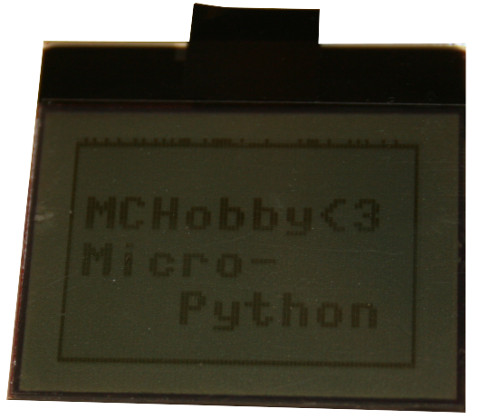
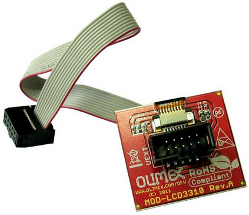
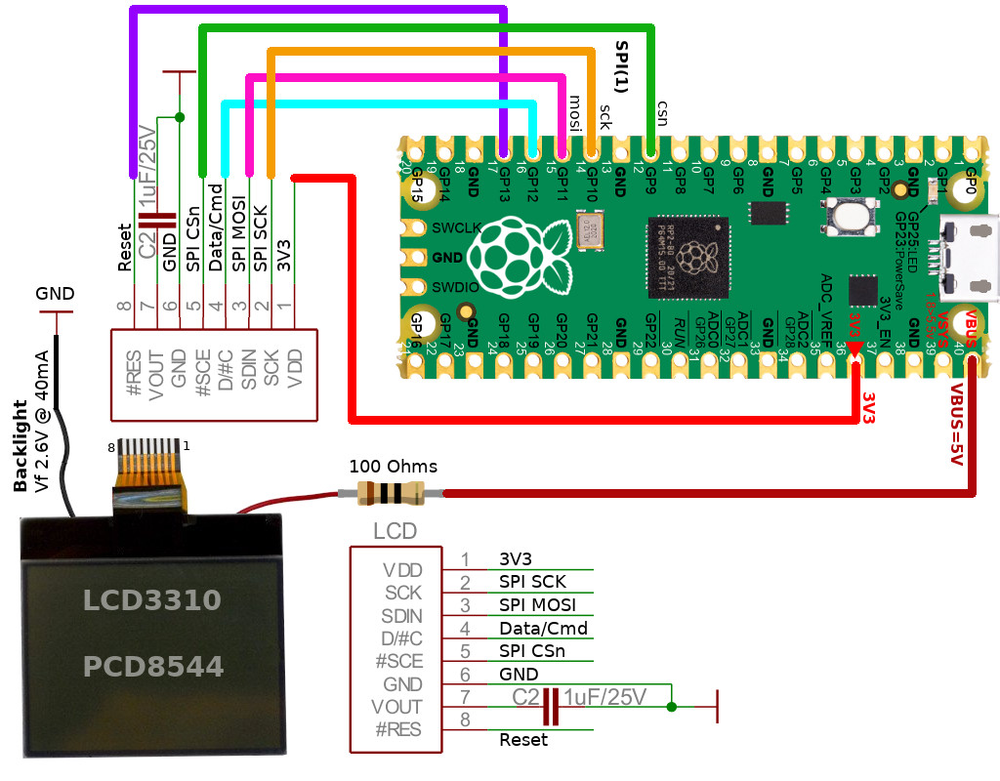
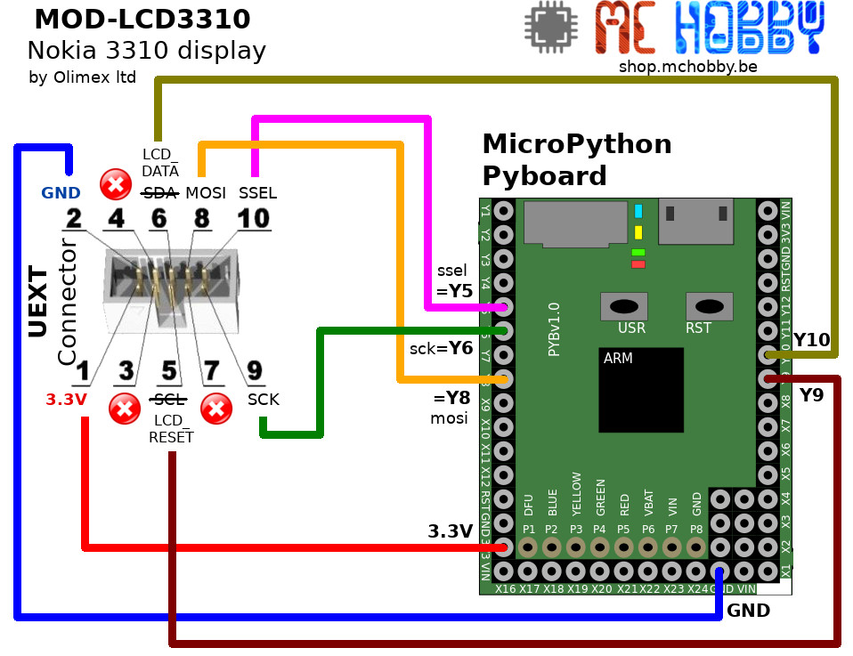

[Ce fichier existe également en FRANCAIS ici](readme.md)

# Use a Nokia 3310 display with MicroPython (FrameBuffer)

This LCD display of 84 x 48 pixels is still available today and quite easy to locate.

It use a SPI bus (one way only) to send the data to the screen, the troughtput is fast enough to offers a smooth display and nice user experience.



The [MOD-LCD3310 d'Olimex](https://shop.mchobby.be/fr/uext/1867-afficheur-noirblanc-84x48-px-nokia-3310-3232100018679-olimex.html) is fit with an standard UEXT connector to make the connection as simple as plug in a cable.



As the UEXT pins have a 2.54mm spacing, it is also possible to connect the display on your favorite microcontroler with some Dupont wires.

__Note:__ the very first line of the display doesn't seems to be proprely managed (there is a shift of one bit somewhere in the LCD RAM). This must still be fixed.

# Library

The library must be copied on the MicroPython board before using the examples.

On a WiFi capable plateform:

```
>>> import mip
>>> mip.install("github:mchobby/esp8266-upy/modlcd3310")
```

Or via the mpremote utility :

```
mpremote mip install github:mchobby/esp8266-upy/modlcd3310
```

# Wiring

## Pico to LCD3310



## Pyboard with UEXT connector

We do have a standard UEXT connector board to plug onto the MicroPython Pyboard, [the wiring is described here in the GitHubt](https://github.com/mchobby/pyboard-driver/tree/master/UEXT).  


Just need to plug the module on it.

## Pyboard on MOD-LCD3310

Here is how to directly wire the Pyboard on the back of the MOD-LCD3310 (on its UEXT connector).



# Test

Before testing the code, it will be necessary to copy the `lib/lcd3310.py` library on your MicroPython board.

The LCD3310 driver inherits from [`framebuf.FrameBuffer`](https://docs.micropython.org/en/latest/library/framebuf.html) so it have access to all the drawing methods offers by the FrameBuffer.

## Test with Pico 
The `test_pico.py` example visible here below show how to use the dîsplay with the driver.

``` python
import time
from machine import SPI, Pin
from lcd3310 import LCD3310

# Pico - create the bus & Pins
ssel = Pin( Pin.board.GP9, Pin.OUT, value=True ) # Not selected by default
lcd_reset = Pin( Pin.board.GP13, Pin.OUT, value=True ) # Not selected by default
lcd_data  = Pin( Pin.board.GP12, Pin.OUT, value=True ) # Data/Command (Data by default)
spi = SPI( 1, miso=Pin.board.GP8, mosi=Pin.board.GP11, sck=Pin.board.GP10 ) 

lcd = LCD3310( spi, ssel, lcd_reset, lcd_data )
print( "contrast: %s" % lcd.contrast )
# See all Framebuffer Method for more information
# https://docs.micropython.org/en/latest/library/framebuf.html
#
lcd.fill( 1 ) # Light-up all points
lcd.text( "Hello", 0,0,0 ) # text, x,y, color=0=transparent
lcd.update()
time.sleep( 3 )

lcd.clear()
lcd.text( "MCHobby<3", 3, 12 )
lcd.text( "Micro-", 3, 12+10 )
lcd.text( "   Python", 3, 12+10+10 )
lcd.rect(0,0,83,47,1)
lcd.update()
```

## Test with Pyboard

The following `test.py` example show how to use the driver/library to draw on the screen (all the FrameBuffer drawing methods aren't used here).

``` python
import time
from machine import SPI, Pin
from lcd3310 import LCD3310

# Pico - create the bus & Pins
ssel = Pin( "Y5", Pin.OUT, value=True ) # Not selected by default
lcd_reset = Pin( "Y9", Pin.OUT, value=True ) # Not selected by default
lcd_data  = Pin( "Y10", Pin.OUT, value=True ) # Data/Command (Data by default)
spi = SPI( 2 ) # y7=mosi, y6=sck

lcd = LCD3310( spi, ssel, lcd_reset, lcd_data )
print( "contrast: %s" % lcd.contrast )
# See all Framebuffer Method for more information
# https://docs.micropython.org/en/latest/library/framebuf.html
#
lcd.fill( 1 ) # Light-up all points
lcd.text( "Hello", 0,0,0 ) # text, x,y, color=0=transparent
lcd.update()
time.sleep( 3 )

lcd.clear()
lcd.text( "MCHobby<3", 3, 12 )
lcd.text( "Micro-", 3, 12+10 )
lcd.text( "   Python", 3, 12+10+10 )
lcd.rect(0,0,83,47,1)
lcd.update()

# Increase the contrast (0..127)
lcd.contrast = 110
```

# Shopping list
* [MOD-LCD3310 - écran Nokia 3310 84x48 pixels](https://shop.mchobby.be/fr/uext/1867-afficheur-noirblanc-84x48-px-nokia-3310-3232100018679-olimex.html) @ MCHobby
* [MOD-LCD3310 - écran Nokia 3310 84x48 pixels](https://www.olimex.com/Products/Modules/LCD/MOD-LCD3310/open-source-hardware) @ Olimex
* [MicroPython boards](https://shop.mchobby.be/fr/56-micropython) @ MCHobby
