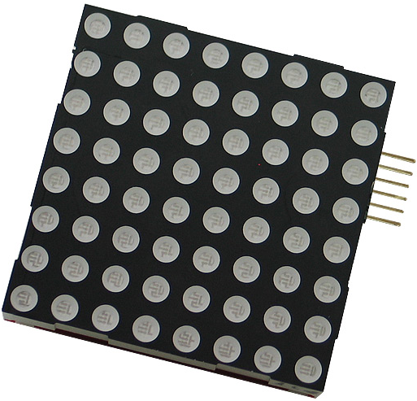
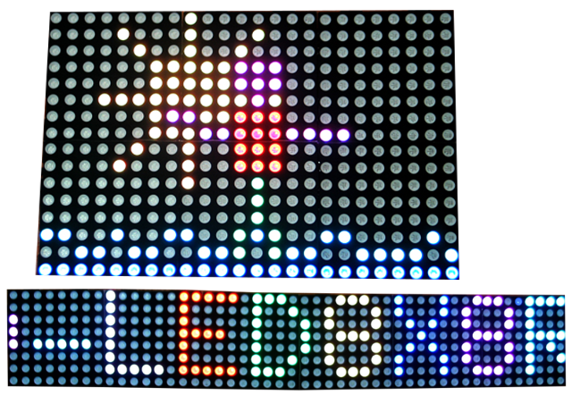
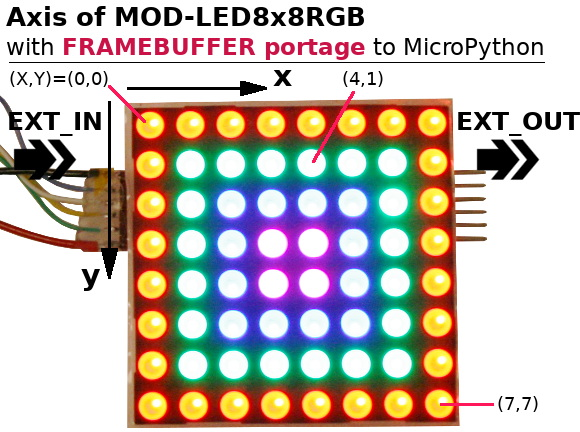
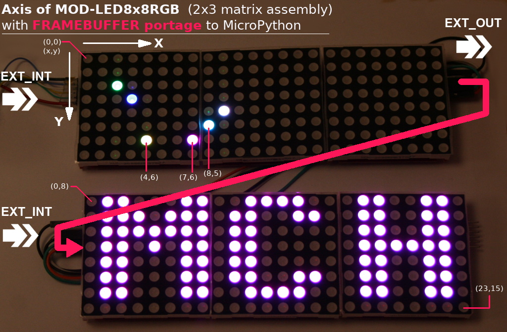
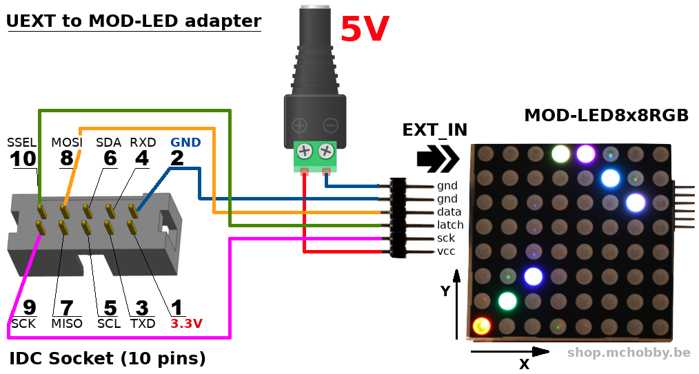
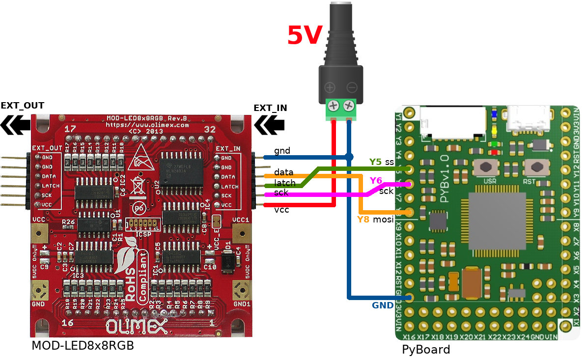
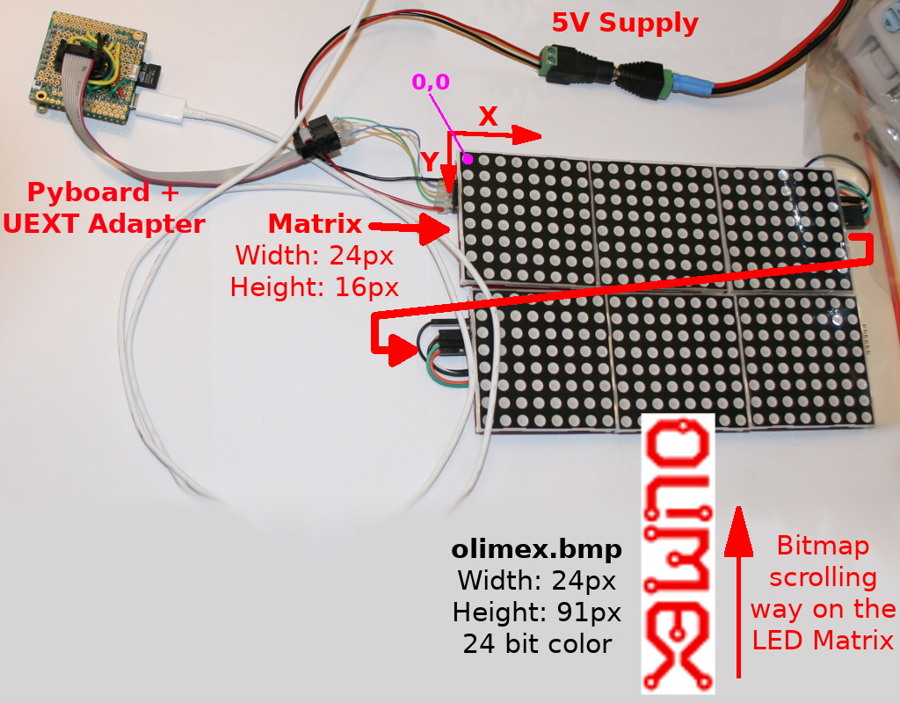

[Ce fichier existe également en FRANCAIS](readme.md)

# Create LED display with MOD-LED8x8RGB slabs


The __MOD-LED8x8RGB__ is an SPI based 8x8 LED module created by [Olimex](https://www.olimex.com).

The modules can be daisy chained to create digital signage or LED display with RGB LEDs (3 fundamental colors + combinations) slab or white leds slabs.



As described in the [datasheet](https://www.olimex.com/Products/Modules/LED/MOD-LED8x8RGB/open-source-hardware), the modules use a simple opensource protocol and __oneway SPI bus__.

The MOD-LED8x8RGB sit in UEXT category but does not expose the UEXT connector. Indeed the UEXT connector is replaced with a pinHeader suited for daysi chaining the slabs/matrix. By the way a simple conversion connector can easily be made (see further).

This board can be found:
* [MOD-LED8x8RGB](https://shop.mchobby.be/fr/138-uext) @ MCHobby
* [MOD-LED8x8RGB](https://www.olimex.com/Products/Modules/LED/MOD-LED8x8RGB/open-source-hardware) @ Olimex.com

# FrameBuffer implementation

The ModLedRGB driver inherit from MicroPython's FrameBuffer class. So every method of FrameBuffer is available on ModLedRGB and the ModLedRGB can be given as FrameBuffer parameter to any function/method.

See [Frame buffer manipulation @ MicroPython.org](http://docs.micropython.org/en/latest/library/framebuf.html?highlight=framebuffer) for more information.

Please note that __AXIS of FrameBuffer implementation__ is different than RAW/Arduino original implementation!

The FrameBuffer axis are positionned as follow with FrameBuffer:



For a single matrix, the ModLedRGB instance is created as follows:
```
modled = ModLedRGB( spi, ss ) # Just one LED brick LED-8x8RGB
```

The matrix can be daisy chained with the following scheme



With this 2 row of 3 columns matrix assembly, the ModLedRGB instance is created as follows:
```
modled =  ModLedRGB( spi, ss, width=3, height=2 ) # 6x LED-8x8RGB
```

# Wiring

## MOD-LED8x8RGB to UEXT adapter
Here is a simple connector cable to connect the MOD-LED8x8RGB to any UEXT host port.



## Port UEXT
If you have the adapter described here above then you can use the UEXT connector of your favorite plateforme.

* The wiring of an UEXT Port on ESP8266 is described in the [UEXT folder](../UEXT/readme_eng.md) of this GitHub.
* The [UEXT adapter for MicroPython Pyboard](https://github.com/mchobby/pyboard-driver/tree/master/UEXT) is also available in the [Pyboard-Driver](https://github.com/mchobby/pyboard-driver) GitHub.

## Direct Wiring on Pyboard
A direct wiring to a Pyboard have also been made while experimenting the MOD-LED8x8RGB so here it is!



_Note: this wiring is fully compatible with the [UEXT adapter for MicroPython Pyboard](https://github.com/mchobby/pyboard-driver/tree/master/UEXT)_

# Testing

## Using the FrameBuffer
MicroPython offer a FrameBuffer to manage the data for the displays.

The `ModLedRGB` driver (modled.py) have been developped on the top of the FrameBuffer and will, then, take all the advantage of FrameBuffer manipulations (line drawing, text displaying, etc).

## Simple examples

Copy the library file `modled.py` and the test file `test.py` on your MicroPython board.

The `test.py` file (listed here under) can be loaded from REPL session with `import test`.

```
from machine import Pin, SPI
from modled import *

# Initialize the SPI Bus (on ESP8266-EVB)
# Software SPI
#    spi = SPI(-1, baudrate=4000000, polarity=1, phase=0, sck=Pin(14), mosi=Pin(13), miso=Pin(12))
# Hardware SPI on Pyboard
spi = SPI(2) # MOSI=Y8, MISO=Y7, SCK=Y6, SS=Y5
spi.init( baudrate=2000000, phase=0, polarity=0 ) # low @ 2 MHz
# We must manage the SS signal ourself
ss = Pin( Pin.board.Y5, Pin.OUT )

modled = ModLedRGB( spi, ss ) # Just one LED brick LED-8x8RGB

modled.rect(0,0,8,8,RED) #x,y, width, Height
modled.rect(1,1,6,6,GREEN)
modled.rect(2,2,4,4,BLUE)
modled.rect(3,3,2,2,MAGENTA)
modled.show()
```

which produce the following result


The second example use a combination of 6 matrixes

```
from machine import Pin, SPI
from modled import *

# Hardware SPI on Pyboard
spi = SPI(2) # MOSI=Y8, MISO=Y7, SCK=Y6, SS=Y5
spi.init( baudrate=2000000, phase=0, polarity=0 ) # low @ 2 MHz
# We must manage the SS signal ourself
ss = Pin( Pin.board.Y5, Pin.OUT )

modled = ModLedRGB( spi, ss, width=3, height=2 )

modled.fill_rect(0,0,8,8,RED)
modled.fill_rect(8,0,8,8,GREEN)
modled.fill_rect(16,0,8,8,BLUE)
modled.fill_rect(0,8,8,8,BLUE)
modled.fill_rect(8,8,8,8,GREEN)
modled.fill_rect(16,8,8,8,RED)
modled.show()
time.sleep( 2 )

# See what's inside the FrameBuffer memory
# modled._dump()

colors = [ RED, GREEN, BLUE, YELLOW, MAGENTA, CYAN, WHITE, BLACK ]
for color in colors:
	y, y_sign = 0, 1
	for x in range( modled.pixels[0] ): # PixelWidth
		modled.clear()
		modled.vline( x, 0, modled.pixels[1], color )
		modled.hline( 0, y, modled.pixels[0], color )
		y += y_sign
		if (y >= modled.pixels[1]) or (y<0):
			y_sign *= -1
			if y<0:
				y = 0
			else:
				y = modled.pixels[1]-1 # Height
		modled.show()
		time.sleep(0.050)

# plot points
modled.clear()
modled.pixel( 2,2, GREEN ) # Green
modled.pixel( 3,3, BLUE ) # Blue
modled.pixel( 4,6, YELLOW ) # Red + Green = Yellow
modled.pixel( 7,6, MAGENTA ) # Red + Blue  = Magenta
modled.pixel( 8,5, CYAN ) # Green + Blue  = Cyan
modled.pixel( 9,4, WHITE ) # Red + Green + Blue  = White
modled.text( "MCH",0,8,MAGENTA) # 8x8 px font

modled.show()
```
which produce the following result:


# Scrolling example

This example will will initialize a matrix of 2x3 RGB Panels (so 24px width and 16px height).

Then it open the `olimex.bmp` (proprely tailored with 24 pixels width) and made its content scrolling on the panel thank to the clipping technic (see [FILEFORMAT's readme](https://github.com/mchobby/esp8266-upy/tree/master/FILEFORMAT) ).

Copy the library file `modled.py`, the test file `test2x3pict.py` and the `olimex.bmp` to your MicroPython board.

__Additional Lib required:__ you will also need to copy the `bmp.py` and `img.py` libraries coming from the /FILEFORMAT/imglib/ . Thoses files are intended to read 24 bit bitmap files.



The `test2x3pict.py` file (listed here under) can be loaded from REPL session with `import test2x3pict.py`.

The script just open the image with an helper function then the image is clipped all along the image height.
At each clipping operation, the content of the clip is send, pixel per pixel, to the MODLED object (inside the FrameBuffer).
Then the `show()` method sends the FrameBuffer content to the display Matrix.

[The result can be seen on the following YouTube vidéo](https://youtu.be/EMIY1aa8jOM)

```
from machine import Pin, SPI
from modled import *
from time import sleep

from img import open_image

# Hardware SPI on Pyboard
spi = SPI(2) # MOSI=Y8, MISO=Y7, SCK=Y6, SS=Y5
spi.init( baudrate=2000000, phase=0, polarity=0 ) # low @ 2 MHz
# We must manage the SS signal ourself
ss = Pin( Pin.board.Y5, Pin.OUT )

# Just 6 LED-8x8RGB organized in 2 row of 3 columns each. So 24x16 pixels
modled = ModLedRGB( spi, ss, width=3, height=2 )

modled.clear()
modled.show()

# ClipReader opening the 24x91 pixels bitmap
clip = open_image( "olimex.bmp" )

# 96-16 is the nbr of image lines to scroll on the display
for y_scroll in range( 91-16 ):

	# Clipping the image @ y = y_scroll
	clip.clip( 0, y_scroll, 24, 16 )

	# Copy from clipped area TO MOD-LED8x8RGB FrameBuffer
	for line in range( clip.height ): #  16 pixels height
		for row in range( clip.width ): # 24 pixels width
			# Read a pixel color (r,g,b) --> convert to 3 bit color --> draw pixel on frameBuffer
			c = clip.read_pix()
			modled.pixel( row, line, colorTo3Bit(c) )
	modled.show()

# Close image
clip.close()

sleep( 1 )
modled.clear()
modled.show()
```

# Where to buy
* [MOD-LED8x8RGB @ MCHobby](https://shop.mchobby.be/fr/nouveaute/1625-mod-led8x8rgb-matrice-led-rgb-8x8-3232100016255-olimex.html) 8x8 RGB LED Matrix
* [MOD-LED8x8RGB @ Olimex](https://www.olimex.com/Products/Modules/LED/MOD-LED8x8RGB/open-source-hardware) 8x8 RGB LED Matrix
* [MicroPython Pyboard](https://shop.mchobby.be/fr/micropython/570-micropython-pyboard-3232100005709.html)
