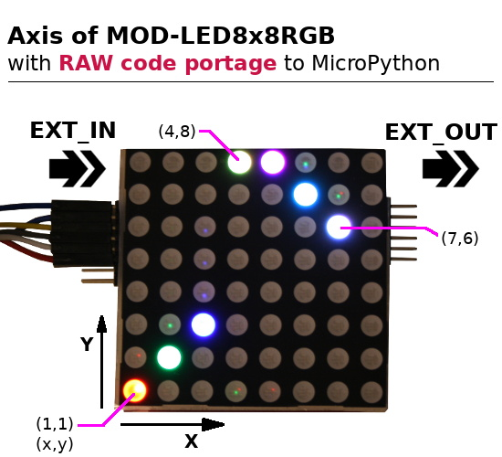
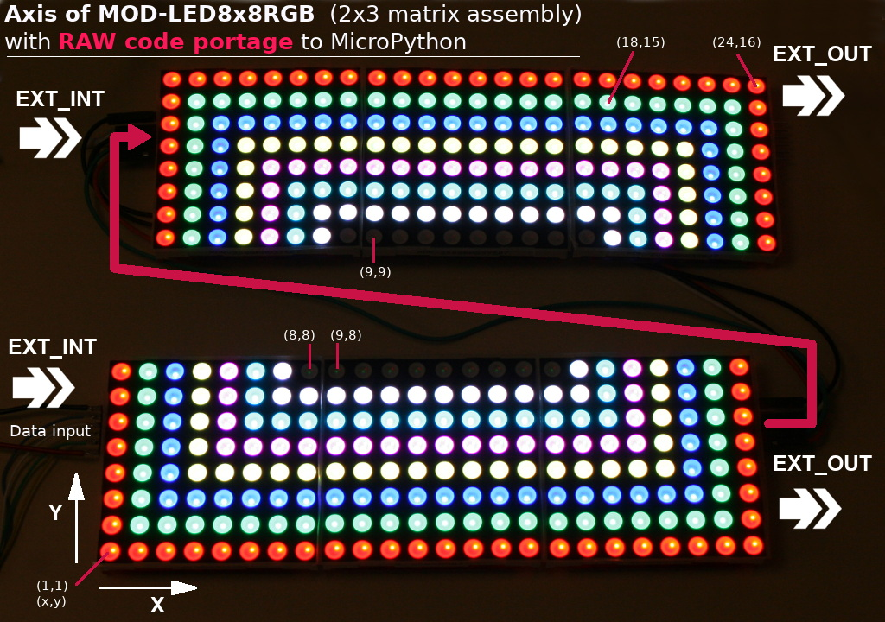
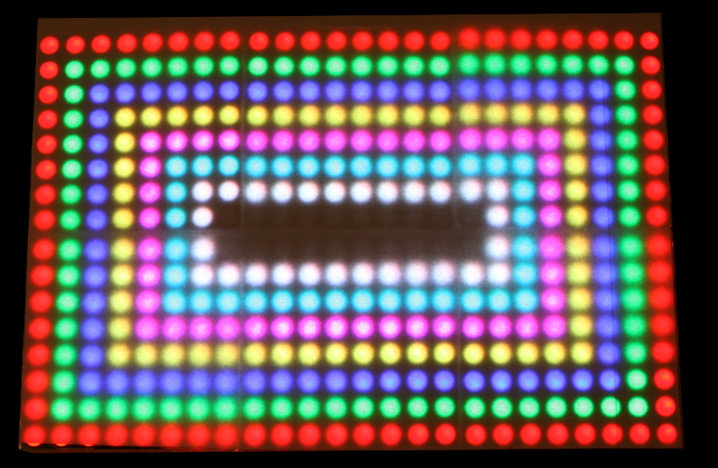

[Ce fichier existe également en FRANCAIS](readme.md)

# Create LED display with MOD-LED8x8RGB slabs


The __MOD-LED8x8RGB__ is an SPI based 8x8 LED module created by [Olimex](https://www.olimex.com).

The modules can be daisy chained to create digital signage or LED display with RGB LEDs (3 fundamental colors + combinations) slab or white leds slabs.


As described in the [datasheet](https://www.olimex.com/Products/Modules/LED/MOD-LED8x8RGB/open-source-hardware), the modules use a simple opensource protocol and __oneway SPI bus__.

The MOD-LED8x8RGB sit in UEXT category but does not expose the UEXT connector. Indeed the UEXT connector is replaced with a pinHeader suited for daysi chaining the slabs/matrix. By the way a simple conversion connector can easily be made (see further).

This board can be found:
* [MOD-LED8x8RGB](https://shop.mchobby.be/fr/138-uext) @ MCHobby
* [MOD-LED8x8RGB](https://www.olimex.com/Products/Modules/LED/MOD-LED8x8RGB/open-source-hardware) @ Olimex.com ncd.io

# Wiring

## MOD-LED8x8RGB to UEXT adapter
Here is a simple connector cable to connect the MOD-LED8x8RGB to any UEXT host port.


## Port UEXT
If you have the adapter described here above then you can une the UEXT connector of your favorite plateforme.

* The wiring of an UEXT Port on ESP8266 is described in the [UEXT folder](../UEXT/readme_eng.md) of this GitHub.
* The [UEXT adapter for MicroPython Pyboard](https://github.com/mchobby/pyboard-driver/tree/master/UEXT) is also available in the [Pyboard-Driver](https://github.com/mchobby/pyboard-driver) GitHub.

## Direct Wiring on Pyboard
A direct wiring to a Pyboard have also been made while experimenting the MOD-LED8x8RGB so here it is!


_Note: this wiring is fully compatible with the [UEXT adapter for MicroPython Pyboard](https://github.com/mchobby/pyboard-driver/tree/master/UEXT)_

# Testing

## Test with FrameBuffer
MicroPython offer a FrameBuffer to manage the data for the displays.

The `ModLedRGB` driver (modled.py) have been developped against the FrameBuffer and will, then, take all the advantage of FrameBuffer manipulations (line drawing, circles, etc).

## library & examples

Copy the library file `modled.py` and the test file `test.py` on your MicroPython board.

The `test.py` file (listed here under) can be loaded from REPL session with `import test`.

```
xxxx
```

# RAW Driver testing

## Test with RAW driver
The initial port of Arduino driver to MicroPython was done with the _video buffer_ suggested by Olimex in the orginal code ( `self.buffer = [0]*self.matrixes*24` ).

The `ModLedRGBraw` driver (examples/modledraw.py) only implement pixel drawing for testing the protocol before switching to FrameBuffer implementation.

The final FrameBuffer driver, the suited version to use, will be made available in the `modled/modled.py` file.

## RAW library & examples
The raw library was for testing only and not designed for regular usage.

Copy the library file `examples/modledraw.py` and the test file `examples/testraw.py` on your MicroPython board.

The `testraw.py` file (listed here under) can be loaded from REPL session with `import testraw`.

```
from machine import Pin, SPI
from modledraw import ModLedRGBraw

# Initialize the SPI Bus (on ESP8266-EVB)
# Software SPI
#    spi = SPI(-1, baudrate=4000000, polarity=1, phase=0, sck=Pin(14), mosi=Pin(13), miso=Pin(12))
# Hardware SPI on Pyboard
spi = SPI(2) # MOSI=Y8, MISO=Y7, SCK=Y6, SS=Y5
spi.init( baudrate=2000000, phase=0, polarity=0 ) # low @ 2 MHz
# We must manage the SS signal ourself
ss = Pin( Pin.board.Y5, Pin.OUT )

modled = ModLedRGBraw( spi, ss ) # Just one LED brick LED-8x8RGB
modled.drawPixel( 1,1, color=1 ) # Red
modled.drawPixel( 2,2, color=2 ) # Green
modled.drawPixel( 3,3, color=4 ) # Blue
modled.drawPixel( 4,8, color=3 ) # Red + Green = Yellow
modled.drawPixel( 5,8, color=5 ) # Red + Blue  = Magenta
modled.drawPixel( 6,7, color=6 ) # Green + Blue  = Cyan
modled.drawPixel( 7,6, color=7 ) # Red + Green + Blue  = White
modled.show()
```

which produce the following result (with axis reference) :



The `examples/testraw2x3.py` test script explore the matrix chaining (2 rows, 3 columns).



Which produce a really nice result under a sheet of paper (otherwise there is too much light for the camera).


