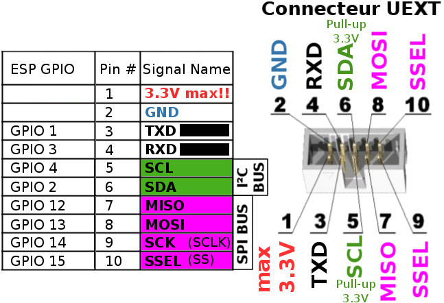
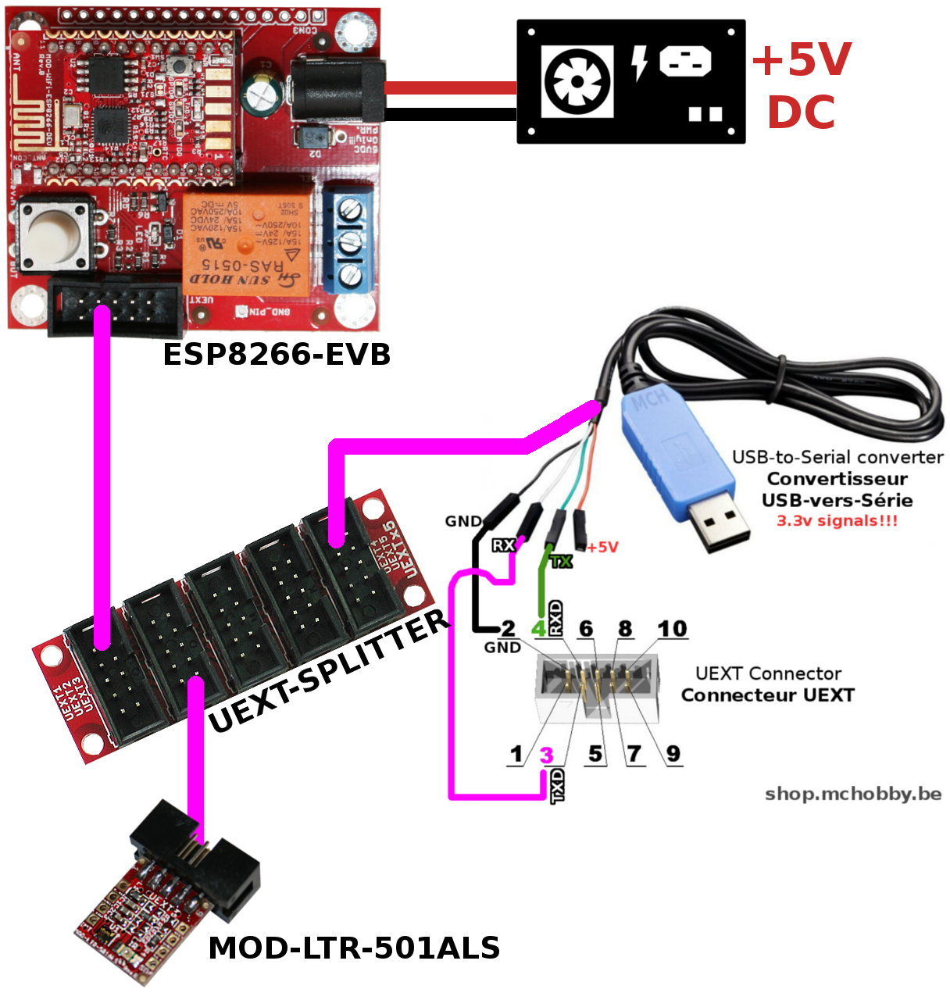

 Utiliser un MOD-LTR-501ALS d'Olimex avec ESP8266 sous MicroPython

Le module utilise un MOD-LTR-501ALS pour effectuer une lecture de luminosité de 0.01 à 64.000 Lux (64K lux) et détection de proximité (jusqu'à 10cm). L'avantage du module MOD-LTR-501ALS est qu'il expose un port UEXT facilitant les raccordements. 


Cette carte expose
* Utilise le __bus I2C__
* Propose une lecture de de la luminosité ambiante, détecteur de proximité (jusqu'à 10cm)
* Un connecteur UEXT pour faciliter le raccordement

# ESP8266-EVB sous MicroPython
Avant de se lancer dans l'utilisation du module MOD-LTR-501ALS sous MicroPython, il faudra flasher votre ESP8266 en MicroPython.

Nous vous recommandons la lecture du tutoriel [ESP8266-EVB](https://wiki.mchobby.be/index.php?title=ESP8266-DEV) sur le wiki de MCHobby.

Ce dernier explique [comment flasher votre carte ESP8266 avec un câble console](https://wiki.mchobby.be/index.php?title=ESP8266-DEV).

## Port UEXT

Sur la carte ESP8266-EVB, le port UEXT transport le port série, bus SPI et bus I2C. La correspondance avec les GPIO de l'ESP8266 sont les suivantes.



# MOD-LTR-501ALS Raccordement

Pour commencer, j'utilise un [UEXT Splitter](http://shop.mchobby.be/product.php?id_product=1412) pour dupliquer le port UEXT. J'ai en effet besoin de raccorder à la fois le câble console pour communiquer avec l'ESP8266 en REPL __et__ raccorder le module MOD-LTR-501ALS



# Code de test

## Bibliothèque ltr501

Avant d'utiliser le script d'exemple, il est nécessaire de transférer la __bibliothèque ltr501__ sur votre carte micropython.
* Copiez le fichier `ltr501.py` sur la carte micropython.

Vous pouvez également transférer le script de test `test.py` sur la carte PyBoard. 

__Note__: la bibliothèque est basée sur le magnifique bibliothèque réalisée par Olimex pour Arduino. 

La bibliothèque offre les fonctionalités suivantes:

__Membres:__
* `data_ready` : permet de savoir si le magnétomètre a une donnée prête à la lecture. Retourne une liste avec le type de donnée disponible. Soit DR_LUX pour une donnée de luminosité, soit DR_PROXIMITY pour information de proximité.
* `lux` : permet de lire la valeur de luminosité, en Lux. Retourne un tuple avec (ALS_0, ALS_1) correspondant respectivement aux convertisseurs ADC (supposé être lumière visible et lumière infrarouge).  
* `proximity` : Permet de lire la valeur du senseur de proximité. Retourne un tuple (valeur brute, distance_cm)

__Methodes:__
* `who_am_i()` : Identification du LTR-501ALS. Doit retourner 0x80 
* `init(...)`  : initialize the senseur avec le paramètrage par défaut.


__Methode init(...)__:

`def init( lux_range )`:

Appelé depuis le contructeur, permet de pré-configurer le senseur avec une valeur par défaut. Activant le Lux Senseur et Senseur de Proximité.
* Lux Sensor (ALS) en Active mode, 64k lux range, Integration 100ms, repeat rate 500ms
* Proximity sensor (PS)) en Active mode, x1 GAIN, 100ms measure rate
* LED IR 60Hz, 50% duty, 50mA, 127 pulses

Parameters:
* __lux_range__ : `LUX_RANGE_64K` gain dynamique de 2 Lux à 64000 Lux, `LUX_RANGE_320` gain dynamique de 0.01 Lux to 320 Lux.

## Exemple avec MOD-LTR-501ALS 
L'exemple ci-dessous fait une lecture de données brutes et  et l'affiche dans la session REPL.

```from machine import I2C, Pin
from time import sleep
from ltr501 import * 

i2c = I2C( sda=Pin(2), scl=Pin(4) ) 
ltr = LTR_501ALS( i2c ) # gamme de 2 Lux à 64000 Lux

# Utiliser le contructeur suivant pour la gamme de 0.01 à 320 Lux range
#
# ltr = LTR_501ALS( i2c, lux_range = LUX_RANGE_320 ) 

while True:
    # Y a t'il des données disponibles?
    dr = ltr.data_ready

    # Luminosité disponible? 
    if DR_LUX in dr:
        # Lecture des convertisseurs analogiques ALS_0 et ALS_1.
        l = ltr.lux  

        # ALS_0 semble être en lumière visible 
        # ALS_1 devrait être l'infrarouge.
        print( "Lux ALS_0, ALS_1 = ", l )

    # Proximité disponible ?
    if DR_PROXIMITY in dr:
        # Lecture de valeur_senseur et distance en cm
        p = ltr.proximity

        print( "Proximity value, cm =" , p )

    # Separateur et attendre
    print( '-'*40 )
    sleep( 1 )


print( "That's the end folks")
```

# Où acheter
* Shop: [UEXT Module MOD-LTR-501ALS](http://shop.mchobby.be/product.php?id_product=1415) module à base de LTR-501ALS
* Shop: [Module WiFi ESP8266 - carte d'évaluation (ESP8266-EVB)](http://shop.mchobby.be/product.php?id_product=668)
* Shop: [UEXT Splitter](http://shop.mchobby.be/product.php?id_product=1412)
* Shop: [Câble console](http://shop.mchobby.be/product.php?id_product=144)
* Wiki: https://wiki.mchobby.be/index.php?title=MICROPYTHON-MOD-LTR501ALS