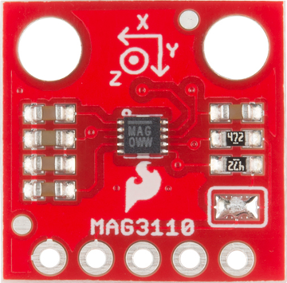
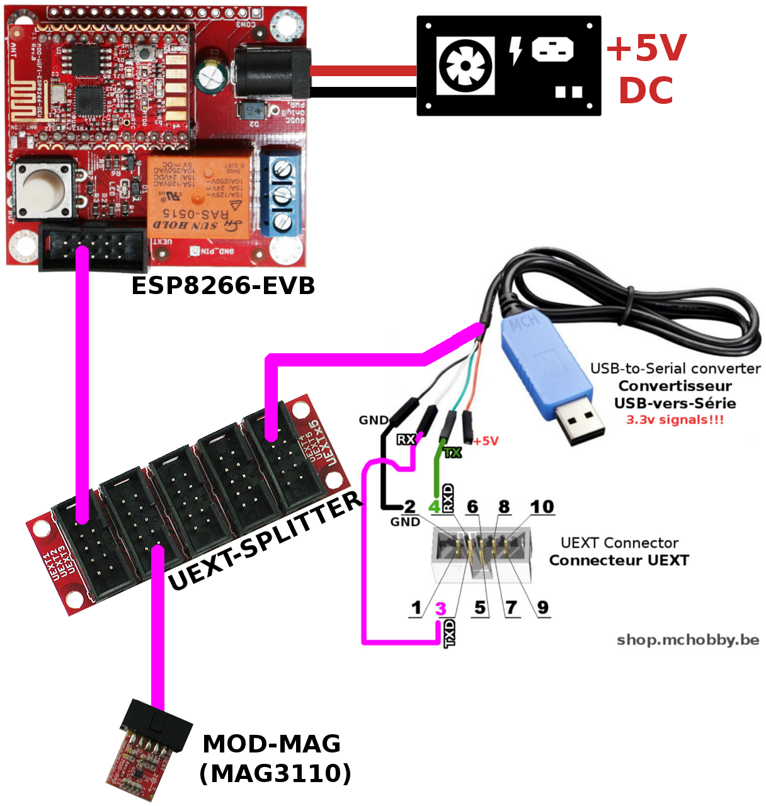

# Utiliser un MOD-MAG d'Olimex ou breakout MAG3110 avec ESP8266 sous MicroPython

MOD-MAG utilise un MAG3110 de NXP pour effectuer une lecture du champ magnétique sur 3 axes. L'avantage du module MOG-MAG est qu'il expose un port UEXT facilitant les raccordements. 


Le MAG3110 équipe également différents breakout comme celui de SparkFun ci-dessous.



Cette carte expose
* Utilise le __bus I2C__
* Propose une lecture de champs magnétiques avec des fontionnalités avancées
* Un connecteur UEXT pour faciliter le raccordement

# ESP8266-EVB sous MicroPython
Avant de se lancer dans l'utilisation du module MOD-MAG sous MicroPython, il faudra flasher votre ESP8266 en MicroPython.

Nous vous recommandons la lecture du tutoriel [ESP8266-EVB](https://wiki.mchobby.be/index.php?title=ESP8266-DEV) sur le wiki de MCHobby.

Ce dernier explique [comment flasher votre carte ESP8266 avec un câble console](https://wiki.mchobby.be/index.php?title=ESP8266-DEV).

## Port UEXT

Sur la carte ESP8266-EVB, le port UEXT transport le port série, bus SPI et bus I2C. La correspondance avec les GPIO de l'ESP8266 sont les suivantes.


# MOD-MAG Raccordement

Pour commencer, j'utilise un [UEXT Splitter](http://shop.mchobby.be/product.php?id_product=1412) pour dupliquer le port UEXT. J'ai en effet besoin de raccorder à la fois le câble console pour communiquer avec l'ESP8266 en REPL __et__ raccorder le module MOD-LCD1x9



# Code de test

## Bibliothèque mag3110

Avant d'utiliser le script d'exemple, il est nécessaire de transférer la __bibliothèque mag3110__ sur votre carte micropython.
* Copiez le fichier `mag3110.py` sur la carte micropython.

Vous pouvez également transférer le script de test `test.py` sur la carte PyBoard. Le fichier `testcal.py` permet de faire un test avec calibration (et indiquer le Nord).   

__Note__: la bibliothèque est basée sur le magnifique bibliothèque réalisée par Sparkfun pour Arduino. 

La bibliothèque offre les fonctionalités suivantes:

__Membres:__
* `is_active` : permet de savoir si le senseur est actif ou en mode standby.
* `is_raw` : permet de savoir si les données renvoyés des données brutes (raw) ou mode utilisateur (données corrigées avec les offsets utilisateurs)
* `is_calibrated` : permet de savoir si le senseur à été calibré manuellement
* `is_calibrating`: permet de savoir si la calibration est en cours
* `data_ready` : permet de savoir si le magnétomètre a une donnée prête à la lecture. Le temps d'échantillonage dépend de la valeur communiquée à `setDR_OS()`.

__Methodes:__
* `who_am_i()`  : Identification du MAG3110. Doit retourner 0xC4 
* `start()` : debute l'acquisition des données (donc sortir du mode standby).
* ` read()` : lit les dernières données du magnétomètre. Voir propriété `data_ready`. Retourne un tuple (x,y,z)
* `setDR_OS()` : permet de fixer la débit de donnée en Hertz (DR) et le taux d'oversampling (OS) parmi les constantes DR_OS_x_y disponibles dans la bibliothèque.
* `enter_standby()` : fait entrer le module en mode standby. voir aussi `exit_standby()`.
* `enter_calibration()`  : Entre en mode de calibration et collecte des données pendant 5 secondes (faire tourner dans tous les sens). Il faut appeler `step_calibration()` aussi souvent que possible pour capturer les données de calibration.
* `exit_calibration()` : provoque la sortie du mode de calibration. 
* `step_calibration()` : acquisition d'une occurence de donnée de calibration.
* `set_offset()` : permet de fixer l'offset utilisateur d'un axe (x,y,z)
* `user_offset()` : lecture de la configuration des offsets utilisateur. Tuple (offset_x, offset_y, offset_z).
* `set_rawdata_mode()` : permet de basculer entre le mode 'données brutes' (raw) ou le module 'utilisateur' (avec les corrections d'offset).
* `heading()` : Indique la position du nord (en degrés). Attention: calibration nécessaire.


## Exemple avec MOD-MAG3110
L'exemple ci-dessous fait une lecture de données brutes et l'affiche dans la session REPL.

```from machine import I2C, Pin
from time import sleep
from mag3110 import MAG3110, DR_OS_1_25_32

i2c = I2C( sda=Pin(2), scl=Pin(4) )
mag = MAG3110( i2c ) 

print( "CHIP ID: %s" % mag.who_am_i() )

# Fixer le débit de donnée à 1.25 Hz et l'oversampling à 32 fois 
mag.setDR_OS( DR_OS_1_25_32 )
# Active le senseur
mag.start()

while True:
	# Attendre qu'une donnée soit disponible
	if mag.data_ready:
		# Lecture du tuple (x,y,z)
		xyz = mag.read() 
		print( 'x,y,z = %s,%s,%s ' % xyz )

print( "That's the end folks")
```

## Exemple: Calibration & Orientation
Contenu de l'exemple disponible dans le fichier `testcal.py`. 

Ce dernier démontre l'utilisation de la phase de calibration avant l'indication du Nord magnétique.

La calibration prend place au démarrage du code, moment où il faut tourner le senseur dans toutes les directions pour détecter les maximas et minimas pour les axes X et Y.

__POUR CALIBRER__: faire tourner le senseur sur 360 degrés. Le mode de calibration s'interrompt entre 5 à 10 secondes.


```from machine import I2C, Pin
from time import sleep
from mag3110 import MAG3110, DR_OS_1_25_32

i2c = I2C( sda=Pin(2), scl=Pin(4) )
mag = MAG3110( i2c ) 

print( "CHIP ID: %s" % mag.who_am_i() )

# Fixer le débit de donnée à 1.25 Hz et l'oversampling à 32 fois 
#   mag.setDR_OS( DR_OS_1_25_32 )

# Activer le senseur
mag.start()
 
while True:
	# Pas encore calibré ?
	if not mag.is_calibrated:
		# Pas en cours de calibration ?
		if not mag.is_calibrating:
			print( "Démarrer le mode de calibration!")
			mag.enter_calibration()
		else:
		    # collecter des données de calibration
			mag.step_calibration()
	else:
		print( "Calibré" )
		break

	# Afficher les infos durant la calibration
	#   (x,y,z) tuple
	# xyz = mag.read() 
	# print( xyz )
	
print( 'Offset utilisateur = %s,%s,%s' % mag.user_offset() )
#mag.setDR_OS( DR_OS_1_25_32 )
while True:
    if mag.data_ready:
        print( 'x,y,z = %s,%s,%s ' % mag.read() )
        heading = mag.heading()
        print( 'Direction Nord = ', heading )
        print( '-'*40 )	
        sleep( 3 )

print( "That's the end folks")

```

# Où acheter
* Shop: [UEXT Module MOD-MAG](http://shop.mchobby.be/product.php?id_product=1413) module à base de MAG3110
* Shop: [Module WiFi ESP8266 - carte d'évaluation (ESP8266-EVB)](http://shop.mchobby.be/product.php?id_product=668)
* Shop: [UEXT Splitter](http://shop.mchobby.be/product.php?id_product=1412)
* Shop: [Câble console](http://shop.mchobby.be/product.php?id_product=144)
* Wiki: https://wiki.mchobby.be/index.php?title=MICROPYTHON-MOD-MAG3110