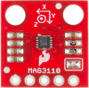

[Ce fichier existe également en FRANCAIS](readme.md)

# Use the Olimex's MOD-MAG or MAG3110 breakout under MicroPython

MOD-MAG is based on the MAG3110 from NXP to evaluate the magnetic field over 3 axis. The MOG-MAG module does fit an UEXT connector which ease the wiring.


The MAG3110 chip is also used on various breakout like the SparkFun's one visible here below.



Olimex's MAG3110 module does features
* transmit data over __I2C bus__
* Can evaluate magnetic field with advanced features
* UEXT connector to facilitate wiring

# About ESP8266-EVB under MicroPython
Before to use this module, it will be necessary to flash the MicroPython firmware onto the ESP8266.

You can read the steps on our [ESP8266-EVB](https://wiki.mchobby.be/index.php?title=ESP8266-DEV) tutorial (on MCHobby's WIKI, French).


## UEXT connector

On the ESP8266-EVB, the UEXT connector does ship UART, SPI, I2C buses as well as 3.3V power. The UEXT pins to ESP8266 GPIO are described in the following picture.


# Library

The library must be copied on the MicroPython board before using the examples.

On a WiFi capable plateform:

```
>>> import mip
>>> mip.install("github:mchobby/esp8266-upy/modmag")
```

Or via the mpremote utility :

```
mpremote mip install github:mchobby/esp8266-upy/modmag
```
## mag3110 library details

Before using the example scripts, the __mag3110 library__ must be available on the MicroControler board.

__Note__: the library is based on the Arduino version of mag3110 made by Sparkfun.

The library offers the following facilities:

__Membres:__
* `is_active` : is the sensor active or in standby mode.
* `is_raw` : does the data are raw information (raw) or user mode (data corrected with user offsets)
* `is_calibrated` : does the sensor being manually calibrated ?
* `is_calibrating`: actally under calibration process.
* `data_ready` : does the magnetometer have some data ready to be read over I2C. Time needed to sample data is related to value set with `setDR_OS()`.

__Methodes:__
* `who_am_i()`  : MAG3110 identification. Should be 0xC4
* `start()` : start sampling (module must exits from standby mode).
* ` read()` : read the last data from the magnetometre. See the `data_ready` property. Return a (x,y,z) tuple.
* `setDR_OS()` : set the data rate in Hertz (DR) and the oversampling rate (OS). See the `DR_OS_x_y` constants available in the library.
* `enter_standby()` : enter in standby mode. See also `exit_standby()`.
* `enter_calibration()`  : Start the calibration mode and sample data for 5 seconds (turn around the board in every direction). `step_calibration()` must be called as often as possible to capture calibration data.
* `exit_calibration()` : Exits the qualibration mode.
* `step_calibration()` : Sample one occurence of calibration dara.
* `set_offset()` : set the user offset for (x,y,z) axis.
* `user_offset()` : Reads the user offset as a (offset_x, offset_y, offset_z) tuple.
* `set_rawdata_mode()` : switch between the raw mode (raw data) and user mode (with offset correction).
* `heading()` : Indicates where is the magnetic North (in degrees). This requires data calibration to work properly.


# Wiring

## MOD-MAG on ESP8266
If you have an [UEXT Interface on your Pyboard](https://github.com/mchobby/pyboard-driver/tree/master/UEXT) then you just plug the MOD-RFID1536MiFare with an IDC cable.

Otherwise, you can also use the following Wiring:


# Test

## MOD-MAG3110 example
The following example shows the RAW data in the REPL.

```from machine import I2C, Pin
from time import sleep
from mag3110 import MAG3110, DR_OS_1_25_32

i2c = I2C( sda=Pin(2), scl=Pin(4) )
mag = MAG3110( i2c )

print( "CHIP ID: %s" % mag.who_am_i() )

# Data rate @ 1.25 Hz and oversampling to 32
mag.setDR_OS( DR_OS_1_25_32 )
# Start sensor
mag.start()

while True:
	# Wait data to be ready
	if mag.data_ready:
		# read the (x,y,z) tuple
		xyz = mag.read()
		print( 'x,y,z = %s,%s,%s ' % xyz )

print( "That's the end folks")
```

## Exemple: Calibration & Orientation
Here is the content of the `testcal.py` script.

That script demonstrate how to calibrate the sensor before detecting the magnetic north.

__TO CALIBRATE__: turn the sensor over the 360 degrees. Calibration mode will stop after 5 to 10 seconds.


```from machine import I2C, Pin
from time import sleep
from mag3110 import MAG3110, DR_OS_1_25_32

i2c = I2C( sda=Pin(2), scl=Pin(4) )
mag = MAG3110( i2c )

print( "CHIP ID: %s" % mag.who_am_i() )

# Data rate @ 1.25 Hz and oversampling @ 32
#   mag.setDR_OS( DR_OS_1_25_32 )

# Activate sensor
mag.start()

while True:
	# Not yet calibrated ?
	if not mag.is_calibrated:
		# Not yet in calibrating mode ?
		if not mag.is_calibrating:
			print( "Start calibration!")
			mag.enter_calibration()
		else:
		    # sample calibration data
			mag.step_calibration()
	else:
		print( "Calibrated" )
		break

	# Display data while calibrating
	#   (x,y,z) tuple
	# xyz = mag.read()
	# print( xyz )

print( 'User offset = %s,%s,%s' % mag.user_offset() )
#mag.setDR_OS( DR_OS_1_25_32 )
while True:
    if mag.data_ready:
        print( 'x,y,z = %s,%s,%s ' % mag.read() )
        heading = mag.heading()
        print( 'North direction = ', heading )
        print( '-'*40 )
        sleep( 3 )

print( "That's the end folks")

```

## Other examples

The [MAG3110 Arduino library from Sparkfun](https://github.com/sparkfun/SparkFun_MAG3110_Breakout_Board_Arduino_Library) offers many examples like:
* read the magnitude
* make numeric compas
* MicroTesla reading (extra)
* Trigerred reading

# Shopping list
* Shop: [UEXT Module MOD-MAG](http://shop.mchobby.be/product.php?id_product=1413) module à base de MAG3110
* Shop: [ESP8266 Wifi Module - ESP8266-EVB evaluation board](http://shop.mchobby.be/product.php?id_product=668)
* Shop: [UEXT Splitter](http://shop.mchobby.be/product.php?id_product=1412)
* Shop: [Console cable](http://shop.mchobby.be/product.php?id_product=144)
