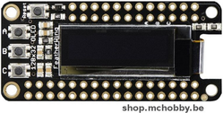

# Utiliser un MOD-OLED-128x64 d'Olimex avec ESP8266 sous MicroPython

MOD-OLED-128x64 est un afficheur LCD Alphanumerique 9 position d'Olimex utilisant le port UEXT. 



Cette carte expose
* Utilise le Bus I2C
* Fonctionne en 3.3v
* Propose une surface d'affichage de 128x64 pixels
* Un connecteur UEXT pour faciliter le raccordement

La bibliothèque MicroPython `ssd1603.py` permet de manipuler les écrans OLED 128x64

# ESP8266-EVB sous MicroPython
Avant de se lancer dans l'utilisation du module MOD-IO sous MicroPython, il faudra flasher votre ESP8266 en MicroPython.

Nous vous recommandons la lecture du tutoriel [ESP8266-EVB](https://wiki.mchobby.be/index.php?title=ESP8266-DEV) sur le wiki de MCHobby.

Ce dernier explique [comment flasher votre carte ESP8266 avec un câble console](https://wiki.mchobby.be/index.php?title=ESP8266-DEV).

## Port UEXT

Sur la carte ESP8266-EVB, le port UEXT transport le port série, bus SPI et bus I2C. La correspondance avec les GPIO de l'ESP8266 sont les suivantes.


# MOD-OLED-128x64 Raccordement

Pour commencer, j'utilise un [UEXT Splitter](http://shop.mchobby.be/product.php?id_product=1412) pour dupliquer le port UEXT. J'ai en effet besoin de raccorder à la fois le câble console pour communiquer avec l'ESP8266 en REPL __et__ raccorder le module MOD-OLED-128x64


# Bibliothèque  
La bibliothèque `sd1306.py` est un pilote SSD1306 I2C et SPI (MicroPyhton GitHub) pour écran OLED ssd1306. Cette bibliothèque doit être copiée sur la carte PyBoard.

* [Télécharger la bibliothèque ssd1306](https://raw.githubusercontent.com/micropython/micropython/master/drivers/display/ssd1306.py)

# Code de test

## Créer LCD OLED 128x64

Dans tous les cas de figure, l'écran OLED sera créé sous la référence __lcd__ .

 

```
# Utilisation de la bibliothèque ssd1306 avec ESP8266-EVB 
# sous MicroPython
#
# Shop: https://shop.mchobby.be/uext/1411-uext-module-oled-display-128-x-64-3232100014114-olimex.html
# Wiki: https://wiki.mchobby.be/index.php?title=MICROPYTHON-MOD-OLED

from machine import Pin, I2C
i2c = I2C( sda=Pin(2), scl=Pin(4) )
import ssd1306
lcd = ssd1306.SSD1306_I2C( 128, 64, i2c )
```

# Tester la bibliothèque
Dans les exemples ci-dessous, voici les paramètres que vous retrouverez dans les différents appels de fonction: 


* __x__ : position du point par rapport au côté gauche de l'écran.
* __y__ : position du point par rapport au dessus de l'écran.
* __w__ : largeur (du mot Width).
* __h__ : hauteur (du mot Height).
* __c__ : __couleur (1=point allumé, 0=point éteint)__

```
# -- Rempli l'écran en blanc --
lcd.fill(1) 
lcd.show()  # Afficher!

# Remplis un rectangle en noir
# fill_rect( x, y, w, h, c ) 
lcd.fill_rect( 10,10, 20, 4, 0 )
lcd.show()  # Afficher!
```

## Autres exemples 
* [Voir les exemples dans oled-ssd1306](https://github.com/mchobby/esp8266-upy/tree/master/oled-ssd1306)
* [UEXT Module MOD-OLED-128x64](https://wiki.mchobby.be/index.php?title=MICROPYTHON-MOD-OLED)

# Où acheter
* Shop: [UEXT Module MOD-OLED-128x64](http://shop.mchobby.be/product.php?id_product=1411)
* Shop: [Module WiFi ESP8266 - carte d'évaluation (ESP8266-EVB)](http://shop.mchobby.be/product.php?id_product=668)
* Shop: [UEXT Splitter](http://shop.mchobby.be/product.php?id_product=1412)
* Shop: [Câble console](http://shop.mchobby.be/product.php?id_product=144)
* Wiki: https://wiki.mchobby.be/index.php?title=MICROPYTHON-MOD-LCD1x9
