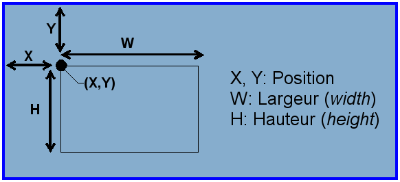

[Ce fichier existe également en FRANCAIS](readme.md)

# Using an Olimex MOD-OLED-128x64 with an ESP8266 under MicroPython

MOD-OLED-128x64 is a OLED display with 128x64 pixels and UEXT connector.


This board offers
* An I2C bus interface
* 3.3v power supply
* Have a 128x64 pixels display surface
* An UEXT connector to ease wiring

The `ssd1603.py` MicroPython library can be used with 128x64 OLED.

# About the ESP8266-EVB under MicroPython
Before using the MOD-OLED module under MicroPython, you will need to flash the MicroPython on the ESP8266.

Reading the following MC Hobby tutorial [ESP8266-EVB](https://wiki.mchobby.be/index.php?title=ESP8266-DEV) (_french_) can helps you.

It explains [how to set the MicroPython on an ESP8266 with a console cable](https://wiki.mchobby.be/index.php?title=ESP8266-DEV).

## UEXT connector

The ESP8266-EVB board expose a UEXT connector shipping serial port, SPI bus, I2C bus and power. The following picture shows the associated ESP8266 PINs.


# Library

The OLED library is located on [esp8266-upy/oled-ssd1306](https://github.com/mchobby/esp8266-upy/tree/master/oled-ssd1306). Follow the installation instruction as descrived over there.

# Wiring
##  MOD-OLED-128x64 on ESP8266-EVB

This setup use an [UEXT Splitter](http://shop.mchobby.be/product.php?id_product=1412) allows us to have several UEXT port. we will use a console cable with UART pin to communicates with the ESP8266 (over MicroPython REPL) __and__ the MOD-OLED-128x64 module will be plugged on second UEXT connector


# Testing

## Create an OLED object instance

In every case, the OLED display is created under the object name __lcd__ .

```
# Using the ssd1306 library with ESP8266-EVB under MicroPython
#
# Shop: https://shop.mchobby.be/uext/1411-uext-module-oled-display-128-x-64-3232100014114-olimex.html
# Wiki: https://wiki.mchobby.be/index.php?title=MICROPYTHON-MOD-OLED

from machine import Pin, I2C
i2c = I2C( sda=Pin(2), scl=Pin(4) )
import ssd1306
lcd = ssd1306.SSD1306_I2C( 128, 64, i2c )
```

# Test the OLED lobrary
In the following example, you will see some calls to the SSD1306 library:


* __x__ : pixel left position from upper-left screen corner.
* __y__ : pixel top position from upper-left screen corner.
* __w__ : width.
* __h__ : Height.
* __c__ : __color (1=bright, 0=off)__

```
# -- Fill the screen in white --
lcd.fill(1)
lcd.show()  # show it!

# fill a rectangle in black
# fill_rect( x, y, w, h, c )
lcd.fill_rect( 10,10, 20, 4, 0 )
lcd.show()  # show it!
```
## Other examples
* [See the example fromVoir les exemples dans oled-ssd1306](https://github.com/mchobby/esp8266-upy/tree/master/oled-ssd1306)
* [UEXT Module MOD-OLED-128x64](https://wiki.mchobby.be/index.php?title=MICROPYTHON-MOD-OLED)

# Shopping list
* Shop: [UEXT Module MOD-OLED-128x64](http://shop.mchobby.be/product.php?id_product=1411)
* Shop: [Module WiFi ESP8266 - ESP8266-EVB evaluation board ](http://shop.mchobby.be/product.php?id_product=668)
* Shop: [UEXT Splitter](http://shop.mchobby.be/product.php?id_product=1412)
* Shop: [Console cable](http://shop.mchobby.be/product.php?id_product=144)
* OLED Wiki: https://wiki.mchobby.be/index.php?title=FEATHER-MICROPYTHON-OLED
