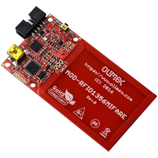
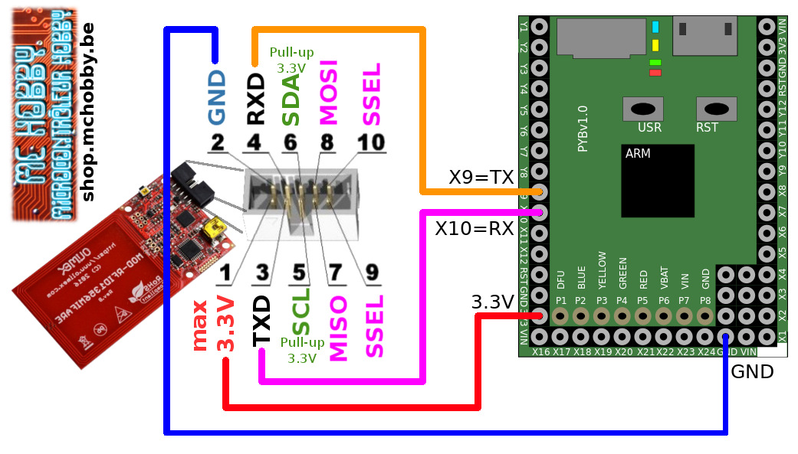

[This file also exists in ENGLISH here](readme_ENG.md)

# Utiliser le MOD-RFID1536 d'Olimex por lire (et ecrire) des tags MiFare/RFID

Cette bibliothèque propose la classe `RFID_READER` pour piloter le scanner RFID MOD-RFID1536MiFare.



Le scanner RFID propose 3 interfaces:
* USB-HID : qui fonctionne comme un clavier branché sur le PC
* USB-CDC : (ou USB-Serial) pour offrir une interface série via USB (approprié pour l'informatique)
* UART : (sur le connecteur UEXT) qui offre une interface série pour les microcontrôleurs.

Le protocole est utilisé par le MOD-RFID1536 est détaillé [ici sur le Wiki d'Olimex](https://www.olimex.com/wiki/MOD-RFID1356MIFARE).

Pour plus d'information, voyez [cette fiche produitt](http://shop.mchobby.be/product.php?id_product=1619) ou [la fiche produit d'Olimex](https://www.olimex.com/Products/Modules/RFID/MOD-RFID1356MIFARE/).

## Activer le mode UART sur la carte
* Presser (et maintenir enfoncé) le bouton enfoncé.
* La/les LEDs vont commencer à glignoter en suivant les schémas suivants (3 sec par schéma). Rouge=Mode clavier, Vert=USB-Série, Rouge+Vert=uart
* Quand le mode UART est pré-sélectionné (rouge+vert clignote) alors relâcher le bouton pour sélectionner ce mode.

## Configurer les clés d'authentification
Configurer la carte par l'intermédiaire de l'UART (port série) n'est pas toujours fiable avec les précédentes version du firmware (ex: j'utilise le firmware 2.1.8).

Je recommande d'utiliser le mode USB-CDC (USB-Série) et utiliser Putty pour fixer les clé d'authentification (qui sont stockés dans l'EEPROM).

Sur une carte MiFare (NTAG203 chip), la clé d'authentification key_A est 0xFFFFFFFFFFFF.

La clé A est fixée (et déclarée comme clé de travail) à l'aide des commandes suivantes:
```
ka,FFFFFFFFFFFF
mka
```
La clé en cours d'utilisateur peut être identifiée à l'aide de la commande `k?`.

# Brancher
Si vous disposez d'une [interface UEXT pour votre Pyboard](https://github.com/mchobby/pyboard-driver/tree/master/UEXT) alors il suffit simplement de brancher la carte MOD-RFID1536MiFare à l'aide d'un cable IDC.

Sinon, il est possible de réaliser les raccordements suivants:



# Tester
La bibliothèque `modrfid.py` contient la classe `RFID_READER` qui facilite le dialogue avec la carte MOD-RFID1536MiFare.

## Script de test - fonctionnalité de base
L'exemple le plus simple est `simpletest.py` pour lire les TAG entrant (uniquement leur UID).

La méthode `update()` doit être appelée aussi souvent que cela est possible. Celle-ci gère toute la complexité de réception et interprétation des informations collectées sur le port série (celles envoyées par la carte MiFare.

``` python
from machine import UART
from modrfid import RFID_READER

uart = UART( 1, baudrate=38400, timeout=500 )
rfid = RFID_READER( uart, debug=False)
rfid.eeprom_read( False ) # Ne pas lire les données de l'EEPROM MiFare

# Afficher les informations du MOD-RFID1536MIFARE firmware
lines = rfid.reader_info()
for line in lines:
	print( line )

print("Please scan RFID cards")
while True:
	rfid.update()
	if rfid.has_card:
		print( "Card detected: %s" % rfid.card_id )
		# Cleat the card data
		rfid.clear()

```

## Fonctionnalités avancées
Le second script `blockread.py` est un peu plus avancé. Après quelques instructions de configurations, le script lit l'UID de la carte + un (ou plusieurs) block de données de l'EEPROM.

Comme l'objet RFID_READER est configuré pour lire l'EEPROM `rfid.eeprom_read( True )`
alors la méthode `update()` effectue un travail complémentaire pour réceptionner les blocks de données après la lecture de l'UID.

``` python
from machine import UART
from modrfid import RFID_READER, DEFAULT_AUTH_KEY
from time import sleep

uart = UART( 1, baudrate=38400, timeout=500 )
rfid = RFID_READER( uart, debug=False)

key_a = rfid.get_key( 'a' )
print( 'Key A = %s' % key_a )

# Code below is not reliable AT ALL and cause ERR: if not in debug mode
# Key A have been fixed by using the USB-CDC support.
#if key_a != '112233445566':
#	print( 'Change the key A...')
#	rfid.set_key( 'a', '112233445566' )

# Quelle est la clé en cours d'utilisation
current_key, current_key_value = rfid.get_work_key()
print( "Current working Key is %s with key=%s" % (current_key, current_key_value) )
if current_key != 'a':
	print('Set current work key to a')
	rfid.set_work_key( 'a' )

key_b = rfid.get_key( 'b' )
print( 'Key B = %s' % key_b )

# Nous voulons lire le block 0 sur l'EEPROM MiFare (manufacturer block) avec
# le numéro UID de la carte. Une carte 1K peut avoir jusqu'à 64 block
rfid.read_blocks( 0 )

# Activer la lecture de l'EEPROM
rfid.eeprom_read( True )

print("Please scan RFID card")
while True:
	try:
		rfid.update()

		if rfid.has_card:
			print( "Card detected: %s" % rfid.card_id )

		if rfid.has_blocks:
			print( 'EEPROM blocks')
			# rfid.blocks est un dictionnaire
			for block_nr, block_data in rfid.blocks.items():
				print( "  blocks % s : %s" % (block_nr, block_data) )

		if rfid.has_card:
			# Quelque chose à été lu... nous pouvons donc effacer les
			# données capturées
			rfid.clear()
	except Exception as err:
		print( '[ERROR] %s' % err )
		print( '[ERROR] LastError = %s' % rfid.last_error )
```

Ce qui affiche les données suivantes (block 0 est le bloc de donnée du fabriquant -  manufacturer block). Ces données au format hexadécimale sont prête à être transformée en donnée binaire à l'aide de `binascii.unhexlify()`.

```
Card detected: 56F6637E
EEPROM blocks
  blocks 0 : 56F6637EBD08040001A8797EC7E2191D

Card detected: 76FBAF7C
EEPROM blocks
  blocks 0 : 76FBAF7C5E0804000153CA346B0F8C1D
```

# Où acheter
* [MOD-RFID1536Mifare](http://shop.mchobby.be/product.php?id_product=1619) @ MCHobby
* [MOD-RFID1536Mifare](https://www.olimex.com/Products/Modules/RFID/MOD-RFID1356MIFARE/) @ Olimex.
* [MicroPython Pyboard](http://shop.mchobby.be/product.php?id_product=570) @ MCHobby
