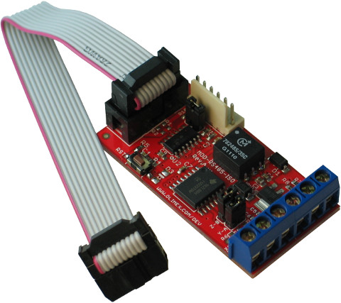
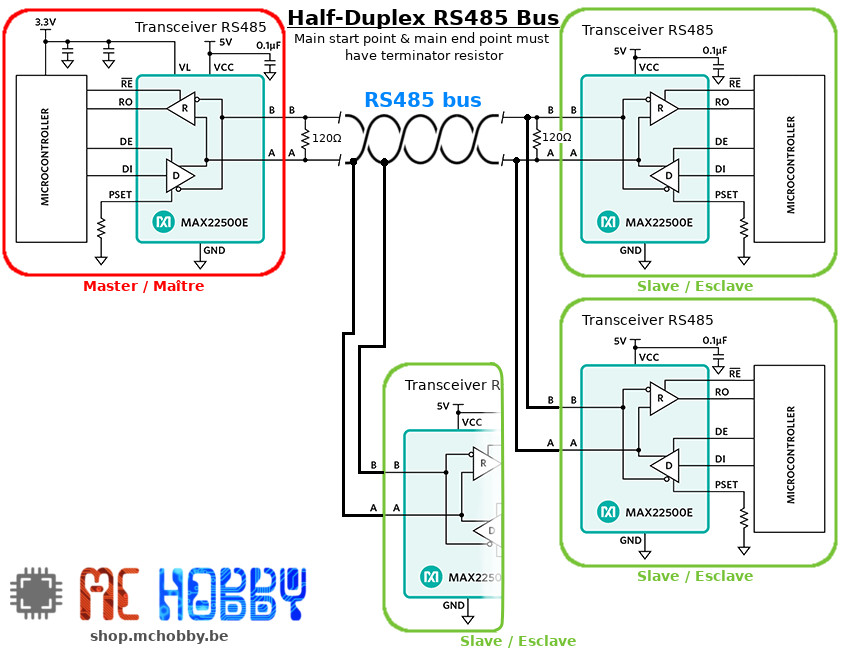
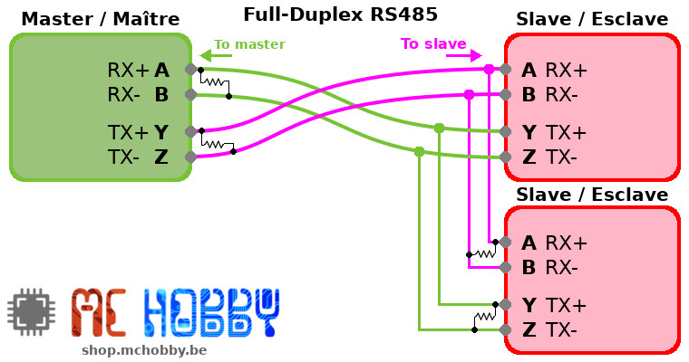
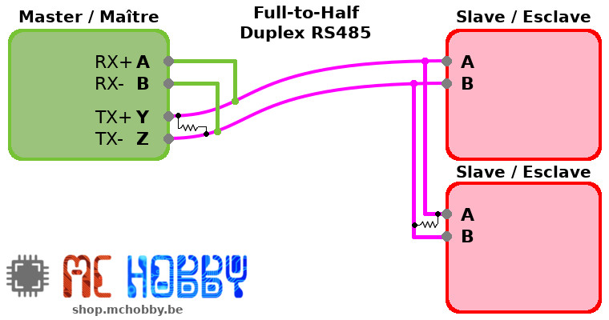
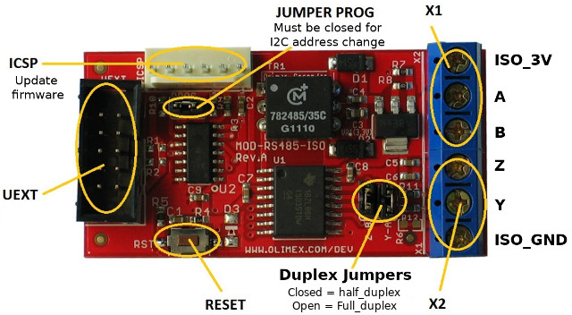
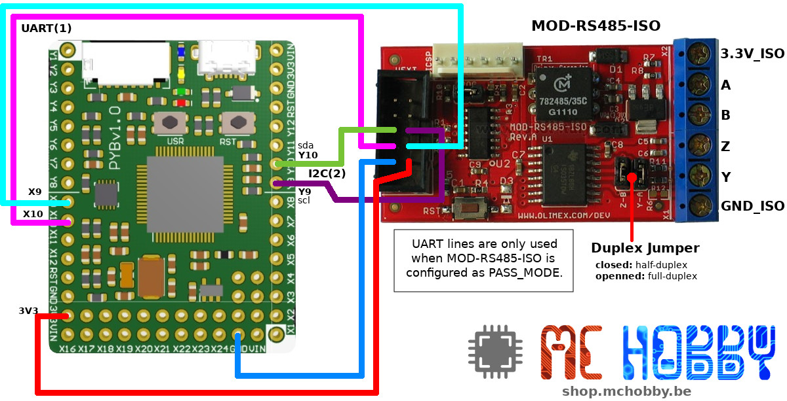
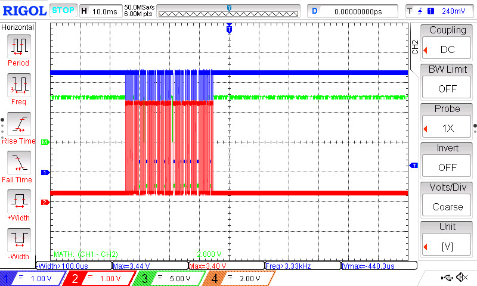
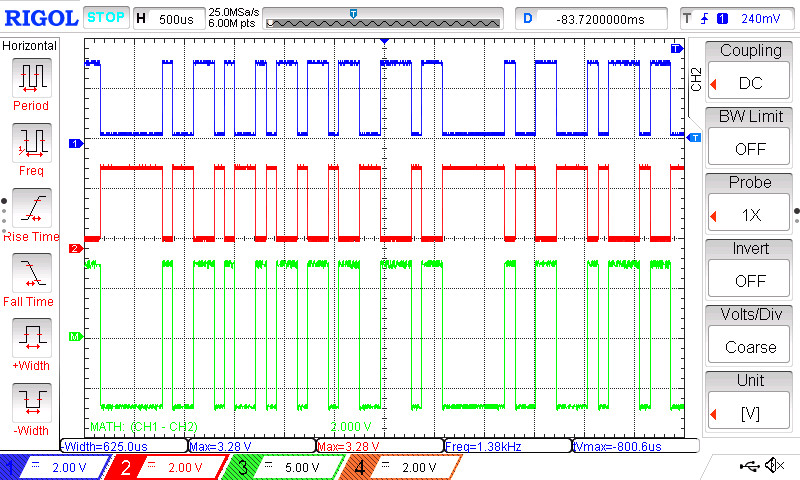
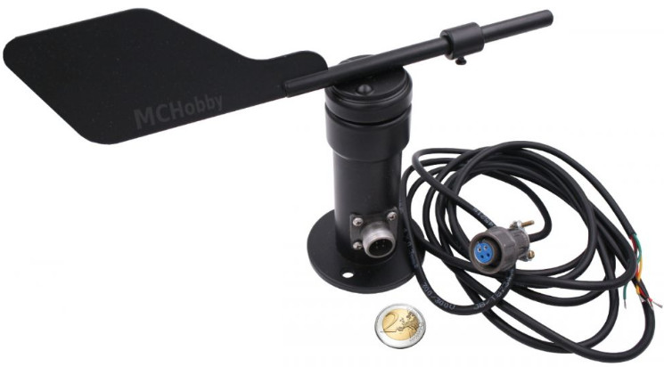

# Utiliser un module MOD-RS485-ISO d'Olimex (RS485) avec MicroPython

=== UNDER CONSTRUCTION ===



Le MOD-RS485-ISO est un convertisseur RS232/I2C vers RS485

Il propose les fonctionnalités suivantes:
* Alimentation: 3.3V
* Modes: Half duplex / Full duplex
* Interface de données: UART ou I2C
 * PASS_MODE : Signal sur TX est passé directement vers le périphérique présent sur la ligne RS-485. C'est pareil pour RX.
 * BRIDGE_MODE : TX et RX sont désactivées. Les données peuvent être envoyées vie le bus I2C.
* Interface de configuration: I2C
* 134 à 1 000 000 bauds
* Interface UEXT
* Peut se brancher à l'aide de fils dupont
* Utilise un PIC16F18324 pour assurer les fonctionnement du module

## A propos de RS485
RS485 est un bus de terrain très populaire qui utilise une paire (half-duplex) de fil torsadé et un signal différentiel pour établir une communication. Bien d'une masse relie généralement les différents appareil, celle-ci n'est pas vitale du fait de la nature différentielle des signaux.

L'intérêt de RS485 est qu'il permet de connecter jusqu'à 32 noeuds (périphérique émetteur/récepteur).

## Configuration Half-Duplex

Le bsus RS485 Half-Duplex est le plus répandu et utilise une seule paire de fil torsadé. Dans ce cas, la communication ne peut se faire que dans un seul sens à la fois (émettre ou recevoir mais pas les deux en même temps).

Le bus principal doit être terminé à l'aide d'une résistance de 120 Ohms.



L'utilisation d'un bus RS485 Half-Duplex nécessite l'usage de 3 broches sur un microcontrôleur (RX,TX, read_write) pour communiquer de façon structurée sur ce bus.

Cela s'inscrit souvent dans le schéma de dialogue suivant:
1. Maître active le mode Emission (TX)
2. Maître émet une requête vers le périphérique (un paquet d'octets respectant un protocole périphérique)
3. Maître passe en mode Réception (RX)
4. Maître réceptionne la réponse du périphérique (un paquet d'octets respectant toujours le protocole défini sur le périphérique)

Exemples d'utilisantion en Half-Duplex:
* __DMX:__ le protocole DMX 3 broches est basé sur le mode Half-Duplex (A, B, GND).
* __Girouette:__ la [girouete RS485](https://shop.mchobby.be/product.php?id_product=2241) est abordée dans les exemples ci-dessous.
* __MODBUS:__ MODBUS est une surcouche de protocole au dessus de RS485. Il est largement utilisé dans le monde industriel.

## Configuration Full-Duplex

Plus rarement utilisé, le bus RS485 Full-Duplex exploite deux paires de fils torsadés. Sur un bus RS485 Full-Duplex, il est possible d'émettre et recevoir des données en même temps, un peu comme une vraie liaison série.



Le module MOD-RS485-ISO est conçu pour supporter la communication RS485 Full-Duplex.

## Configuration Full-Duplex vers Half-Duplex

Par contre, il est assez courant d'avoir besoin de connecter un module Full-Duplex sur un appareil Half-Duplex.

Voici comment cela se fait:



Dans cette configuration, tous les octets émis vers un esclave sont aussi  réceptionnés en écho sur le maître.

Le MOD-RS485-ISO propose des cavaliers "Duplex Jumper" pour passer rapidement en mode Half-Duplex en fermant les cavaliers.



En mode Full-Duplex, les cavaliers doivent être ouverts.

# Brancher

## MOD-RS485-ISO vers Pyboard



# Tester

Après avoir copié la bibliothèque [rs485iso.py](lib/rs485iso.py) sur votre carte, vous pouvez exécuter les scripts de tests.

## Test 1: Tester le module à l'oscilloscope

Il est assez facile de tester le bon fonctionnement du module MOD-RS485-ISO en __mode BRIDGE (data over I2C)__ avec un oscilloscope 2 voies.



Où l'on peut y voir la trace du Signal A (en bleu) et du Signal B (en rouge). La différence A-B (en vert) est malheureusement cachée derrière les courbes A & B.

Configuration:
1. Placer le module en mode HALF-DUPLEX (les cavalier duplex en place)
2. brancher le canal 1 de l'oscilloscope sur la sortie A
3. brancher le canal 2 de l'oscilloscope sur la sortie B
4. brancher la masse de l'oscilloscope sur la sortie ISO_GND

Les canaux 1 et 2 doivent être réglés sur 1V/div et la base de temps sur 200µS.

Si votre oscilloscope dispose de fonctions mathématiques, réalisez une soustraction des canaux 1 et 2 (puisque RS485 est un bus différentiel).

Enfin, exécutez le script [test_sender.py](examples/test_sender.py) qui envoi des données sur le bus. Il est alors possible de voir passer (et capturer la transmission des données).

Le script [test_sender.py](examples/test_sender.py) affiche les messages envoyés sur le bus.

```
PYB: sync filesystems
PYB: soft reboot
MicroPython v1.10 on 2019-01-25; PYBv1.1 with STM32F405RG
Type "help()" for more information.
>>> import test_sender
Setting TX control...
Setting bridged mode...
Setting baud...
Sending...  1/50: MCHobby is the best
Sending...  2/50: MCHobby is the best
...

...
Sending...  47/50: MCHobby is the best
Sending...  48/50: MCHobby is the best
Sending...  49/50: MCHobby is the best
Sending...  50/50: MCHobby is the best
That s all Folks
```
Message dont on peut inspecter une partie de la trame... que je me suis amusé à décoder.



Le contenu de la trame à été décodée dans [cet article sur le blog de MCHobby](https://arduino103.blogspot.com/2021/10/decoder-une-trame-rs485-loscilloscope.html) (_Français_)

### Emission de données

Le script [test_sender.py](examples/test_sender.py), repris partiellement ci-dessous, transforme une chaîne de caractère en type bytes grâce à l'encodage puis emet les octets sur le bus RS485.

``` python
from machine import I2C
from rs485iso import RS485ISO, TX_ENABLED, BRIDGE_MODE, UART_B9600
from time import sleep

# Pyboard - I2C(2) - Y10=sda, Y9=scl
i2c = I2C(2)

rs485 = RS485ISO( i2c )

print( "Setting TX control..." )
rs485.control = TX_ENABLED
print( "Setting bridged mode..." ) # Emission des données via le bus I2C
rs485.mode = BRIDGE_MODE
print( "Setting baud..." )
rs485.baud_rate = UART_B9600

# Convert a string to bytes()
s = "1/50: MCHobby is the best"
data = s.encode('ASCII')
rs485.send( data )

# Sending 2 bytes
buf2 = bytearray( 2 )
buf2[0] = 65
buf2[1] = 128
rs485.send( buf2 )
```

### Réception de données

Le script [test_reader.py](examples/test_reader.py) permet de collecter les données passant sur le bus RS485 (configuré à 9600 bauds) et de les afficher au format Hexadecimal.

``` python
from machine import I2C
from rs485iso import RS485ISO, RX_ENABLED, BRIDGE_MODE, UART_B9600
from time import sleep

# Pyboard - I2C(2) - Y10=sda, Y9=scl
i2c = I2C(2)

rs485 = RS485ISO( i2c )

print( "Setting RX control..." )
rs485.control = RX_ENABLED
print( "Setting bridged mode..." ) # donnée transmissent via I2C
rs485.mode = BRIDGE_MODE
print( "Setting baud..." )
rs485.baud_rate = UART_B9600

buf = bytearray( 1 )
while True:
	# lecture 1 octet et affichage
	rs485.read( buf )
	print( hex(buf[0]) )
	sleep( 0.250 )
```

Ce qui produit le résultat suivant:

```
MicroPython v1.10 on 2019-01-25; PYBv1.1 with STM32F405RG
Type "help()" for more information.
>>>
>>> import test_reader
Setting RX control...
Setting bridged mode...
Setting baud...
0x0
0x0
0x0
0x0
0x0
```

Il n'y a que des 0x00 l'interface est testée sans connexion RS485.

Le script d'exemple [test_readarr.py](examples/test_readarr.py) indique comment faire des lectures de multiples octets.

``` python
from machine import I2C
from rs485iso import RS485ISO, RX_ENABLED, BRIDGE_MODE, UART_B9600
from time import sleep

# Pyboard - I2C(2) - Y10=sda, Y9=scl
i2c = I2C(2)

rs485 = RS485ISO( i2c )

print( "Setting RX control..." )
rs485.control = RX_ENABLED
print( "Setting bridged mode..." ) # Données recues via I2C
rs485.mode = BRIDGE_MODE
print( "Setting baud..." )
rs485.baud_rate = UART_B9600

buf10 = bytearray( 10 )

# Lecture du buffer complet (10 octets)
rs485.read( buf10 )
print( buf10 )

# Lecture de 3 octets dans le buffer
# Seul les 3 premiers octets du buffer sont remplacés.
rs485.read( buf10, max_read=3 )
print( buf10 )
```

## Test 2: Girouette RS485



La [girouette RS485](https://shop.mchobby.be/product.php?id_product=2241) utilise le protocole MODBUS pour recevoir la requête de "position" et renvoyer la valeur sur le bus RS485.

Le module MOD-RS485-ISO en half-duplex et __mode BRIDGE (data over I2C)__ permet d'envoyer la requête et réceptionner la réponse.


Dans l'exemple [test_gir.py](examples/test_gir.py), l'implémentation du protocole MODBUS est contournée en employant approches suivantes:
1. la requête MODBUS est codée en dur (suivant l'exemple ci-dessous).
2. la réponse MODBUS réceptionné n'est pas contrôlée.
3. la donnée de position est extraite directement de la réponse MODBUS


Pour connaître la direction du vent, le __maitre__ fait une requête pour lire 1 octet depuis le registre 0x0000 de l'esclave 0x02 :

| Slave Addr | Function Code | Reg. Addr | Reg. Length | CRC High | CRC Low |
|------------|---------------|-----------|-------------|----------|---------|
| 1 byte     | 1 byte        | 2 bytes   | 2 bytes     | 1 byte   | 1 byte  |
| 0×02       | 0x03          | 0x00 0x00 | 0x00 0x01   | 0x84     | 0x39    |

La fonction 0x03 = 'read holding registers'

Ce qui correspond à la requête MODBUS: 0x02 0x03 0x00 0x00 0x00 0x01 0x84 0x39 (soit 8 octets)

Le périphérique répond avec une structure comme la suivante:

| Slave Addr | Function Code | #Bytes | Data      | CRC High | CRC Low |
|------------|---------------|--------|-----------|----------|---------|
| 1 byte     | 1 byte        | 1 byte | 2 bytes   | 1 byte   | 1 byte  |
| 0×02       | 0x03          | 0x02   | 0x00 0x03 | 0xBC     | 0x45    |

La donnée retournée est codée sur 2 octets (16 bits) dans la zone 'Data'. La donnée est est donc 0x00 0x03 => soit 3 en décimal, ce qui correspond Est-Nord-Est.


Le script produit la réponse suivante sur la session REPL:

```
MicroPython v1.17-93-g7e62c9707 on 2021-10-23; PYBv1.1 with STM32F405RG
Type "help()" for more information.
>>>
>>> import test_gir
Setting RX/TX control...
Setting bridged mode...
Setting baud...
 Southeast by east
 Southeast by east
 Southeast by east
Direction: Southeast by east
Direction: Southeast by east
Direction: Southeast by south
Direction: Southeast by south
 South
Direction: South
Direction: Southwest by south
Direction: Southwest by south
Direction: Southwest by west
Direction: Northeast
Direction: Northeast
Direction: Northeast
 Northeast by North
 Northeast by North
Direction: Northeast by North
Direction: Northeast by North
Direction: Northeast by North
Direction: North
 East
Direction: Southeast by east
Direction: Southeast by east
...
```

# Ressources

* [manuel utilisateur](https://www.olimex.com/Products/Modules/Interface/MOD-RS485-ISO/resources/MOD-RS485-ISO-UM.pdf) (_Olimex Ltd, Anglais_).
* [Décodage RS435 à l'oscilloscope](https://arduino103.blogspot.com/2021/10/decoder-une-trame-rs485-loscilloscope.html) (_MC Hobby, Français_)
* Plis informations sur [la page du fabriquant](https://www.olimex.com/Products/Modules/Interface/MOD-RS485-ISO/open-source-hardware).

# Ou acheter
* [MOD-RS485-ISO](https://shop.mchobby.be/fr/uext/2104-module-communication-rs485-rs422-isolation-galvanique-uext-3232100021044-olimex.html) @ MCHobby
* [MOD-RS485-ISO](https://www.olimex.com/Products/Modules/Interface/MOD-RS485-ISO/open-source-hardware) @ Olimex
* [MicroPython Pyboard](https://shop.mchobby.be/fr/micropython/570-micropython-pyboard-3232100005709.html) @ MCHobby
