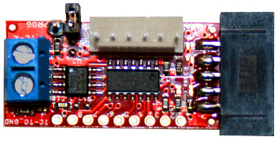
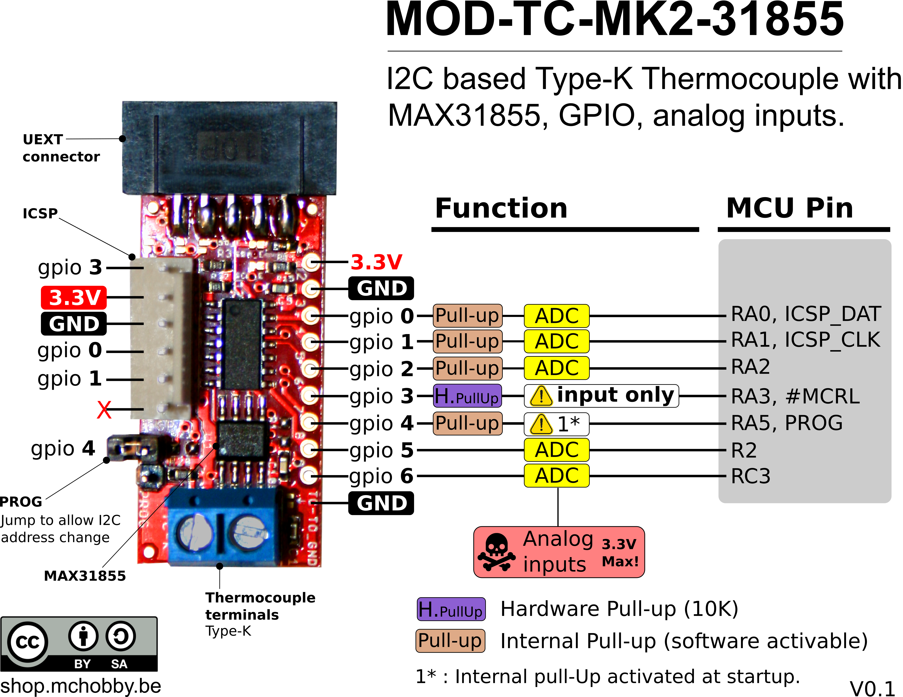

[Ce fichier existe également en FRANCAIS](readme.md)

__CONTENT UNDER TRANSLATION__

# Use a Type-K thermocouple via I2C (and MAX31855) under MicroPython

The __MOD-TC-MK2-31855__ from Olimex is not only a MAX31855 thermocouple amplifier but also a PIC16F1503 microcontroler allowing to capture the thermocouple temperature over the I2C bus.



The module also offers 7 GPIOs also available via the I2C bus. You can manage the GPIOs as digital input or output or as analog input (10 bits resolution).

 

The interest of `modtc_mk2.py` MicroPython library is to offer the acces to all the pin behaviours via the GPIO number.

# Wiring

Pour brancher la carte, il suffit d'utiliser son connecteur UEXT.

Il est possible de préparer un [breakout UEXT pour Pyboard](https://github.com/mchobby/pyboard-driver/tree/master/UEXT) pour brancher facilement des cartes UEXT sur la Pyboard.


Il est possible de connecter le le module MOD-TC par l'intermédiaire de l'adaptateur [PYBOARD-UNO-R3](https://github.com/mchobby/pyboard-driver/tree/master/UNO-R3) qui expose également un connecteur UEXT.

# Test

Pour exécuter les exemples, il sera nécessaire de copier la bibliothèque `modtc_mk2.py` sur la carte MicroPython.

## Lecture de température

``` python
from machine import I2C
from modtc_mk2 import MODTC_MK2

# PYBOARD-UNO-R3 & UEXT for Pyboard. SCL=Y9, SDA=Y10
i2c = I2C(2)
mk2 = MODTC_MK2( i2c )

# Internal & External temperatures
temp_in, temp_ext = mk2.temperatures
# display
print( "Internal Temp = %s" % temp_in )
print( "External Temp = %s" % temp_ext )
```

## Entrée analogique

La carte supporte la lecture analogique sur les GPIO 0,1,2,5,6.

Le script `test_analog.py` effectue une lecture de toutes les broches analogiques toutes les secondes.

``` python
from machine import I2C
from modtc_mk2 import MODTC_MK2

# PYBOARD-UNO-R3 & UEXT for Pyboard. SCL=Y9, SDA=Y10
i2c = I2C(2)
mk2 = MODTC_MK2( i2c )

for pin in [0,1,2,5,6]: # PinNumber with Analog support
	value = mk2.analog_read( pin ) # 10 bits reading
	volts = value / 1023 * 3.3 # Voltage
	print( "Analog %s = %3.2f v (%4i)" % (pin,volts,value ) )
```

Ce qui produit le résultat:

```
Analog 0 = 0.63 v ( 194)
Analog 1 = 0.35 v ( 109)
Analog 2 = 0.16 v (  51)
Analog 5 = 1.53 v ( 474)
Analog 6 = 1.34 v ( 416)
```

## Entrée avec Pullup

``` python
from machine import I2C, Pin
from modtc_mk2 import MODTC_MK2
from time import sleep

# PYBOARD-UNO-R3 & UEXT for Pyboard. SCL=Y9, SDA=Y10
i2c = I2C(2)
mk2 = MODTC_MK2( i2c )

print( "Config GPIO 2 en entree avec Pull-up" )
mk2.pin_mode( 2, Pin.IN )
mk2.pullup( 2, True  )
while True:
	print( "GPIO 2 : %s" % ("3.3v" if mk2.digital_read(2) else "Gnd") )
	sleep( 1 )
```

Ce qui produit:

```
MicroPython v1.11-473-g86090de on 2019-11-15; PYBv1.1 with STM32F405RG
Type "help()" for more information.
>>>
>>> import test_pullup
Config GPIO 2 en entree avec Pull-up
GPIO 2 : 3.3v
GPIO 2 : 3.3v
GPIO 2 : 3.3v
GPIO 2 : 3.3v
GPIO 2 : 3.3v
GPIO 2 : Gnd
GPIO 2 : Gnd
GPIO 2 : 3.3v
```

## Sortie Numérique

``` python
from machine import I2C, Pin
from modtc_mk2 import MODTC_MK2
from time import sleep

# PYBOARD-UNO-R3 & UEXT for Pyboard. SCL=Y9, SDA=Y10
i2c = I2C(2)
mk2 = MODTC_MK2( i2c )

# Le GPIO a tester
GPIO = 6

print( "Inverser l etat du GPIO %s" % GPIO )
mk2.pin_mode( GPIO, Pin.OUT )
while True:
	print( "MARCHE" )
	mk2.digital_write( GPIO, True )
	sleep( 1 )
	print( "arret" )
	mk2.digital_write( GPIO, False )
	sleep( 1 )
```

## Changer l'adresse I2C du module

L'adresse I2C du module MOD-TC-MK2-31855 est stockée dans l'EEPROM du microcontrôleur.

Cela permet de modifier l'adresse que le module doit avoir sur le bus (à l'aide d'une commande I2C appropriée pris en charge par la bibliothèque).

Grâce à cette modification d'adresse, il est possible d'avoir plusieurs module MOD-TC-MK2-31855 sur un même bus I2C.

``` python
from machine import I2C
from modtc_mk2 import MODTC_MK2

FROM_ADDRESS = 0x23 # 0x23 is the default address of MOD-TC-MK2-31855
TO_ADDRESS   = 0x25

# PYBOARD-UNO-R3 & UEXT for Pyboard. SCL=Y9, SDA=Y10
i2c = I2C(2)

print( "I2C scan..." )
print( ", ".join( [ "0x%x" % value for value in i2c.scan() ] ))
print( "" )

print( "Connecting to address 0x%x" % FROM_ADDRESS )
mk2 = MODTC_MK2( i2c, address=FROM_ADDRESS )

print( "Change to address 0x%x" % TO_ADDRESS )
mk2.change_address( new_address=TO_ADDRESS )

print( "Power cycle the board and make")
print( "a new I2C scan to check the address." )
```

## Lecture sur plusieurs modules

En utilisant plusieurs modules MOD-TC-MK2-31855 ayant chacun leur propre adresse I2C, il est possible de les placer sur le même bus I2C et de les interroger à tour de rôle.

Dans l'exemple ci-dessous les deux modules sont respectivement accessibles aux adresses 0x23 et 0x25.

``` python
from machine import I2C
from modtc_mk2 import MODTC_MK2
from time import sleep

# l'adresse des deux modules
MK2_ADDR_1 = 0x23
MK2_ADDR_2 = 0x25

# PYBOARD-UNO-R3 & UEXT for Pyboard. SCL=Y9, SDA=Y10
i2c = I2C(2)
mk_dic = { 'temp 1' : MODTC_MK2( i2c, address=MK2_ADDR_1 ),
		   'temp 2' : MODTC_MK2( i2c, address=MK2_ADDR_2 )   }

while True:
	print( "-"*40 )
	for name, mk2 in mk_dic.items():
		temp = mk2.temperatures[1]
		print( "%s : %5.2f C" % (name, temp) )
	sleep(1)
```

Ce qui produit les résultats suivants:

``` python
MicroPython v1.11-473-g86090de on 2019-11-15; PYBv1.1 with STM32F405RG
Type "help()" for more information.
>>>
>>> import test_dual
----------------------------------------
temp 1 : 21.00 C
temp 2 : 22.25 C
----------------------------------------
temp 1 : 21.00 C
temp 2 : 22.25 C
----------------------------------------
temp 1 : 20.75 C
temp 2 : 21.75 C
----------------------------------------
temp 1 : 21.00 C
temp 2 : 21.50 C
```

# Shopping list
* [MicroPython board](https://shop.mchobby.be/fr/56-micropython) @ MCHobby
* [MOD-TC-MK2-31855 with MAX31855](https://shop.mchobby.be/fr/nouveaute/1624-mod-tc-mk2-31855-interface-thermocouple-type-k-avec-max31855-bus-i2c-gpio-3232100016248-olimex.html) @ MCHobby
* [MOD-TC-MK2-31855 with MAX31855](https://www.olimex.com/Products/Modules/Sensors/MOD-TC-MK2-31855/open-source-hardware) @ Olimex
