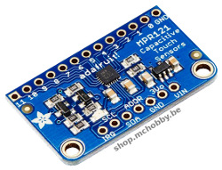
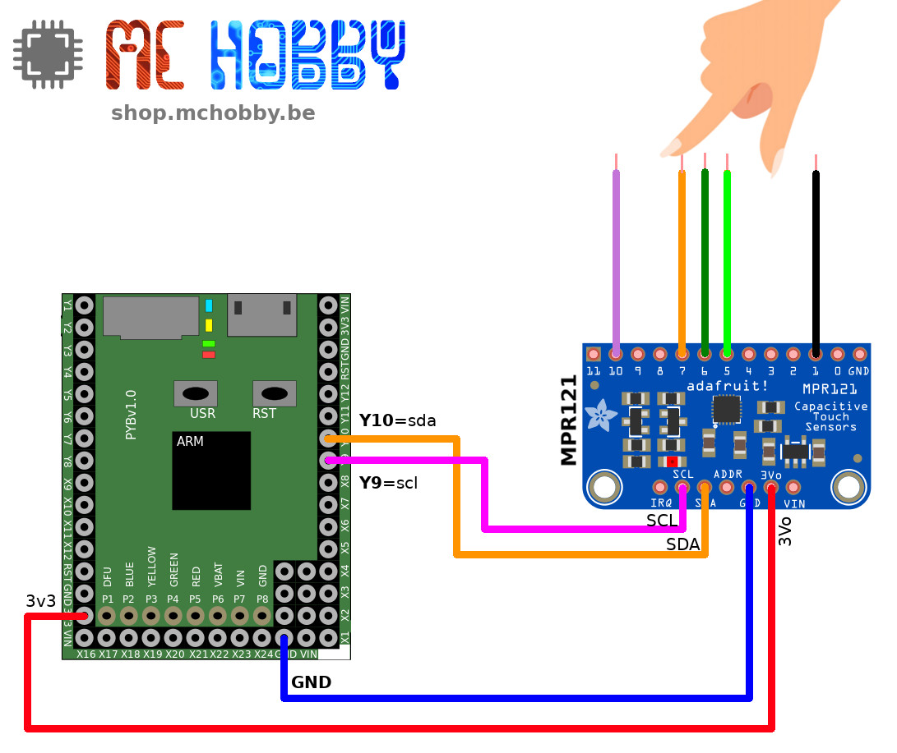
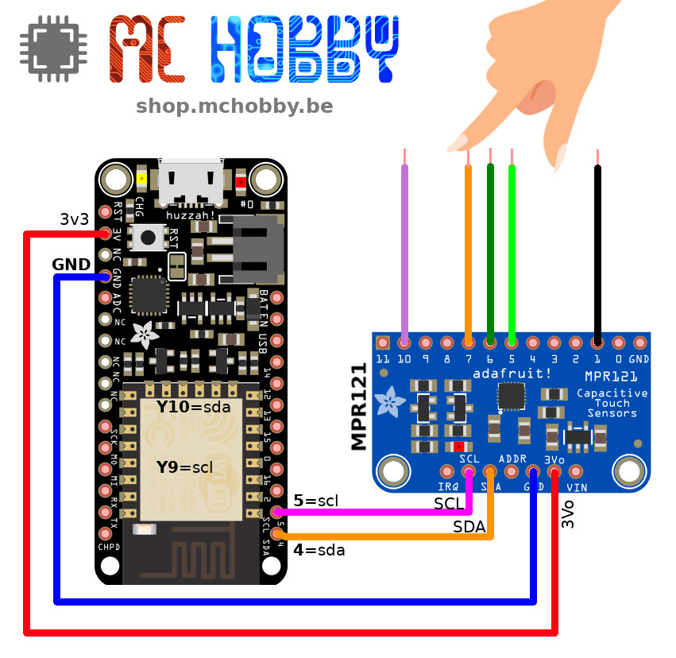

[This file also exists in ENGLISH here](readme_ENG.md)

# MPR121, un capteur capacitif avec 12 entrées pour vos projets MicroPython

Le MPR121 est un composant spécialisé utilisé pour réaliser des détections capacitives plus facilement qu'en utilisant des entrées analogiques. Le MPR121 gère déjà le filtrage des entrée et peut être configuré avec plus ou moins de sensibilité.

Le MPR121 est un composant I2C qui permet de sélectionner jusque 4 adresse pour un total de 48 entrées capacitives (whoaw!).



Pour plus d'information, voyez cette [fiche produit](http://shop.mchobby.be/product.php?id_product=1685) ou [celle-ci](hhttps://www.adafruit.com/product/1982).

# Bibliothèque

Cette bibliothèque doit être copiée sur la carte MicroPython avant d'utiliser les exemples.

Sur une plateforme connectée:

```
>>> import mip
>>> mip.install("github:mchobby/esp8266-upy/mpr121")
```

Ou via l'utilitaire mpremote :

```
mpremote mip install github:mchobby/esp8266-upy/mpr121
```


# Brancher

## sur MicroPython Pyboard



## sur ESP8266



# Tester

La bibliothèque MPR121 doit être installée avec l'utilisation de ces exemples.

La bibliothèque `mpr121.py` est disponible sur [ICI sur le GitHub de MicroPython](https://github.com/mcauser/micropython-mpr121/blob/master/mpr121.py). Téléchargez le fichier et installez le sur votre carte MicroPython.

Le script de test `test.py` permet de détecter si des entrées (de 0 à 11) est/sont touchés.

``` python
from machine import I2C
from time import sleep
from mpr121 import MPR121

# Pyboard - SDA=Y10, SCL=Y9
i2c = I2C(2)
# ESP8266 sous MicroPython
# i2c = I2C(scl=Pin(5), sda=Pin(4))

mpr = MPR121( i2c )

while True:
	print( "="*40)
	for i in range(12): # 0 à 11
		if mpr.is_touched(i):
			print( "Entree %2s: TOUCHEE" % i  )
		else:
			print( "Entree %2s: " % i  )
	sleep(1)
```

Le problème principal du précédent exemple est qu'il fait des appels répétés à `is_touched(key_nr)`, ce qui initie une communication I2C pour chaque append de la méthode.

Comme le bus I2C est relativement lent par rapport à la vitesse de traitement et l'accès en mémoire.
Cette seconde version nommée `fasttest.py` lit les données une fois puis calcule l'état des douzes entrées.


``` python
from machine import I2C
from time import sleep
from mpr121 import MPR121

# Pyboard - SDA=Y10, SCL=Y9
i2c = I2C(2)
# ESP8266 sous MicroPython
# i2c = I2C(scl=Pin(5), sda=Pin(4))

mpr = MPR121( i2c )

# contiendra une valeur pour chaque broche
touched = bytearray( 12 )

while True:
	print( "="*40)
	# Lecture et décodage (aussi vite que possible)
	data = mpr.touched()
	for i in range( 12 ):
		touched[i] = 1 if data & (1<<i) else 0

	# Affiche le résultat
	for i in range(12): # 0 to 11
		if touched[i]: # valeur > 0 signifie touché!
			print( "Entree %2s: TOUCHEE" % i  )
		else:
			print( "Entree %2s: " % i  )
	sleep(0.1)
```

# Where to buy
* [MPR121 Capteur capacitif 12 touches breakout @ MC Hobby](http://shop.mchobby.be/product.php?id_product=1685)
* [12-Key Capacitive Touch Sensor Breakout @ Adafruit](https://www.adafruit.com/product/1982)
