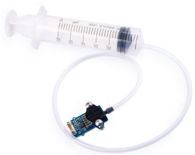
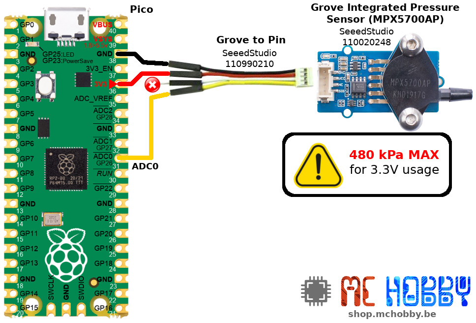
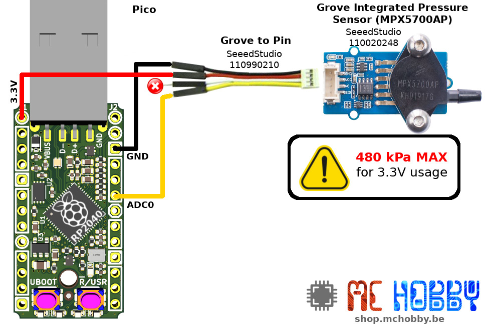

[Ce fichier existe également en FRANCAIS](readme.md)

# Using the MPX5700AP pressure sensor with MicroPython

------ TRANSLATE -------------

The MPX5700AP is an analog sensor able to measure the air pressure between 15 KPa and 700 Kpa. It is a very wide range of pressure measurement.

To compare it with something known, the usual atmospheric pressure is equal to ~1024 hPa (soit 102.4 kPa). With 15 KPa, this sensor is able to capture an depression (against the atmospheric pressure).

The error on MPX5700AP is 2.5% max on a sensor offering a high precision and reliability... all without specific calibration task.



SeedStudio do distribute a [Grove - Integrated Pressure Sensor (MPX5700AP)](https://www.seeedstudio.com/Grove-Integrated-Pressure-Sensor-Kit-MPX5700AP-p-4295.html) kit including a MPX5700APbreakout with an amplifier and syringe able to apply pressure and depressure onto the sensor.


The kit is made around the pressure sensor and LMV358 amplifier both powered with HX4002 step-up voltage regulator powering the sensor with 5V (whatever is the board power supply 3.3V or 5V).

__What represents 700 kPa and 500 kPa pressure?__

The usual atmospheric pressure is around 1024 mBar, equal to 1024 hPa... equal to __102.4 kPa__ .

The air pressure above our heads is about __102.4 kPa__ (so a little bit more than 1 Atmosphere).

With 500 kPa, we are at 5 time the atmospheric pressure (and almost 7 times for 700 kPa).

__Max pressure for 3.3V?__

Under 480 kPa, the sensor can be used dorectly onto a 3.3V logic microcontroler (see calcul note at the bottom).

480 kPa is about 5 time atmospheric pressure... so it is a lot.

# Library

No library for this componant!

# Wiring

## Raspberry-Pico

Here is how to wire a [Raspberry-Pi Pico](https://shop.mchobby.be/fr/pico-rp2040/2036-pico-header-rp2040-microcontroleur-2-coeurs-raspberry-pi-3232100020368.html) to the sensor.



## PYBStick-RP2040

Here is how to wire the sensor to a [PYBStick RP2040](https://shop.mchobby.be/fr/pybstick/2331-pybstick-rp2040-26-broches-micropython-c-3232100023314-garatronic.html)



# Testing

The [test.py](examples/test.py) script here below do:
1. reads of voltage on the analog input,
2. then transform the voltage into a `rawValue` compatible with the Arduino example (see note)
3. then calculate kPas with the formula `(rawValue-41)*700/(963-41)`

``` python
from machine import Pin, ADC
import time

adc = ADC(Pin(26)) # ADC0 sur GP26

while True:
	raw = adc.read_u16() # 0..65535 for 0v..3.3v
	v = 3.3*raw/65535 # Transform into voltage
	kpa = (((v*1023)/5)-41)*700/(963-41)
	print( 'V: %8.6f, kPa: %s' % (v, kpa) )
	time.sleep(0.100)
```

That produce the following results on the REPL session:

```
V: 0.597913, kPa: 61.7495
V: 0.592273, kPa: 60.87344
V: 0.592273, kPa: 60.87344
V: 0.594690, kPa: 61.24889
V: 0.595496, kPa: 61.37404
V: 0.596301, kPa: 61.49919
V: 0.597107, kPa: 61.62435
V: 0.595496, kPa: 61.37404
V: 0.599524, kPa: 61.99979
V: 0.593884, kPa: 61.12375
V: 0.593079, kPa: 60.99859
```

For the Thonny IDE fans (and its plotter), you can also use the [plotter.py](examples/plotter.py) example. It only outputs the pressure in kPa (making the data plottale in Thonny).

# Calul notes

## Analog voltages for 500 kPa and 700 kPa

By reading the [Arduino code and measurement on the SeeedStudio Wiki](https://wiki.seeedstudio.com/Grove-Integrated-Pressure-Sensor-Kit/), I did wonder what was the sensor voltage output for 500 kPa (and sensor maximum of 700 kPa).

__For 500 kPa:__

```
500kPa = ((rawValue-offset)*700.0) / (fullScale-offset)

500kPa = ((rawValue-410)*700.0) / (9630-410)

rawValue = 6995.7
```

In that version of the formula `rawValue` do represent an __accumulate__ of 10 ADC data acquisition on Arduino. The meaning value os then 699.5 (rounded to 700) on the ADC.

A raw value of 700 on Arduino's ADC (5V, 10bits) represent a voltage of `Vadc = 700 * (500/1024) = 3.41 V`

__For 700 kPa:__

By applying the same formula to 700kPa, we do obtains :

```
700kPa = ((rawValue-410)*700.0) / (9630-410)
```

Which gives us a coltage of 4.0V as sensor's output signal.

__Conclusion:__

With a sensor output voltage of 3.41v for 500 kPa, the voltage is _almost_ compatible with 3.3V logic computer.

By lowering the max pressure of about 20 kPa, it would be possible to quitely runs a the sensor under 3.3V logic.

With 480A we are almost at 5 atmospheres pressure, 5x 1024hPa or also 5x 1024mBar (so 5 Bar).

In comparison, the distribution water pressure is 3 bar max (between 1 and 3 Bar)... just try to prevent the water to escape out and you will have an idea of such pressure.

## Which is the Max pressure for 3.3V ?

The big question is: __Which is the maximum pressure to not exceed 3.3V of the sensor's analog output ?__

When turning the problem upside down, for 3.3V on the ADC, we do have this rawValue on the ADC = 3.3V * 1024 / 5 = 675.84 on our Arduino.

To remind the conversion formula used `rawValue` as the addition of 10 repetitive data acquisition on the ADC (so 10x 675.84).

```
rawValue = 6758   

Pkpa = ((6758-410)*700.00)/(9630-410)

Pkpa = 481.95 kPa
```

To not exceed 3.3V on the sensor's output, you will need to stay below the 481.95 kPa pressure.

## rawValue calculation on RP2040 MCU (3.3V)

When we do not accumulate 10x ADC into `rawValue` then the kPa formula can be reduced to `kPa = ((rawValue-41)*700.0) / (963-41)` (juste some zero removal).

In the `kPa = ((rawValue-41)*700.0) / (963-41)` formula, the `rawvalue` variable do contains a value from 0 to 1023 acquired on a 10 bits 5V Arduino UNO ADC.

The issue here is that 3.3V logic as the Pico does returns a 16 bits value!

To avoids the issue, the Pico reading is transformed into voltage (as produced by the sensor analog output). This is the voltage that would be applied to the Arduino ADC if it were present.

```
v = 3.3*raw/65535
```

Then, we do calculate the `rawValue` as produced by the Arduino.

```
Volt = rawValue * 5 / 1023
```

However, we do already kown the votlage (as measured on the 3.3v ADC!)

So:

```
rawValue = Volt * 1023 / 5
```

The final formula is

```
kPa = (( (Volt * 1023 / 5) -41)*700.0) / (963-41)
```

# Shopping list
* [Grove - Integrated Pressure Sensor Kit (MPX5700AP)](https://www.seeedstudio.com/Grove-Integrated-Pressure-Sensor-Kit-MPX5700AP-p-4295.html) @ SeeedStudio
* [Raspberry-Pi Pico](https://shop.mchobby.be/fr/pico-rp2040/2036-pico-header-rp2040-microcontroleur-2-coeurs-raspberry-pi-3232100020368.html) @ MCHobby
* [PYBStick RP2040](https://shop.mchobby.be/fr/pybstick/2331-pybstick-rp2040-26-broches-micropython-c-3232100023314-garatronic.html?search_query=rp2040&results=8) @ MCHobby
