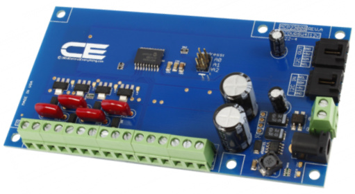
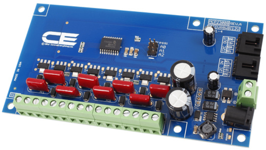
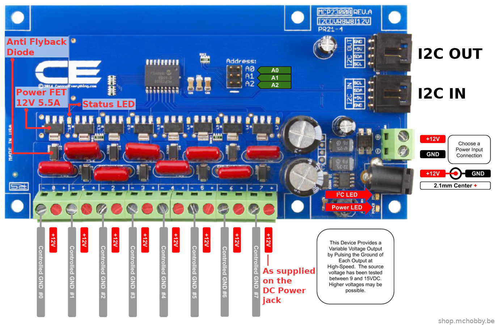
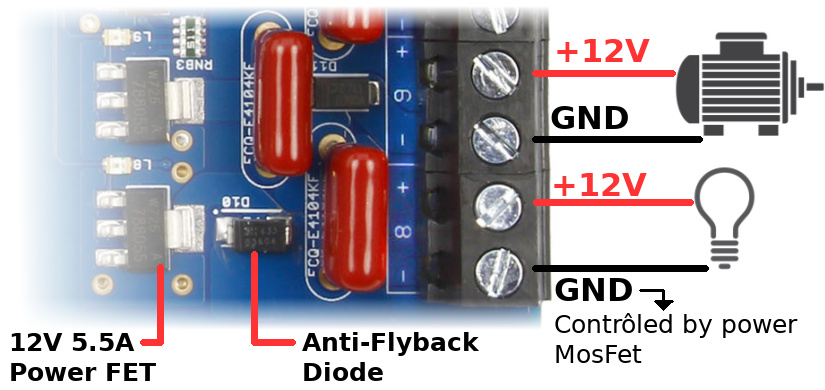
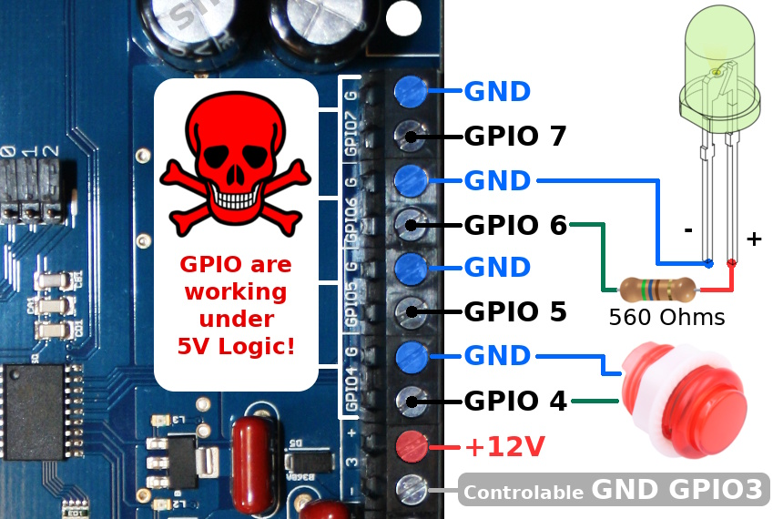
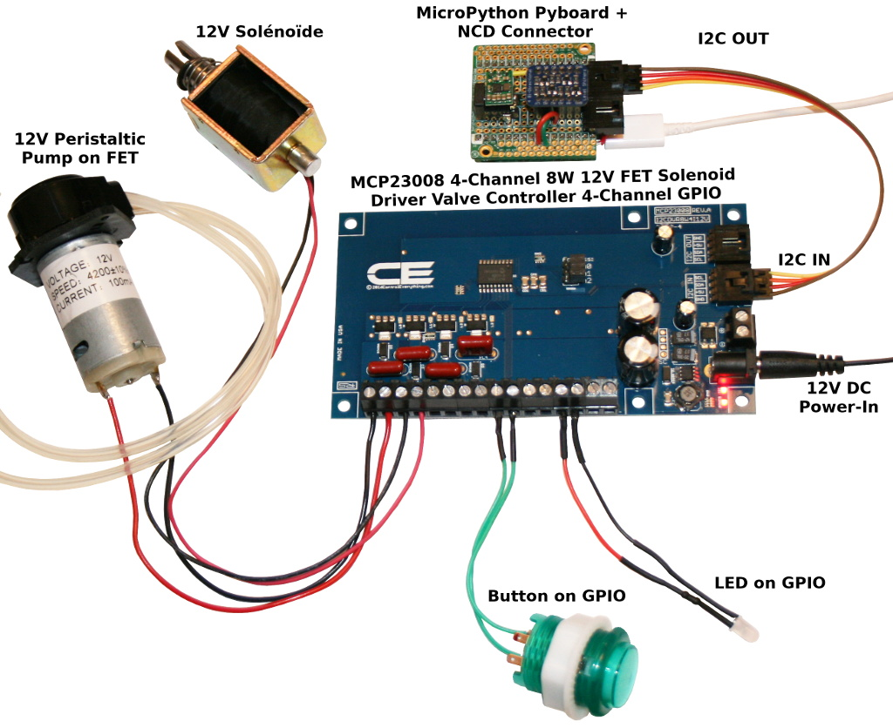

[Ce fichier existe également en FRANCAIS](readme.md)

# FET Solenoïd Driver Valve controller (MCP23008 based)
Based on __MCP23008__ (I2C 8-bits GPIO extender, [datasheet](https://ww1.microchip.com/downloads/en/DeviceDoc/21919e.pdf), the __FET Solenoïd Driver Valve controller__ from [National Control Device](https://store.ncd.io) is an easy way to control 12V resistive and inductive loads like pump, solenoïds, door lock, LEDs, motor, etc.

This I2C board exists in 2 flavours:
* [4 FET Solenoïd Drivers + 4 GPIOs](https://store.ncd.io/product/mcp23008-4-channel-8w-12v-fet-solenoid-driver-valve-controller-4-channel-gpio-with-i2c-interface/) on ncd.io
* [8 FET Solenoïd Drivers](https://store.ncd.io/product/mcp23008-8-channel-8w-12v-fet-solenoid-driver-valve-controller-with-i2c-interface/) on ncd.io

## 4 Channels FET Solenoïd driver + 4 GPIO


* [4 FET Solenoïd Drivers + 4 GPIOs](https://store.ncd.io/product/mcp23008-4-channel-8w-12v-fet-solenoid-driver-valve-controller-4-channel-gpio-with-i2c-interface/) on ncd.io
* 12V On/Off Power Fet Controller with I2C Interface
* 4-Channel Programmable GPIO (5V logic can be used as input or output)
* 4-channel Power Fets controlled (12V)
 * 4-Channel 12V Outputs Rated for Use with Resistive or Inductive Loads
 * Provides 12V On/Off Control of Solenoids, Valves and DC Motors
 * Solid-State On/Off Control of 12V Incandescent or High-Power LED Lighting
 * 8W Power Dissipation per Channel
 * 4 N-Channel BUK98150-55A __12V 5.5A Power Fets__. [BUK98150-55A datasheet](https://www.nexperia.com/products/mosfets/automotive-mosfets/BUK98150-55A.html)
* I2C Expansion Port for Adding External Sensors or Controllers
* MCP23008 8-Channel I2C GPIO Extender. [MCP23008 Datasheet](https://ww1.microchip.com/downloads/en/DeviceDoc/21919e.pdf)

## 8 Channels FET Solenoïd driver


* [8 FET Solenoïd Drivers](https://store.ncd.io/product/mcp23008-8-channel-8w-12v-fet-solenoid-driver-valve-controller-with-i2c-interface/) on ncd.io
* 12V On/Off Power Fet Controller with I2C Interface
* No extra GPIO available
* 8-channel Power Fets controlled (12V)
 * 8-Channel 12V Outputs Rated for Use with Resistive or Inductive Loads
 * Provides 12V On/Off Control of Solenoids, Valves and DC Motors
 * Solid-State On/Off Control of 12V Incandescent or High-Power LED Lighting
 * 8W Power Dissipation per Channel
 * 4 N-Channel BUK98150-55A __12V 5.5A Power Fets__. [BUK98150-55A datasheet](https://www.nexperia.com/products/mosfets/automotive-mosfets/BUK98150-55A.html)
* I2C Expansion Port for Adding External Sensors or Controllers
* MCP23008 8-Channel I2C GPIO Extender. [MCP23008 Datasheet](https://ww1.microchip.com/downloads/en/DeviceDoc/21919e.pdf)

## Connect 12V devices

FET connectors offers 12V power supply + Ground controled by the FET. This interface be used with resistive or inductive (coils) loads.





## Using extra GPIOs

The extra GPIO can be used as output (to control a LED) or as Input (to read button state) with/without pull-up resistor.

The exemple here under shows:
* GPIO6 as OUTPUT wired to a LED.
* GPIO4 as INPUT with PULL-UP ACTIVATED wired to a button.



# Wiring

It is a I2C sensor based on NCD connector, so use the appropritate interface to connect it. This repository propose NCD interface for [MicroPython Pyboard](https://github.com/mchobby/pyboard-driver/blob/master/NCD/README.md) and [ESP modules](../NCD/readme.md).




Notice that __National Control Device propose [many adapter board](https://store.ncd.io/shop/?fwp_product_type=adapters) __ for many development plateform.

# Testing

The testing script will use wiring examples show here above for 4 Channel Solenoid FET + 4 Channel GPIO:
* 12V Motor pump on GPIO 0
* 12V push-pull on GPIO 1
* Input button on GPIO 4 (pull-up activated)
* Output LED on GPIO 6

## Prerequisite

The file `mcp230xx.py` from the mcp230xx library must be available on the library search path.

The [mcp230xx library is available here](../mcp230xx/readme.md) on this github.

## library & examples

Copy the library file `fetsol.py` and the test file `test44.py` (4 channels + 4  gpios) on your MicroPython board.

The `test44.py` file (listed here under) can be loaded from REPL session with `import test44`.

```
from machine import I2C, Pin
from fetsol import FetSolenoid4
import time

# Create the I2C bus accordingly to your plateform.
# Pyboard: SDA on Y9, SCL on Y10.
#         So reduce it to 100 Khz. Do not hesitate to test with 10 KHz (10000)
i2c = I2C( 2, freq=100000 )
# Feather ESP8266 & Wemos D1: sda=4, scl=5.
# i2c = I2C( sda=Pin(4), scl=Pin(5) )
# ESP8266-EVB
# i2c = I2C( sda=Pin(6), scl=Pin(5) )

# Add "address" parameter as needed (default is 0x20)
board = FetSolenoid4( i2c )

# Activating Fet Outputs
for i in range(4):
	board.output( i, True )
	time.sleep( 1 )

# deactivate the 4 outputs in 2 steps
board.output_pins( {0: False, 2: False } )
time.sleep( 1 )
board.output_pins( {1: False, 3: False } )
time.sleep( 1 )

# Using a dictionnary to change several pins
dic = {}
dic[2] = True
dic[3] = True
board.output_pins( dic )
time.sleep( 1 )

# Reset all FETs
board.reset()

# --------------------------------------------
#   Manipulate GPIOs
# --------------------------------------------
# Setting GPIO 6 as output
board.setup( 6, Pin.OUT )
board.output( 6, True )

# Setting GPIO 4 as input + activate pull-up
board.setup( 4, Pin.IN )
board.pullup( 4, True )
# Perform 10x input reading
for i in range( 10 ):
	print( "GPIO 4 = %s" % board.input(4) )
	time.sleep( 1 )

# turn off GPIO 6
board.output( 6, False )
```
See also the example `test8.py` that manipulates output to 8-Channel FETs.
