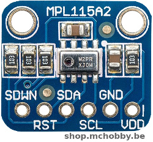
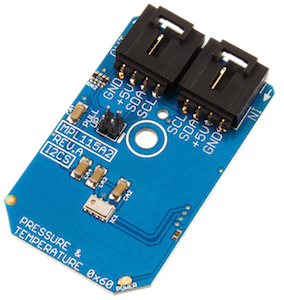
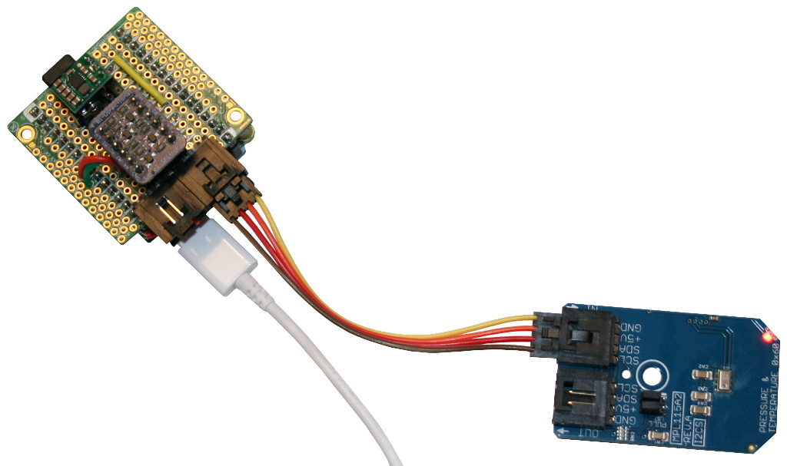
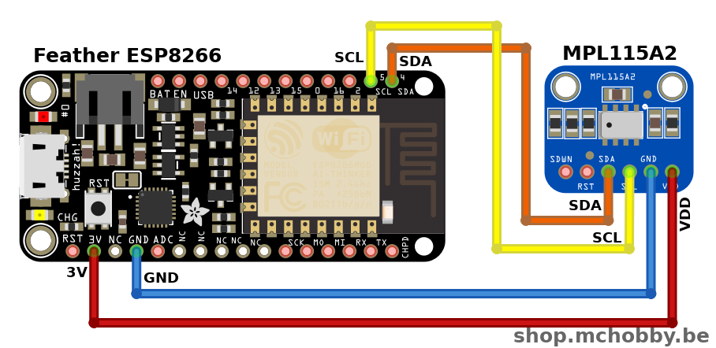
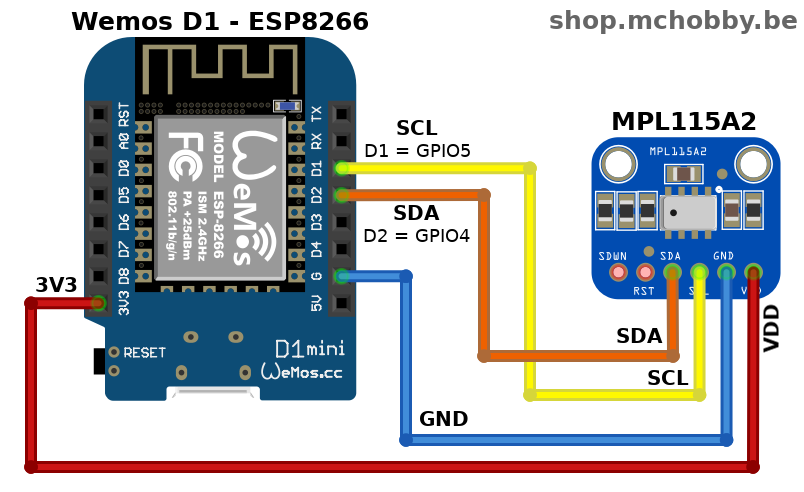
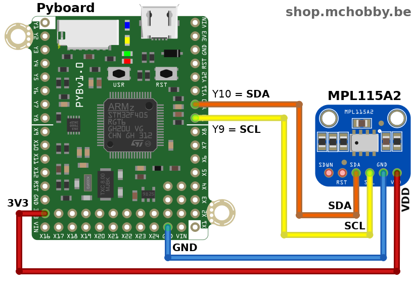

[Ce fichier existe également en FRANCAIS](readme.md)

# Measuring athmospheric pressure and temperature with the MPL115A2 sensor

Freescale’s MPL115A2 employs a MEMS pressure sensor with an I2C interface to provide accurate Pressure/Altitude and Temperature data.

The sensor outputs are digitized by a high resolution 24-bit ADC. It is capable of detecting a change in only 0.05 kPa which equates to a 0.3m change in altitude.
* I2C Altimeter with 24-Bit ADC
* Operating Pressure Range 50 kPa~115 kPa
* Fully Compensated Internally
* Programmable Events
* Logs Data up to 12 Days
* RoHS Compliant
* 0x60 I2C Start Address

This sensor is available as breakout and as NCD Mini board (easier to wire).





Common applications for the MPL115A2 include:
* personal electronics altimetry,
* weather station equipment,
* navigation and map assist,
* HVAC, etc.

## About NCD Modules
The NCD I2C Mini Modules are designed with a standard & convenient 4-Pin plug connector. Thanks to the connector, it eliminating the need for soldering and the devices can be daisy-chained onto the I2C Bus.

This NCD MPL115A2 module doen't need any level shifter, neither any voltage regulator since it can work with a supply voltage from 2.4V to 5.5V.

# Wiring

## Wiring with NCD

It is a I2C sensor based on NCD connector, so use the appropriate interface to connect it. This repository propose NCD interface for [MicroPython Pyboard](https://github.com/mchobby/pyboard-driver/blob/master/NCD/README.md) and [ESP modules](../NCD/readme.md).




Notice that __National Control Device propose [many adapter board](https://store.ncd.io/shop/?fwp_product_type=adapters) __ for many development plateform.

## Wiring with breakout (Feather, Wemos et Pyboard)







# Testing
Copy the file `mpl115a2.py` and `test.py` on your MicroPython board.

The `test.py` file (listed here under) can be loaded from REPL session with `import test`

```
from machine import I2C, Pin
from mpl115a2 import MPL115A2
import time

# Create the I2C bus accordingly to your plateform.
# Pyboard: SDA on Y9, SCL on Y10. See NCD wiring on https://github.com/mchobby/pyboard-driver/tree/master/NCD
#         Default bus Freq 400000 = 400 Khz is to high.
#         So reduce it to 100 Khz. Do not hesitate to test with 10 KHz (10000)
i2c = I2C( 2, freq=100000 )
# Feather ESP8266 & Wemos D1: sda=4, scl=5.
# i2c = I2C( sda=Pin(4), scl=Pin(5) )
# ESP8266-EVB
# i2c = I2C( sda=Pin(6), scl=Pin(5) )

mpl = MPL115A2( i2c )
print( 'raw_values ', mpl.raw_values ) # computer Friendly pressure, temp
val = mpl.values # Human Friendly values
print( val[0] ) # pressure hPa
print( val[1] ) # temp °C

while True:
	print( '%-15s %-15s' % mpl.values )
	time.sleep(1)
```

which produce the following results:

```
raw_values  (1010.17, 20.3271)
1011.71hPa
20.3271C
1010.59hPa      20.51402C      
1010.17hPa      20.3271C       
1011.71hPa      20.3271C       
1012.12hPa      20.51402C      
1011.71hPa      20.3271C       
1012.12hPa      20.51402C
...
```

# Where to buy
* NCD-MPL115A2 : http://shop.mchobby.be/
* NCD-MPL115A2 : https://store.ncd.io/product/mpl115a2-digital-barometer-50-to-115-kpa-i2c-mini-module/
* MPL115A2 breakout : https://shop.mchobby.be/fr/nouveaute/1587-mpl115a2-is-an-i2c-pressure-and-temperature-sensor-3232100015876.html
