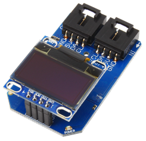
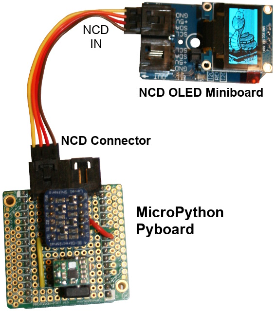
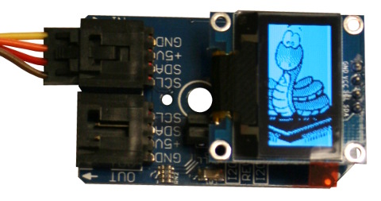

[This file also exists in ENGLISH](readme_ENG.md)

 *** TRADUCTION ***

# Afficher des informations sur écran OLED SSD1306

The NCD OLED display mini board makes it easy to display data from your embedded controller with 128×64 resolution.



OLED displays are an excellent method of displaying variable data and troubleshooting embedded code.

At a very low cost, OLED display makes it easy to learn, create, and have fun.

Main features:
* 2.3cm OLED Display
* 128×64 Graphic Display
* SSD1306 OLED controler
* I2C Mini Module Footprint
* Available in Blue, White, or Yellow
* Powered by the I2C Bus
* Default address: 0x3C

## About NCD Modules
The NCD I2C Mini Modules are designed with a standard & convenient 4-Pin plug connector. Thanks to the connector, it eliminating the need for soldering and the devices can be daisy-chained onto the I2C Bus.

This NCD OLED display doen't need any level shifter, neither any voltage regulator.

# Wiring with NCD

It is a I2C mini board based on NCD connector, so use the appropriate interface to connect it. This repository propose NCD interface for [MicroPython Pyboard](https://github.com/mchobby/pyboard-driver/blob/master/NCD/README.md) and [ESP modules](../NCD/readme.md).




Notice that __National Control Device propose [many adapter board](https://store.ncd.io/shop/?fwp_product_type=adapters) __ for many development plateform.

# Testing
Copy the file [`ssd1306.py` from MicroPython.org](https://raw.githubusercontent.com/micropython/micropython/master/drivers/display/ssd1306.py) and `test.py` to your MicroPython board.

The `test.py` file (listed here under) can be loaded from REPL session with `import test`

```
from machine import I2C, Pin
import ssd1306
import time

# Create the I2C bus accordingly to your plateform.

# --- ESP8266 ---
# Feather ESP8266 & Wemos D1: sda=4, scl=5.
# i2c = I2C( sda=Pin(4), scl=Pin(5) )
# ESP8266-EVB
# i2c = I2C( sda=Pin(6), scl=Pin(5) )
# lcd = ssd1306.SSD1306_I2C( 128, 64, i2c , addr=0x78)

# --- PYBOARD ---
# WARNING: On pyboard, the ssd1306 driver is written for machine.I2C (not pyb.I2C)
#          and I2C bus must be instanciate against specific Pin configuration
#          see Topic https://forum.micropython.org/viewtopic.php?f=6&t=4663
# Pyboard: SDA on Y9, SCL on Y10. See NCD wiring on https://github.com/mchobby/pyboard-driver/tree/master/NCD
#
pscl = Pin('Y9', Pin.OUT_PP)
psda = Pin('Y10', Pin.OUT_PP)
i2c = I2C(scl=pscl, sda=psda)
lcd = ssd1306.SSD1306_I2C( 128, 64, i2c )

lcd.fill(1) # Fill the screen in white
lcd.show()  # Display!

# Fill a black rectangle
# fill_rect( x, y, w, h, c )
lcd.fill_rect( 10,10, 20, 4, 0 )
lcd.show()  # Display!
```

which display a small dark box on a screen completely lighted.


This second example loads '.pbm' files (_Portable Bitmap_ format) and display them on the OLED display.



It will be necessary to transfers the `loadbmp.py` script and the `ncd-mch.pbm` & `upy-logo.pbm` files. See the __oled-ssd1306__ folder to see how to produce the `.pbm` files.

```
from machine import I2C, Pin
import ssd1306
import framebuf
import time

# Create the I2C bus accordingly to your plateform.

# --- ESP8266 ---
# Feather ESP8266 & Wemos D1: sda=4, scl=5.
# i2c = I2C( sda=Pin(4), scl=Pin(5) )
# ESP8266-EVB
# i2c = I2C( sda=Pin(6), scl=Pin(5) )
# lcd = ssd1306.SSD1306_I2C( 128, 64, i2c , addr=0x78)

# --- PYBOARD ---
# WARNING: On pyboard, the ssd1306 driver is written for machine.I2C (not pyb.I2C)
#          and I2C bus must be instanciate against specific Pin configuration
#          see Topic https://forum.micropython.org/viewtopic.php?f=6&t=4663
# Pyboard: SDA on Y9, SCL on Y10. See NCD wiring on https://github.com/mchobby/pyboard-driver/tree/master/NCD
#
pscl = Pin('Y9', Pin.OUT_PP)
psda = Pin('Y10', Pin.OUT_PP)
i2c = I2C(scl=pscl, sda=psda)
lcd = ssd1306.SSD1306_I2C( 128, 64, i2c )

lcd.fill(1) # Rempli l'écran en blanc
lcd.show()  # Afficher!

while True:
	# Code inspired from twobitarcade.net
	#   https://www.twobitarcade.net/article/displaying-images-oled-displays/
	with open('ncd-mch.pbm', 'rb' ) as f:
		f.readline() # Magic number    P4 for pbm (Portable Bitmap)
		f.readline() # Creator comment
		f.readline() # Dimensions
		data = bytearray(f.read())

	fbuf = framebuf.FrameBuffer(data, 128, 64, framebuf.MONO_HLSB)
	lcd.invert(1)
	lcd.blit(fbuf, 0, 0)
	lcd.show()

	time.sleep(3)

	with open('upy-logo.pbm', 'rb' ) as f:
		f.readline() # Magic number    P4 for pbm (Portable Bitmap)
		f.readline() # Creator comment
		f.readline() # Dimensions
		data = bytearray(f.read())

	fbuf = framebuf.FrameBuffer(data, 128, 64, framebuf.MONO_HLSB)
	lcd.invert(1)
	lcd.blit(fbuf, 0, 0)
	lcd.show()

	time.sleep(3)
```

# ressources
* See the GitHub [oled-ssd1306](https://github.com/mchobby/esp8266-upy/tree/master/oled-ssd1306) for more details about the SSD1306 driver, its method, etc.

# Where to buy
* NCD-I2COLED : http://shop.mchobby.be/
* NCD-I2COLED : https://store.ncd.io/product/oled-128x64-graphic-display-i2c-mini-module/
