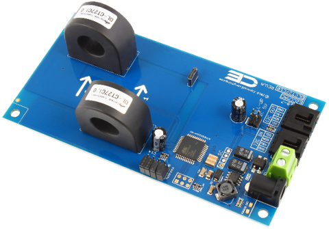
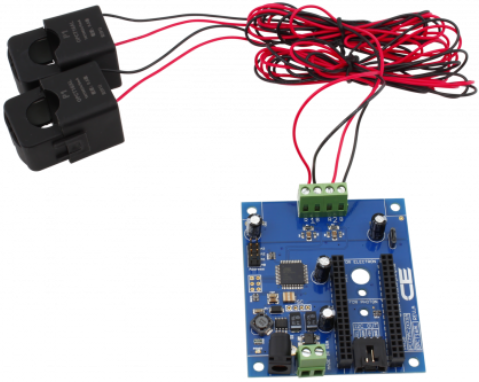
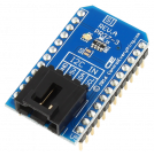
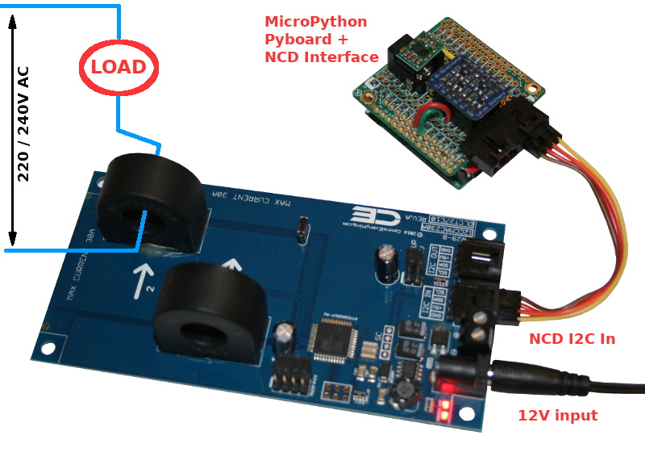
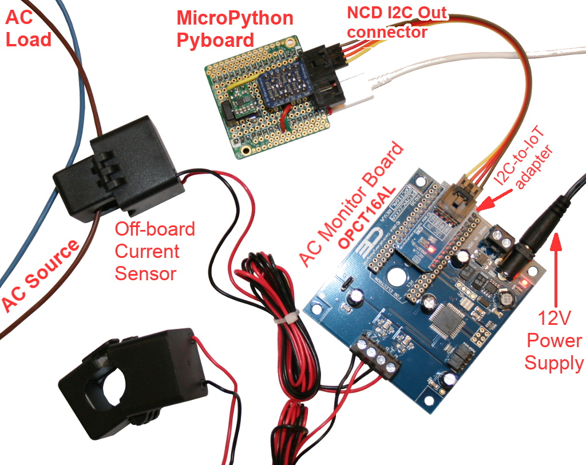
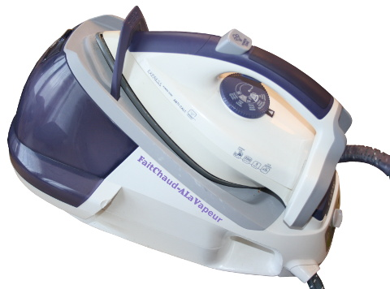

[This file also exists in ENGLISH](readme_ENG.md)

TRADUCTION

# Moniteur de courant Multi-Canal de précision avec interface I2C

PECMAC sont des senseur de courant alternatif **disponible en plusieurs version** (canaux et courants) et disposent de connecteurs NCD (plus facile à raccorder).

Les capteur-AC (alias PECMAC) ont étés testés en deux versions distinctes:
* Carte moniteur de courant avec 2 canaux sur carte.
* Moniteur de courant avec 2 canaux et déporté avec interface IoT (Internet des Objets)

## Moniteur de courant 2-Canaux -précision 97% - I2C Interface



La [carte DLCT27C10 testée](https://store.ncd.io/product/2-channel-on-board-97-accuracy-ac-current-monitor-with-i2c-interface/) avec 2 canaux mais existe également en multi-canaux.
* Contrôleur de surveillance de courant avec bus I2C
* 2 Canaux en entrée avec gamme de courant de 10, 20, 30, 50 ou 70 ampères
* Idéal pour une utilisation avec PC en utilisant Windows 8/10 (via USB)
* Compatible avec Arduino, Raspberry Pi, Onion, PyCom, **MicroPython**
* Capteur de courant en une pièce avec taux d'erreur de 3% Max
* Cross-Platform : compatible avec les interface I2C
* Connecteur d'extension I2C sur la carte (logique 5V)
* Jusqu'à 16 cartes par port I2C
* Adresse de départ I2C: 0x2A
* [Datasheet](https://media.ncd.io/sites/2/20170721135011/Current-Monitoring-Reference-Guide-12.pdf)
* [Pilotes PECMAC](https://github.com/ControlEverythingCommunity/PECMAC) (Hors MicroPython)

## Moniteur de courant 2-Canaux déportés - précision 98% - avec interface I2C



La [carte OPCT16AL testée](https://store.ncd.io/product/2-channel-off-board-98-accuracy-ac-current-monitor-with-iot-interface/) disposant de 2 canaux mais existe également avec plusieurs canaux.
* 2 canaux avec mesure de courant de 10 à 100 ampères en fonction du modèle pour surveillance via IoT
* Surveillance énergétique pour application et plateforme de type IoT.
* Compatible avec Particle Electron (communication cellulaire)
* Compatible avec Particle Photon (communication WiFi)
* Compatible avec Bluz (communication Bluetooth Low Energy, BLE)
* Adaptable avec Raspberry Pi, Arduino et autres plateformes **y compris MicroPython**.
* Processeur sur la carte prenant en charge les mesures et conversion d'information.
* Pour d'extension I2C (en sortie) pour ajouter d'autres cartes avec connecteur NCD

Pour utiliser cette carte avec MicroPython Pyboard, il est nécessaire d'ajouter un [adaptateur I2C vers IoT adapter](https://store.ncd.io/product/i2c-to-iot-interface-adapter/) permettant d'avoir une entrée I2C NCD (à la place de la connectique IoT).



## A propos des modules NCD
Les mini modules et carte I2C de NCD National Control Device / ncd.io sont conçus avec un connecteur standard à 4 broches très pratique. Grâce à ces connecteurs, plus besoin de souder et les modules peuvent être chaînés sur un bus I2C.

Cette carte de NCD dénommée "AC Current Sense board" (carte capteur courant alternatif) dispose de son propre microcontrôleur pour effectuer les tâches d'acquisition et de capture. La carte est également alimentée à l'aide d'une alimentation 12V séparée.


Cette bibliothèque doit être copiée sur la carte MicroPython avant d'utiliser les exemples.

Sur une plateforme connectée:

```
>>> import mip
>>> mip.install("github:mchobby/esp8266-upy/ncd-pecmac")
```

Ou via l'utilitaire mpremote :

```
mpremote mip install github:mchobby/esp8266-upy/ncd-pecmac
```

# Brancher

Il s'agit d'une carte exposant un connecteur NCD (bus I2C). Il est donc nécessaire d'utiliser une interface appropriée pour s'y connecter. Ce dépôt propose une interface NCD pour [MicroPython Pyboard](https://github.com/mchobby/pyboard-driver/blob/master/NCD/README.md) et [modules ESP](../NCD/readme.md).






Notez que **National Control Device propose [de nombreux adaptateur](https://store.ncd.io/shop/?fwp_product_type=adapters) ** pour de nombreuses cartes de développement.

# Tester
Copiez le fichier `pecmac.py` et `test.py` sur votre carte MicroPython.

Le script `test.py` (affiché ci-dessous) fonctionnera avec toutes les cartes PECMAC. et peut être chargé dans une session REPL avec `import test`

```
from machine import I2C, Pin
from pecmac import PECMAC, PECMAC_SENSOR_TYPES
import time

# Créer le bus I2C en fonction de la plateforme.
# Pyboard: SDA sur Y9, SCL sur Y10. Voir branchement NCD sur https://github.com/mchobby/pyboard-driver/tree/master/NCD
#         Vitesse de bus réduit à 100 Khz pour test.
i2c = I2C( 2, freq=100000 )
# Feather ESP8266 & Wemos D1: sda=4, scl=5.
# i2c = I2C( sda=Pin(4), scl=Pin(5) )
# ESP8266-EVB
# i2c = I2C( sda=Pin(6), scl=Pin(5) )

# Ajouter le parametre "address" si necessaire
board = PECMAC( i2c )
print( 'Type de capteur: %d (%s)' % (board.sensor_type, PECMAC_SENSOR_TYPES[board.sensor_type]) )
print( 'Courent Max    : %d' % board.max_current )
print( 'Canaux         : %d' % board.channels    )

print( '' )
print( 'Lecture de la calibration des canauxn :' )
for ch in range(1, board.channels+1 ):
	print( 'Canal %s = %i' % (ch, board.read_calibration(ch)) )

# board.raw_values retournera une entrée par canal
# raw_values est plus approprié pour le calcul
print( '' )
print( 'Lecture brute (RAW) des canaux (floats):' )
print( board.raw_values )

print( '' )
print( 'Lecture des valeurs Human Friendly (info textuelle):')
while True:
	# board.values retourne une valeur par canal
	print( board.values )
	time.sleep(1)
```

Ce qui produit le resultat suivant sur la carte DLCT27C10 (avec capteur sur la carte) avec un fer à vapeur comme charge (branché sur le canal 2):



```
Sensor Type : 2 (DLCT27C10)
Max current : 30
Channels    : 2

Read Channels Calibration :
Channel 1 = 855
Channel 2 = 855

Reading Channels RAW value (floats):
(0.0, 0.0)

Human Friendly values (textual):
('0.000A', '0.000A')
('0.000A', '0.000A')
('0.000A', '3.513A')  --> Démarrage du fer
('0.000A', '9.418A')  --> Activation du générateur de vapeur
('0.000A', '9.418A')
('0.000A', '9.330A')
('0.000A', '9.300A')
('0.000A', '9.330A')
('0.000A', '9.330A')
('0.000A', '9.300A')
('0.000A', '9.330A')
('0.000A', '9.300A')
('0.000A', '9.330A')
('0.000A', '9.300A')
('0.000A', '9.300A')
('0.000A', '9.300A')
('0.000A', '9.300A') --> Vapeur générée
...
('0.000A', '3.484A') --> Chauffe encore la semelle du fer
('0.000A', '3.484A')
('0.000A', '3.484A')
...
('0.000A', '0.000A') --> Complètement chaud
('0.000A', '0.000A')
('0.000A', '3.484A') --> Ajuster la température sur le fer à souder
...
```
Ce second test (avec `test.py`) a été réaliser avec la carte senseur de courant OPCT16AL (celle disposant des senseurs déportés).


```
Sensor Type : 4 (OPCT16AL)
Max current : 30
Channels    : 2

Read Channels Calibration :
Channel 1 = 1845
Channel 2 = 1845

Reading Channels RAW value (floats):
(0.0, 0.0)

Human Friendly values (textual):
('0.000A', '0.000A')
('0.000A', '0.000A')
('0.054A', '0.000A') --> Branchement de l'aspirateur
('3.924A', '0.000A') --> Démarrage de l'aspirateur
('3.632A', '0.000A')
('6.127A', '0.000A')
('2.144A', '0.000A')
('6.028A', '0.000A')
('5.216A', '0.000A')
('5.964A', '0.000A')
('3.632A', '0.000A')
('6.028A', '0.000A')
```


# Où acheter
* NCD-PR29-6_10A (PECMAC) : http://shop.mchobby.be/
* NCD-PR29-6_10A (PECMAC): https://store.ncd.io/product/2-channel-on-board-97-accuracy-ac-current-monitor-with-i2c-interface/
* NCD-OPCT16AL (PECMAC): https://store.ncd.io/product/2-channel-off-board-98-accuracy-ac-current-monitor-with-iot-interface/
* NCD-PR37-3 (I2C to IoT Adapter): https://store.ncd.io/product/i2c-to-iot-interface-adapter/
