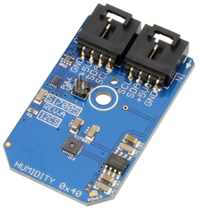
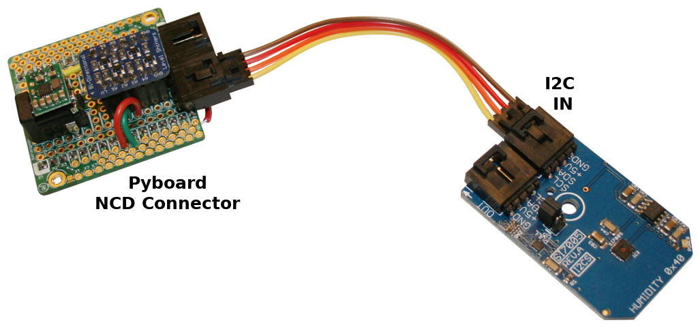

[This file also exists in ENGLISH here](readme_eng.md)

# Mesure de l'humidité relative (%Rel) et la température avec le senseur SI7005 sous  MicroPython



Le SI7005 est un senseur d'humidité relative et température avec les caractéristiques suivantes:
* +/- 4.5 %RH
* +/- 0.5 °C

Ce circuit CMOS monolitique intègre:
* Les éléments du senseur de température et humidité,
* Un convertisseur analogique-vers-numérique (ADC),
* un traitement de signal,
* des __données de calibration__ et
* une interface I2C.

Les deux capteurs température et humidité sont calibrés en usine et les données de calibration sont stockées dans la mémoire non-volatile du composant. C'est une solution idéale pour mesurer la température, l'humidité et le point-de-rosée pour un grand nombre d'applications industrielle et privées.

Les applications du SI7005 sont:
* thérapie respiratoire,
* air conditionné, frigo, poêle,
* surveillance et contrôle de biens et
* contrôle de climatisation automobile.

## A propos des modules NCD
Les mini modulesI2C  de NCD [National Control Device / ncd.io](https://store.ncd.io) sont conçu avec un connecteur standard à 4 broches très pratique. Grâce à ces connecteurs, plus besoin de souder et les modules peuvent être chaînés sur un bus I2C.

Ce module NCD SI7005 inclus un régulateur de tension et un level shifter I2C PCA9306 pour adapter la logique au standard NCD (5V).

# Brancher
Le capteur i2C utilise un connecteur NCD. Il suffit donc d'utiliser l'interface appropriée pour connecter le module. Ce dépôt propose des interfaces NCD pour [MicroPython Pyboard](https://github.com/mchobby/pyboard-driver/blob/master/NCD/README.md) et [modules ESP8266/ESP32](../NCD/readme.md).




A noter que __National Control Device propose de [nombreux adapteurs](https://store.ncd.io/shop/?fwp_product_type=adapters)__ pour les plateformes de développement les plus courantes.

# Tester
Copier le fichier `si70x.py` et `test.py` sur votre carte MicroPython.

Le fichier `test.py` (listé ci-dessous) peut être chargé à la volée dans une session REPL en utilisant `import test`

```
from machine import I2C, Pin
from si70x import SI7005
import time

# Créer le bus I2C en fonction de votre plateforme.
# Pyboard: SDA sur Y9, SCL sur Y10.
#          la frequance du bus par défaut (400000 = 400 Khz) est beaucoup trop élevée.
#         Réduire cette fréquence à 100 Khz. Ne pas hésiter à descendre à 10 KHz (10000) durant les tests préliminaires.
i2c = I2C( 2, freq=100000 )
# Feather ESP8266: sda=2, scl=4.
# i2c = I2C( sda=Pin(2), scl=Pin(4) )

mpl = SI7005( i2c )
i = 0
while True:
	i += 1
	print( '--- Iteration %s %s' % (i,'-'*20) )
	# tuple (hrel, temp)
	print( 'raw_values ', mpl.raw_values ) # Valeur brute de humidité, température
	print( 'values ', mpl.values ) # Valeurs _Human Friendly_
```

Ce qui produit les résultats suivants:

```
...
--- Iteration 1669 --------------------
raw_values  (54.875, 24.25)
values  ('54.88 %HRel', '24.21875 C')
--- Iteration 1670 --------------------
raw_values  (54.9375, 24.25)
values  ('54.94 %HRel', '24.21875 C')
--- Iteration 1671 --------------------
raw_values  (54.9375, 24.21875)
values  ('54.94 %HRel', '24.25 C')
--- Iteration 1672 --------------------
raw_values  (54.875, 24.25)
values  ('54.88 %HRel', '24.21875 C')
--- Iteration 1673 --------------------
raw_values  (54.875, 24.21875)
values  ('54.94 %HRel', '24.25 C')
--- Iteration 1674 --------------------
raw_values  (54.875, 24.25)
values  ('54.88 %HRel', '24.21875 C')
```

# Ou acheter
* NCD-SI7005 : http://shop.mchobby.be/
* NCD-SI7005 : https://store.ncd.io/product/si7005-humidity-and-temperature-sensor-%c2%b14-5rh-%c2%b10-5c-i2c-mini-module/
