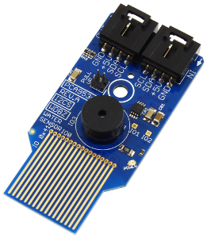
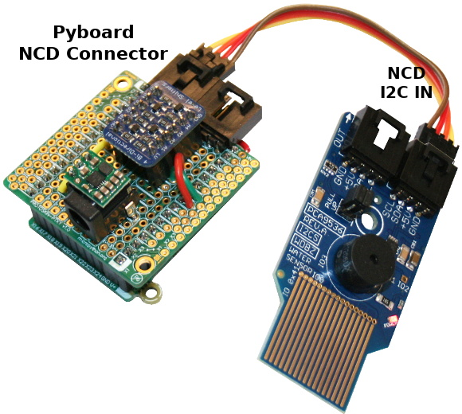
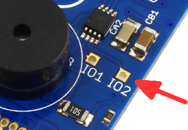

[This file also exists in ENGLISH](readme_ENG.md)

# Detecteur d'eau avec Buzzer (basé sur PCA9536)

Le capteur "détection d'eau" avec buzzer peut être utilisé pour détecter de l'eau et fuite de liquide.



La détection de liquide est branché sur le le GPIO IO0, GPIO qui est connecté à la masse lorsque qu'un liquide est détecté (Low: Eau détectée, High: Pas d'eau présente).  

Le buzzer est connecté sur le GPIO IO3 (à placer à High pour activer le buzzer).

Les GPIO IO2 & IO3 sont toujours disponibles sur la carte.

Fonctionnalités principales:
* Basé sur un __PCA9536__ (I2C 4-bits GPIO extender, [datasheet](https://media.ncd.io/sites/2/20170721134419/PCA9536-5.pdf) )
* Capteur I2C de détection d'eau
* 4.41 cm² de surface de détection
* Buzzer I2C pouvant être utilisé comme alarme
* 2 connecteurs GPIO en extra pour usage externe (IO1 & IO2)

Ce capteur est disponible comme Mini Carte NCD (_NCD Mini board_) plus facile à brancher.

# Bibliothèque

Cette bibliothèque doit être copiée sur la carte MicroPython avant d'utiliser les exemples.

Sur une plateforme connectée:

```
>>> import mip
>>> mip.install("github:mchobby/esp8266-upy/ncd-water-detect")
```

Ou via l'utilitaire mpremote :

```
mpremote mip install github:mchobby/esp8266-upy/ncd-water-detect
```

# Branchement

C'est un capteur I2C exploitant le connecteur NCD, il faut donc utiliser une interface adéquate pour connecter la carte. Ce dépôt propose une interface NCD pour [MicroPython Pyboard](https://github.com/mchobby/pyboard-driver/blob/master/NCD/README.md) et [modules ESP](../NCD/readme.md).




Note: __National Control Device propose [de nombreuses cartes adaptateurs](https://store.ncd.io/shop/?fwp_product_type=adapters) __ pour de nombreuses carte de développement.

# Tester

## Prérequis

Le fichier `pca9536.py` de la bibliothèque PCA9536 doit être disponible sur la plateforme MicroPython.

La [bibliothèque pca9536 est disponible ici](../pca9536/readme.md) sur le dépôt GitHub.

## Bibliothèque et exemples

Copire les fichiers `wdetect.py` et `wdtest.py` sur votre carte MicroPython.

Le fichier `wdtest.py` (listé ci-dessous) peut être chargé dans une session REPL ç l'aide de `import wdtest`.

Cet exemple teste les fonctionnalités basiques du détecteur d'eau en activant le buzzer aussi longtemps que le senseur détecte de l'eau.

```
from machine import Pin, I2C
from time import sleep
from wdetect import WaterDetect

# Creer le bus I2C en fonction de votre plateforme.
# Pyboard: SDA sur Y9, SCL sur Y10. Voir le branchement NCD sur https://github.com/mchobby/pyboard-driver/tree/master/NCD
#          La vitesse du bus à été reduite à 100 Khz.
#          Ne pas hésité à descendre à 10 KHz (10000) durant les tests.
i2c = I2C( 2, freq=100000 )
# Feather ESP8266 & Wemos D1: sda=4, scl=5.
# i2c = I2C( sda=Pin(4), scl=Pin(5) )
# ESP8266-EVB
# i2c = I2C( sda=Pin(6), scl=Pin(5) )

wd = WaterDetect( i2c )
buz = False
try:
	while True:
		if wd.has_water:
			print( "EAU DETECTEE!" )
			# Change l'état du buzzer 1 SEULE FOIS pour éviter de charger le bus I2C
			if not buz:
				buz = True
				wd.buzzer( True )
		else:
			print( '...')
			# Change l'état du buzzer 1 SEULE FOIS
			if buz:
				buz = False
				wd.buzzer( False )
		sleep( 1 )
finally:
	# Etre certain que le buzzer est désactivé
	# ... avant que quelqu'un ne pète un câble :-)
	if buz:
		wd.buzzer( False )
```

Ce second exemple montre comment contrôler les deux GPIO en extra (IO1 et IO2) toujours disponible sur la carte



```
from machine import Pin, I2C
from time import sleep
from wdetect import WaterDetect

# Créer le bus I2C en fonction de la plateforme.
# Pyboard
i2c = I2C( 2, freq=100000 )
# Feather ESP8266 & Wemos D1: sda=4, scl=5.
# i2c = I2C( sda=Pin(4), scl=Pin(5) )
# ESP8266-EVB
# i2c = I2C( sda=Pin(6), scl=Pin(5) )

wd = WaterDetect( i2c )
wd.setup( 1, Pin.IN  ) # IO1 as Input
wd.setup( 2, Pin.OUT ) # IO2 as Output

while True:
	val = wd.input( 1 )
	print( "IO1 -> %s" % val )

	# activater IO2 si de l'eau est détectée
	wd.output( 2, wd.has_water )
	sleep( 1 )
```
