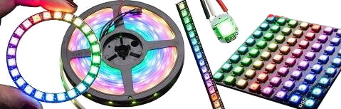
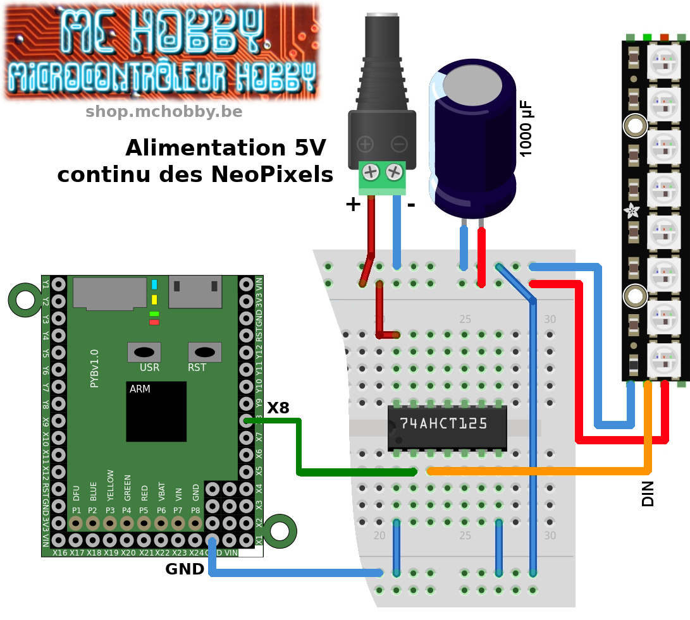

# Utilisation de NeoPixel sous MicroPython
Les LED RGB WS2812, aussi appelées NeoPixels chez Adafruit, sont des LEDs intelligentes capables d'offrir une explosion de couleur et équipe de nombreux types de produits (ruban, anneau, panneau, etc.



Pour commander des NeoPixels, une seule broche de données est nécessaire sur le microcontrôleur (Arduino, ESP8266, Pyboard) pour contrôler toutes les LEDs. Chaque pixel est adressable individuellement et propose un panel de couleur 24 bit sur chaque LED.

__Attention: Utiliser des NeoPixels Récents!__

La bibliothèque incluse dans le firmware microPython prend en charge génération de NeoPixel avec flux de donnée de 800 KHz.

La bibliothèque __ne prend pas en charge__:
* l'ancienne génération de NeoPixel (flux de donnée à 400 KHz)
* les LEDs NeoPixel RGBW.

# Raccordement (ESP8266, Pyboard)
## ESP8266 sous sous 3.3V


| Broche ESP8266 | Broche  NeoPixel | Note                                                                                                       |
|----------------|------------------|------------------------------------------------------------------------------------------------------------|
| GND            | GND              |                                                                                                            |
| 3V             | 5V               | Neopixel fonctionne également sous 3.3V. Juste moins brillant. Attention le signal doit aussi être en 3.3V |
| 2              | DIN              | Le signal doit entrer par la broche Data IN (ne pas se tromper avec Data OUT)                              |

## ESP8266 sous 5V

Il est possible d'alimenter les NeoPixels sous 5V afin d'avoir des couleurs vives et stables en toutes circonstances.

Il faut absolument utiliser un [Level Shifter 74AHCT125](http://df.mchobby.be/datasheet/74AHC125.pdf) (pdf) aussi que le signal de commande des NeoPixel soit en 5V.


## ESP8266 - broches compatibles

Nous avons testé la bibliothèque NeoPixel sur les broches suivantes de l'ESP8266:

| Broche | Compatibilité |
|---|---|
| __14__ | NeoPixel compatible. |
| __12__ | _non testé._ |
| __13__ | NeoPixel compatible. |
| __15__ | NeoPixel compatible. |
| __0__  | __NE PAS UTILISER__. Broche de boot. |
| __16__ | __NON FONCTIONNEL__ pour NeoPixel |
| __2__  | NeoPixel compatible. |
| __5__  | NeoPixel compatible. Bus I2C (SCL) |
| __4__  | NeoPixel compatible. Bus I2C (SDA) |

## Pyboard sous 5V

A noter que MicroPython Pyboard ne dispose pas de pilotes natifs mais il existe différentes ressources sur Internet dont [micropython-ws2812](https://github.com/JanBednarik/micropython-ws2812) de JanBednarik.

Cette bibliothèque est intégrée dans ce GitHub avec quelques modifications pour exposer la même interface similaire à la bibliothèque NeoPixel disponible pour l'ESP8266.



## Pyboard - broches compatibles

La bibliothèque utilise la broche MOSI du bus SPI pour émettre les données.

Il faut donc un bus SPI matériel supportant la vitesse de 3.200.000 bauds

| Broche | Compatibilité |
|---|---|
| __X8__ | MOSI bus SPI(1) |
| __Y8__ | MOSI bus SPI(2) |

# tester

## Exemple simple
```
# Utilisation de la bibliothèque neopixel avec Feather ESP8266
# sous MicroPython
#
# Shop: https://shop.mchobby.be/55-leds-neopixels-et-dotstar
# Wiki: https://wiki.mchobby.be/index.php?title=MicroPython-Accueil#ESP8266_en_MicroPython

from time import sleep

# -- CHARGER BIBLIOTHEQUE ---------------------------
# ESP8266 NEOPIXEL - utiliser bibliothèque native
from machine import Pin
from neopixel import NeoPixel

# Pyboard NEOPIXEL - utiliser bibliothèque WS2812
# from ws2812 import NeoPixel

# -- INSTANCE NEOPIXEL ------------------------------
# ESP8266 NeoPixel( broche_signal, nbre_de_led )
np = NeoPixel( Pin(2), 8 )

# Pyboard NeoPixel( spi_bus=1, led_count=1, intensity=1 ) -> X8
# np = NeoPixel( spi_bus=1, led_count=8 )

# Fixer la couleur la couleur du premier pixel
# avec un tuple (r,g,b) ou chaque valeur est
# située entre 0 et 255
np[0] = (255,0,0) # rouge

# couleur des autres pixels
np[1] = (0, 255, 0) # vert
np[2] = (0, 0, 128) # bleu (1/2 brillance)

# Voir aussi HTML Color Picker
# https://www.w3schools.com/colors/colors_picker.asp
np[3] = (255, 102, 0) # Orange
np[4] = (255, 0, 102) # Rose bonbon
np[5] = (153, 51, 255) # Violet
np[6] = (102, 153, 255) # bleu pastel
np[7] = (153, 255, 153) # vert pastel

# Envoyer l'info au NeoPixels
np.write()

sleep(2)

# fill() permet de remplir tout
# le NeoPixel avec une seule couleur
colors = [ (255,0,0), (0, 255, 0), (0, 0, 128),
    (255, 102, 0) , (255, 0, 102), (153, 51, 128),
    (102, 153, 128), (153, 255, 128) ]

for color in colors:
    np.fill( color )
    np.write()
    sleep(2)

# Eteindre les NeoPixels
np.fill( (0,0,0) )
np.write()
```

## Effets lumineux
Ce github contient un second script de test nommé `fxdemo.py` . Ce dernier contient différentes fonctions d'exemple permettant de réaliser des effets lumineux à base de NeoPixels.

Vous trouverez ci-dessous le corps du script appelant les différentes fonctions d'effet.

Il est possible de tester le fichier `fxdemo.py` en saisissant `import fxdemo` depuis l'invite REPL.

```
# theater_chase sample
theater_chase( np, (127,0,0) ) # red
theater_chase( np, (127,127,127) ) # white
theater_chase( np, (0,0,127) ) # blue
clear( np )
sleep( 1 )

# Wipe in color
np.fill( (190, 0, 0) ) # fill in red
np.write()
wipe( np, (0,180,0), pause=0.150 ) # wipe in green
wipe( np, (0,0,255), pause=0.150 ) # wipe in blue
wipe( np, (0,0,0),   pause=0.150 ) # wipe in black
sleep( 1 )

# Moving_rainbow
for i in range( 4 ):
	moving_rainbow( np )
clear( np )
sleep( 1 )

# Fade In And Out
fade_inout( np, (255,   0,   0) ) # Red
fade_inout( np, (0  , 255,   0) ) # Green
fade_inout( np, (0  ,   0, 255) ) # Blue
clear( np )
sleep( 1 )

# moving_wheel
moving_wheel( np )
clear( np )
sleep( 1 )

# cycle_wheel
for i in range(2):
	cycle_wheel( np )
clear( np )
sleep( 1 )

# Candle Effect
candle( np )
clear( np )
sleep( 1 )

# Larson Scanner (K2000)
#   execute 3 iterations
posdir = None
for i in range( 3 ):
	posdir = larson_scanner( np, posdir )
clear( np )
sleep( 1 )
```

# Informations techniques

## Couleur bleue et 3.3V
La couleur bleue est difficile à produire sous 3.3V.

Par conséquent, `np.write( (0,0,255) )` ne produit pas vraiment de couleur.

C'est parce que le Forward Voltage d'une LED bleue est d'environ 2.8V (typiquement 3.2V). Avec une source d'alimentation de 3.3V, le tension est un peu faible pour activer une led bleue. Nous sommes à la limite pour pouvoir produire du Bleu.

Il est parfois plus efficace de produire un bleu en mi-brillances avec `np.write( (0,0,128) )` ou bleu en quart-de-brillance avec `np.write( (0,0,64) )`

__Limite du régulateur de tension:__

De même, nous avons remarqué que le régulateur de tension d'un ESP8266 ne produit pas vraiment assez de courant pour l'ESP8266 + le contrôler de 8 LEDs NeoPixels. Par conséquent l'utilisation d'une alimentation externe 3.3v pour alimenter les NeoPixels est le bienvenue.

Ne pas oublier d'avoir une masse commune (référentiel de tension) entre l'alimentation NeoPixel et l'ESP8266.

A noter que si le régulateur de tension peine à founir le courant nécessaire alors sa tension chutera un peu (de 3.3v à 3.1v), ce qui aura pour effet de produire un effet de scintillement sur les LEDs.

__Utiliser le régulateur du microcontrôleur:__

Le régulateur de la plateforme ESP8266 sera néanmoins suffisant pour commander quelques NeoPixels. Dans ce cas, il est préférable de:
* ne pas êtres pas trop exigeant sur la qualité des couleurs (utiliser des couleurs en mi-brillance)
* s'attendre à des scintillements lors d'un charge plus importante en courant (lorsque l'on affiche du blanc ou des couleurs vive).

# Source et ressources
* [Référence officielle NeoPixel sous ESP8266](http://docs.micropython.org/en/v1.8.2/esp8266/esp8266/tutorial/neopixel.html)
* (Bibliothèque WS2512 originale de JanBednarik](https://github.com/JanBednarik/micropython-ws2812)
* [Wiki NeoPixel avec ESP8266](https://wiki.mchobby.be/index.php?title=MicroPython-Accueil#ESP8266_en_MicroPython)

# Où acheter
* Shop: [Gamme NeoPixel](https://shop.mchobby.be/55-leds-neopixels-et-dotstar)
* Shop: [NeoPixel Stick](https://shop.mchobby.be/leds-neopixels-et-dotstar/407-stick-neopixel-8-leds-rgb--3232100004078-adafruit.html) utilisé dans cet exemple.
