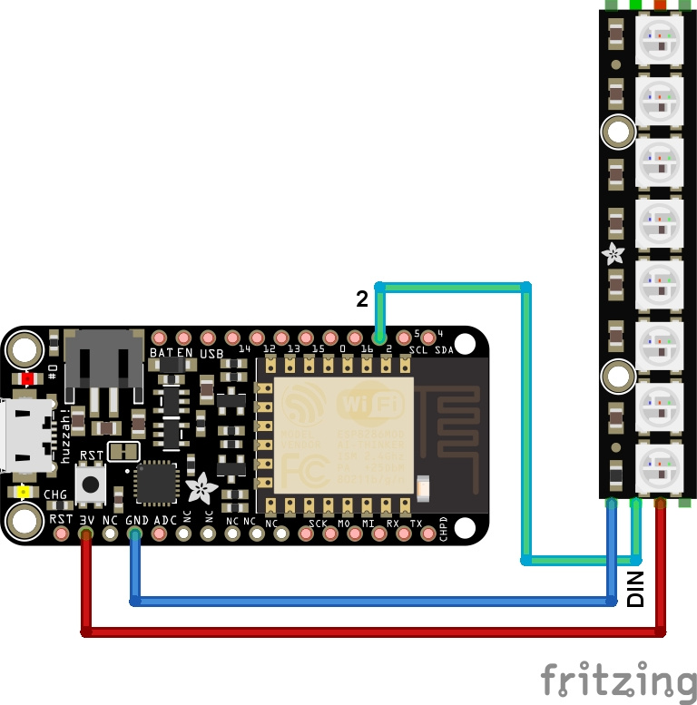

# Utilisation de NeoPixel et ESP8266 MicroPython

* Shop: [Gamme NeoPixel](https://shop.mchobby.be/55-leds-neopixels-et-dotstar)
* Shop: [NeoPixel Stick](https://shop.mchobby.be/leds-neopixels-et-dotstar/407-stick-neopixel-8-leds-rgb--3232100004078-adafruit.html) utilisé dans cet exemple.
* Wiki: https://wiki.mchobby.be/index.php?title=MicroPython-Accueil#ESP8266_en_MicroPython

# Attention: Utiliser des NeoPixels Récents
La bibliothèque incluse dans le firmware microPython ne prend pas en charge l'ancienne génération de NeoPixel (flux de donnée à 400 KHz) mais la génération plus récente (à 800 KHz).

# Raccordement



| Broche ESP8266 | Broche  NeoPixel | Note                                                                                                       |
|----------------|------------------|------------------------------------------------------------------------------------------------------------|
| GND            | GND              |                                                                                                            |
| 3V             | 5V               | Neopixel fonctionne également sous 3.3V. Juste moins brillant. Attention le signal doit aussi être en 3.3V |
| 2              | DIN              | Le signal doit entrer par la broche Data IN (ne pas se tromper avec Data OUT)                              |

## Broches compatibles

Nous avons testé la bibliothèque NeoPixel sur les broches suivantes de l'ESP8266:

| Broche | Compatibilité |
|---|---|
| __14__ | NeoPixel compatible. |
| __12__ | _non testé._ |
| __13__ | NeoPixel compatible. |
| __15__ | NeoPixel compatible. |
| __0__  | __NE PAS UTILISER__. Broche de boot. |
| __16__ | __NON FONCTIONNEL__ pour NeoPixel |
| __2__  | NeoPixel compatible. |
| __5__  | NeoPixel compatible. Bus I2C (SCL) |
| __4__  | NeoPixel compatible. Bus I2C (SDA) |

# Code de test

```
# Utilisation de la bibliothèque neopixel avec Feather ESP8266 
# sous MicroPython
#
# Shop: https://shop.mchobby.be/55-leds-neopixels-et-dotstar
# Wiki: https://wiki.mchobby.be/index.php?title=MicroPython-Accueil#ESP8266_en_MicroPython

from machine import Pin
from neopixel import NeoPixel
from time import sleep

# NeoPixel( broche_signal, nbre_de_led )
np = NeoPixel( Pin(2), 8 )

# Fixer la couleur la couleur du premier pixel
# avec un tuple (r,g,b) ou chaque valeur est 
# située entre 0 et 255
np[0] = (255,0,0) # rouge

# couleur des autres pixels
np[1] = (0, 255, 0) # vert
np[2] = (0, 0, 128) # bleu (1/2 brillance)

# Voir aussi HTML Color Picker
# https://www.w3schools.com/colors/colors_picker.asp
np[3] = (255, 102, 0) # Orange
np[4] = (255, 0, 102) # Rose bonbon
np[5] = (153, 51, 255) # Violet
np[6] = (102, 153, 255) # bleu pastel
np[7] = (153, 255, 153) # vert pastel

# Envoyer l'info au NeoPixels
np.write()

sleep(2)

# fill() permet de remplir tout
# le NeoPixel avec une seule couleur
colors = [ (255,0,0), (0, 255, 0), (0, 0, 128),
    (255, 102, 0) , (255, 0, 102), (153, 51, 128), 
    (102, 153, 128), (153, 255, 128) ]

for color in colors:
    np.fill( color )
    np.write()
    sleep(2)

# Eteindre les NeoPixels
np.fill( (0,0,0) )
np.write()
```

## Couleur bleue et 3.3V
La couleur bleue est difficile à produire sous 3.3V.

Par conséquent, `np.write( (0,0,255) )` ne produit pas vraiment de couleur. C'est parce que le Forward Voltage d'une LED bleue est d'environ 2.8V (typiquement 3.2V). A  une source d'alimentation de 3.3V, tension un peu faible pour activer une led bleue. Nous sommes donc à la limite pour pouvoir produire du Bleu. Il est parfois plus efficace d'utiliser des bleus en mi-brillance avec `np.write( (0,0,128) )` ou quart-de-brillance avec `np.write( (0,0,64) )` 

__Limite du régulateur de tension:__

De même, nous avons remarqué que le régulateur de tension d'un ESP8266 ne produit pas vraiment assez de courant pour l'ESP8266 + le contrôler de 8 LEDs NeoPixels. Par conséquent l'utilisation du alimentation externe 3.3v pour alimenter les NeoPixels est le bienvenue.

Si le régulateur de tension peine à founir le courant alors sa tension chutera un peu (de 3.3v à 3.1v), ce qui aura pour effet de produire un effet de scintillement

__Conclusion:__

Le régulateur de la plateforme ESP8266 sera néanmoins suffisant pour commander quelques NeoPixels si vous n'êtes pas trop exigeant sur la qualité des couleurs (utiliser des couleurs en mi-brillance) et si des cou

# Source et ressources
* Référence officielle NeoPixel sous ESP8266: http://docs.micropython.org/en/v1.8.2/esp8266/esp8266/tutorial/neopixel.html

